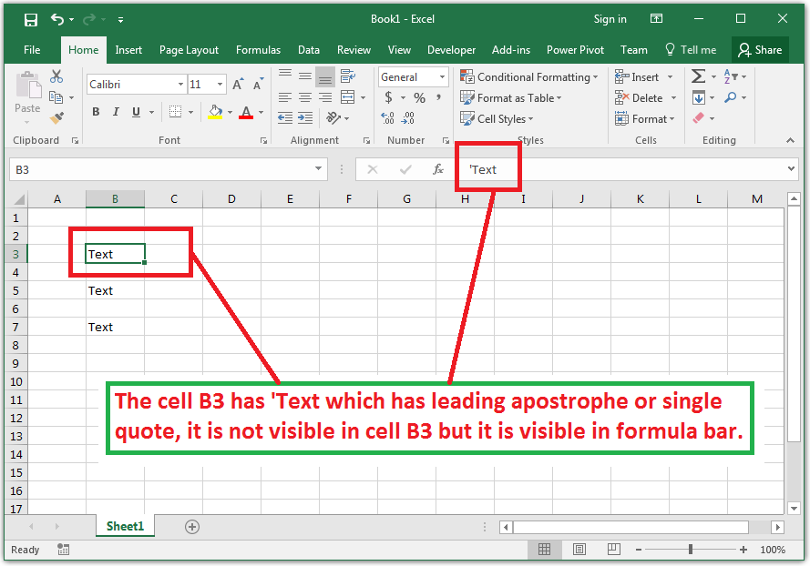

## **Possible Usage Scenarios**

When you put some value inside a cell that has a leading apostrophe or single‑quote mark, Microsoft Excel hides it, but when you select the cell, it displays the leading apostrophe or single quote in the formula bar as shown in the following screenshot.

Aspose.Cells for Node.js via C++ also hides the leading apostrophe or single quote as Microsoft Excel does, but it sets the [**Style.setQuotePrefix(boolean)**](https://reference.aspose.com/cells/nodejs-cpp/style/#setQuotePrefix-boolean-) to **true** for that cell. If you set an empty style on the cell, then [**Style.getQuotePrefix()**](https://reference.aspose.com/cells/nodejs-cpp/style/#getQuotePrefix--) becomes **false** again. To address this issue, Aspose.Cells for Node.js via C++ provides the [**Style.setQuotePrefix(boolean)**](https://reference.aspose.com/cells/nodejs-cpp/style/#setQuotePrefix-boolean-) method; when it is set to **false**, then [**Style.getQuotePrefix()**](https://reference.aspose.com/cells/nodejs-cpp/style/#getQuotePrefix--) is not updated at all, and its previous value is preserved. It means that if the old value of [**Style.getQuotePrefix()**](https://reference.aspose.com/cells/nodejs-cpp/style/#getQuotePrefix--) was **true**, it will remain **true**, and if the old value was **false**, it will remain **false**.

## **Preserve Single Quote Prefix of Cell Value or Range**

The following sample code explains the usage of the [**Style.setQuotePrefix(boolean)**](https://reference.aspose.com/cells/nodejs-cpp/style/#setQuotePrefix-boolean-) method as described previously. Please read the comments inside the code and see the console output of the code given below for more help.

## **Sample Code**



## **Console Output**


Quote Prefix of Cell A1: False

Quote Prefix of Cell A1: True

When StyleFlag.QuotePrefix is False, it means, do not update the value of Cell.Style.QuotePrefix.

Similarly, when StyleFlag.QuotePrefix is True, it means, update the value of Cell.Style.QuotePrefix.

Quote Prefix of Cell A1: True

Quote Prefix of Cell A1: False



