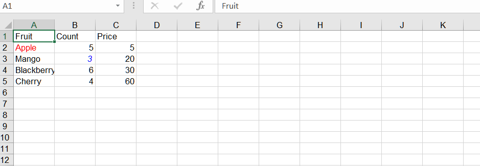

## **Possible Usage Scenarios**
When you want to highlight certain data, you can change the style of the cells.

## **How to change the format of a cell in Excel**

To change the format of a single cell in Excel, follow these steps:

1. Open Excel and open the workbook that contains the cell you want to format.

2. Locate the cell you want to format.

3. Right-click on the cell and select "Format Cells" from the context menu. Alternatively, you can select the cell and go to the Home tab in the Excel ribbon, click on the "Format" dropdown in the "Cells" group, and select "Format Cells".

4. The "Format Cells" dialog box will appear. Here, you can choose various formatting options to apply to the selected cell. For example, you can change the font style, font size, font color, number format, borders, background color, etc. Explore the different tabs in the dialog box to access various formatting options.

5. After making the desired formatting changes, click the "OK" button to apply the formatting to the selected cell.


## **How to change the format of a cell Using Node.js**

To change the format of a cell using Aspose.Cells, you can use the following methods:
1. [Cell.setStyle(style)](https://reference.aspose.com/cells/nodejs-cpp/cell/#setStyle-style-)
2. [Cell.setStyle(style, explicitFlag)](https://reference.aspose.com/cells/nodejs-cpp/cell/#setStyle-style-explicitFlag-)
3. [Cell.setStyle(style, styleFlag)](https://reference.aspose.com/cells/nodejs-cpp/cell/#setStyle-style-styleFlag-)


## **Sample Code**
In this example, we create an Excel workbook, add some sample data, access the first worksheet, and get two cells ("A2" and "B3"). Then, we get the style of the cell, set various formatting options (e.g., font color, bold), and change the format to the cell. Finally, we save the workbook to a new file.


```javascript
const path = require("path");
const AsposeCells = require("aspose.cells.node");

// The path to the documents directory.
const dataDir = path.join(__dirname, "data");
const filePath = path.join(dataDir, "sample.xlsx");
// Loads the workbook which contains hidden external links
const workbook = new AsposeCells.Workbook(filePath);

// Get the first worksheet
const ws = workbook.getWorksheets().get(0);
const cells = ws.getCells();

// Setting the value to the cells
let cell = cells.get("A1");
cell.putValue("Fruit");
cell = cells.get("B1");
cell.putValue("Count");
cell = cells.get("C1");
cell.putValue("Price");

cell = cells.get("A2");
cell.putValue("Apple");
cell = cells.get("A3");
cell.putValue("Mango");
cell = cells.get("A4");
cell.putValue("Blackberry");
cell = cells.get("A5");
cell.putValue("Cherry");

cell = cells.get("B2");
cell.putValue(5);
cell = cells.get("B3");
cell.putValue(3);
cell = cells.get("B4");
cell.putValue(6);
cell = cells.get("B5");
cell.putValue(4);

cell = cells.get("C2");
cell.putValue(5);
cell = cells.get("C3");
cell.putValue(20);
cell = cells.get("C4");
cell.putValue(30);
cell = cells.get("C5");
cell.putValue(60);

// Access the worksheet
const worksheet = workbook.getWorksheets().get(0);

const a2 = worksheet.getCells().get("A2");

// Get style of A2
const style = a2.getStyle();

// Change the format
style.getFont().setColor(AsposeCells.Color.Red);
style.getFont().setIsBold(true);

const flag = new AsposeCells.StyleFlag();
flag.setFontColor(true);
a2.setStyle(style, flag);

const b3 = worksheet.getCells().get("B3");
// Get style of B3
const style2 = b3.getStyle();

// Change the format
style2.getFont().setColor(AsposeCells.Color.Blue);
style2.getFont().setIsItalic(true);
b3.setStyle(style2);

// Save the modified workbook
workbook.save("output.xlsx");
```
