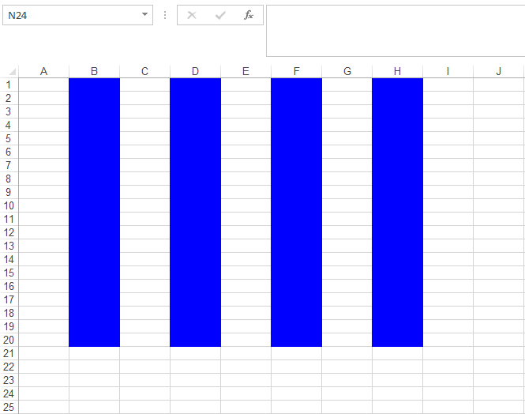

{}

Aspose.Cells APIs provide the means to add & manipulate conditional formatting rules for the [**Worksheet**](https://reference.aspose.com/cells/nodejs-cpp/worksheet) object. These rules can be tailored in a number of ways to get the desired formatting based on conditions or rules. This article will demonstrate the use of Aspose.Cells for Node.js via C++ APIs to apply shading to alternate rows & columns with the help of conditional formatting rules and Excel's built-in functions.

{}

This article makes use of Excel's built-in functions such as ROW, COLUMN & MOD. Here are some details of these functions for a better understanding of the code snippet provided ahead.

- **ROW()** function returns the row number of a cell reference. If the reference parameter is omitted, it assumes that the reference is the cell address in which the ROW function has been entered.
- **COLUMN()** function returns the column number of a cell reference. If the reference parameter is omitted, it assumes that the reference is the cell address in which the COLUMN function has been entered.
- **MOD()** function returns the remainder after a number is divided by a divisor, where the first parameter to the function is the numeric value whose remainder you wish to find and the second parameter is the number used to divide into the number parameter. If the divisor is 0, then it will return the #DIV/0! error.

Let's start writing some code to accomplish this goal with the help of Aspose.Cells for Node.js via C++ API.

```javascript
const path = require("path");
const AsposeCells = require("aspose.cells.node");

// The path to the documents directory.
const dataDir = path.join(__dirname, "data");

// Create an instance of Workbook or load existing
const book = new AsposeCells.Workbook();

// Access the Worksheet on which desired rule has to be applied
const sheet = book.getWorksheets().get(0);

// Add FormatConditions to the instance of Worksheet
let idx = sheet.getConditionalFormattings().add();

// Access the newly added FormatConditions via its index
const conditionCollection = sheet.getConditionalFormattings().get(idx);

// Define a CellsArea on which conditional formatting will be applicable
// The code creates a CellArea ranging from A1 to I20
const area = AsposeCells.CellArea.createCellArea("A1", "I20");

// Add area to the instance of FormatConditions
conditionCollection.addArea(area);

// Add a condition to the instance of FormatConditions
// For this case, the condition type is expression, which is based on some formula
idx = conditionCollection.addCondition(AsposeCells.FormatConditionType.Expression);

// Access the newly added FormatCondition via its index
const formatCondition = conditionCollection.get(idx);

// Set the formula for the FormatCondition
formatCondition.setFormula1("=MOD(ROW(),2)=0");

// Set the background color and pattern for the FormatCondition's Style
formatCondition.getStyle().setBackgroundColor(AsposeCells.Color.Blue);
formatCondition.getStyle().setPattern(AsposeCells.BackgroundType.Solid);

// Save the result on disk
book.save(path.join(dataDir, "output_out.xlsx"));
```


The following snapshot shows the resultant spreadsheet loaded in Excel application.

||
| :- |

In order to apply the shading to alternative columns, all you have to do is to change the formula **=MOD(ROW(),2)=0** as **=MOD(COLUMN(),2)=0**, that is; instead of getting the row index, modify the formula to retrieve the column index.  
The resultant spreadsheet, in this case, will look as follow.

||
| :- |
