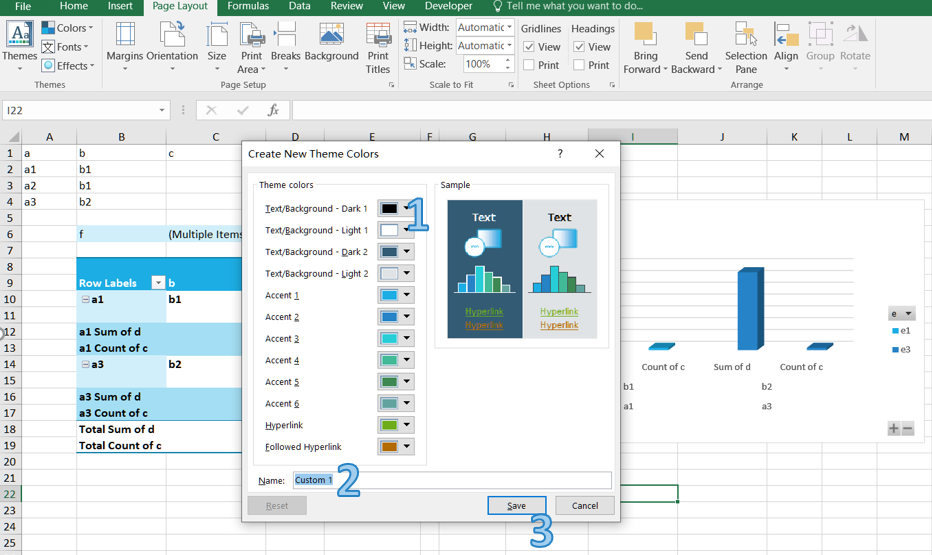

---  
title: Excel Themes and Colors with Node.js via C++  
linktitle: Excel Themes and Colors  
type: docs  
weight: 100  
url: /nodejs-cpp/excel-themes-and-colors/  
description: Learn how to use custom color schemes with Aspose.Cells for Node.js via C++.  
keywords: Node.js Create and Apply Color Schemes, Node.js programmatically Create a Custom Color Scheme, programmatically how to Apply a Custom Color Scheme Node.js, Node.js how to Use Color Scheme in Excel  
---  

## **How to Apply and Create Color Scheme in Excel**  
Document themes make it easy to coordinate colors, fonts, and graphic formatting effects of Excel documents and update them quickly.  
Themes provide a unified look with named styles, graphical effects, and other objects used in a workbook. For example, the Accent1 style looks different in the Office and the Apex themes. Often, you apply a document theme and then amend it to how you want it.  

### **How to Apply a Color Scheme in Excel**  
1. Open Excel and go to the "Page Layout" tab in the Excel ribbon.  
1. Click on the "Colors" button in the "Themes" section.  
<br>  
  
1. Choose a color palette that matches your requirements or hover over a scheme to see a live preview.  

### **How to Create a Custom Color Scheme in Excel**  
You can create your own color set to give your document a fresh, unique look or comply with your organization’s brand standards.  

1. Open Excel and go to the "Page Layout" tab in the Excel ribbon.  
1. Click on the "Colors" button in the "Themes" section.  
1. Click "Customize Colors..." button.  
<br>  
  

1. In the "Create New Theme Colors" dialog box, you can select colors for each element by clicking on the color dropdowns next to them. You can choose colors from the palette or define custom colors using the "More Colors" option.  
<br>  
  
1. After selecting all the desired colors, provide a name for your custom color scheme in the "Name" field.  

1. Click on the "Save" button to save your custom color scheme. Your custom color scheme will now be available in the "Colors" drop-down menu for future use.  

## **How to Create and Apply Color Scheme in Aspose.Cells**  
Aspose.Cells provides features for customizing themes and colors.  

### **How to Create Custom Color Theme in Aspose.Cells**  
If theme colors are used in the file, we don't need to modify each cell individually; we just need to modify the colors in the theme.  

The following example shows how to apply custom themes with your desired colors. We use a sample template file manually created in Microsoft Excel 2007.  

The following example loads a template XLSX file, defines colors for different theme color types, applies the custom colors, and saves the Excel file.  

```javascript
const path = require("path");
const AsposeCells = require("aspose.cells.node");

// The path to the documents directory.
const dataDir = path.join(__dirname, "data");
const filePath = path.join(dataDir, "book1.xlsx");

// Define Color array (of 12 colors) for Theme.
const carr = [
new AsposeCells.Color("AntiqueWhite"), // Background1
new AsposeCells.Color("Brown"), // Text1
new AsposeCells.Color("AliceBlue"), // Background2
new AsposeCells.Color("Yellow"), // Text2
new AsposeCells.Color("YellowGreen"), // Accent1
new AsposeCells.Color("Red"), // Accent2
new AsposeCells.Color("Pink"), // Accent3
new AsposeCells.Color("Purple"), // Accent4
new AsposeCells.Color("PaleGreen"), // Accent5
new AsposeCells.Color("Orange"), // Accent6
new AsposeCells.Color("Green"), // Hyperlink
new AsposeCells.Color("Gray") // Followed Hyperlink
];

// Instantiate a Workbook.
// Open the template file.
const workbook = new AsposeCells.Workbook(filePath);

// Set the custom theme with specified colors.
workbook.customTheme("CustomeTheme1", carr);

// Save as the excel file.
workbook.save(path.join(dataDir, "output.out.xlsx"));
```  

### **How to Apply Theme Colors in Aspose.Cells**  
The following example applies a cell’s foreground and font colors based on the default theme (of the workbook) color types. It also saves the Excel file to disk.  

```javascript
const path = require("path");
const AsposeCells = require("aspose.cells.node");

// The path to the documents directory.
const dataDir = path.join(__dirname, "data");

// Instantiate a Workbook.
const workbook = new AsposeCells.Workbook();

// Get cells collection in the first (default) worksheet.
const cells = workbook.getWorksheets().get(0).getCells();

// Get the D3 cell.
const c = cells.get("D3");

// Get the style of the cell.
const s = c.getStyle();

// Set foreground color for the cell from the default theme Accent2 color.
s.setForegroundThemeColor(new AsposeCells.ThemeColor(AsposeCells.ThemeColorType.Accent2, 0.5));

// Set the pattern type.
s.setPattern(AsposeCells.BackgroundType.Solid);

// Get the font for the style.
const f = s.getFont();

// Set the theme color.
f.setThemeColor(new AsposeCells.ThemeColor(AsposeCells.ThemeColorType.Accent4, 0.1));

// Apply style.
c.setStyle(s);

// Put a value.
c.putValue("Testing1");

// Save the excel file.
workbook.save(path.join(dataDir, "output.out.xlsx"));
```  

### **How to Get and Set Theme Colors in Aspose.Cells**  
Below are a few methods and properties that implement theme colors.  

- [**Style.ForegroundThemeColor**](https://reference.aspose.com/cells/nodejs-cpp/style/properties/foregroundthemecolor): Used to set the foreground color.  
- [**Style.BackgroundThemeColor**](https://reference.aspose.com/cells/nodejs-cpp/style/properties/backgroundthemecolor): Used to set the background color.  
- [**Font.ThemeColor**](https://reference.aspose.com/cells/nodejs-cpp/font/properties/themecolor): Used to set the font color.  
- [**Workbook.getThemeColor**](https://reference.aspose.com/cells/nodejs-cpp/workbook/methods/getthemecolor): Used to get a theme color.  
- [**Workbook.setThemeColor**](https://reference.aspose.com/cells/nodejs-cpp/workbook/methods/setthemecolor): Used to set a theme color.  

The following example shows how to get and set theme colors.  

The following example uses a template XLSX file, gets the colors for different theme color types, changes the colors, and saves the Microsoft Excel file.  

```javascript
const path = require("path");
const AsposeCells = require("aspose.cells.node");

// The path to the documents directory.
const dataDir = path.join(__dirname, "data");
const filePath = path.join(dataDir, "book1.xlsx");

// Instantiate Workbook object.
// Open an existing excel file.
const workbook = new AsposeCells.Workbook(filePath);

// Get the Background1 theme color.
let c = workbook.getThemeColor(AsposeCells.ThemeColorType.Background1);

// Print the color.
console.log("theme color Background1: ", c);

// Get the Accent2 theme color.
c = workbook.getThemeColor(AsposeCells.ThemeColorType.Accent2);

// Print the color.
console.log("theme color Accent2: ", c);

// Change the Background1 theme color.
workbook.setThemeColor(AsposeCells.ThemeColorType.Background1, AsposeCells.Color.Red);

// Get the updated Background1 theme color.
c = workbook.getThemeColor(AsposeCells.ThemeColorType.Background1);

// Print the updated color for confirmation.
console.log("theme color Background1 changed to: ", c);

// Change the Accent2 theme color.
workbook.setThemeColor(AsposeCells.ThemeColorType.Accent2, AsposeCells.Color.Blue);

// Get the updated Accent2 theme color.
c = workbook.getThemeColor(AsposeCells.ThemeColorType.Accent2);

// Print the updated color for confirmation.
console.log("theme color Accent2 changed to: ", c);

// Save the updated file.
workbook.save(path.join(dataDir, "output.out.xlsx"));
```  

## **Advance topics**  
- [Extract Theme Data from Excel File](/cells/nodejs-cpp/extract-theme-data-from-excel-file/)  
  