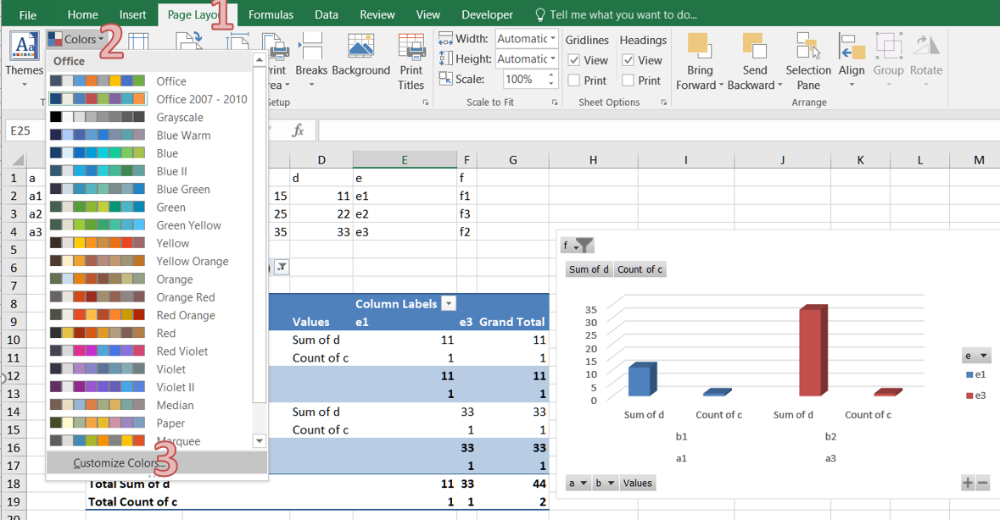

---  
title: Excel Themes and Colors
linktitle: Excel Themes and Colors  
type: docs  
weight: 100  
url: /nodejs-cpp/excel-themes-and-colors/  
description: Learn how to use custom color schemes with Aspose.Cells for Node.js via C++.  
keywords: Node.js Create and Apply Color Schemes, Node.js programmatically Create a Custom Color Scheme, programmatically how to Apply a Custom Color Scheme Node.js, Node.js how to Use Color Scheme in Excel  
ai_search_scope: cells_nodejscpp
ai_search_endpoint: "https://docsearch.api.aspose.cloud/ask"
---  

## **How to Apply and Create Color Scheme in Excel**  
Document themes make it easy to coordinate colors, fonts, and graphic formatting effects of Excel documents and update them quickly.  
Themes provide a unified look with named styles, graphical effects, and other objects used in a workbook. For example, the Accent1 style looks different in the Office and the Apex themes. Often, you apply a document theme and then amend it to how you want it.  

### **How to Apply a Color Scheme in Excel**  
1. Open Excel and go to the "Page Layout" tab in the Excel ribbon.  
1. Click on the "Colors" button in the "Themes" section.  
   
  
1. Choose a color palette that matches your requirements or hover over a scheme to see a live preview.  

### **How to Create a Custom Color Scheme in Excel**  
You can create your own color set to give your document a fresh, unique look or comply with your organization’s brand standards.  

1. Open Excel and go to the "Page Layout" tab in the Excel ribbon.  
1. Click on the "Colors" button in the "Themes" section.  
1. Click "Customize Colors..." button.  
   
  

1. In the "Create New Theme Colors" dialog box, you can select colors for each element by clicking on the color dropdowns next to them. You can choose colors from the palette or define custom colors using the "More Colors" option.  
   
  
1. After selecting all the desired colors, provide a name for your custom color scheme in the "Name" field.  

1. Click on the "Save" button to save your custom color scheme. Your custom color scheme will now be available in the "Colors" drop-down menu for future use.  

## **How to Create and Apply Color Scheme in Aspose.Cells**  
Aspose.Cells provides features for customizing themes and colors.  

### **How to Create Custom Color Theme in Aspose.Cells**  
If theme colors are used in the file, we don't need to modify each cell individually; we just need to modify the colors in the theme.  

The following example shows how to apply custom themes with your desired colors. We use a sample template file manually created in Microsoft Excel 2007.  

The following example loads a template XLSX file, defines colors for different theme color types, applies the custom colors, and saves the Excel file.  



### **How to Apply Theme Colors in Aspose.Cells**  
The following example applies a cell’s foreground and font colors based on the default theme (of the workbook) color types. It also saves the Excel file to disk.  



### **How to Get and Set Theme Colors in Aspose.Cells**  
Below are a few methods and properties that implement theme colors.  

- [**Style.setForegroundThemeColor**](https://reference.aspose.com/cells/nodejs-cpp/style/#setForegroundThemeColor-themecolor-): Used to set the foreground color.  
- [**Style.setBackgroundThemeColor**](https://reference.aspose.com/cells/nodejs-cpp/style/#setBackgroundThemeColor-themecolor-): Used to set the background color.  
- [**Font.setThemeColor**](https://reference.aspose.com/cells/nodejs-cpp/font/#setThemeColor-themecolor-): Used to set the font color.  
- [**Workbook.getThemeColor**](https://reference.aspose.com/cells/nodejs-cpp/workbook/#getThemeColor-themecolortype-): Used to get a theme color.  
- [**Workbook.setThemeColor**](https://reference.aspose.com/cells/nodejs-cpp/workbook/#setThemeColor-themecolortype-color-): Used to set a theme color.  

The following example shows how to get and set theme colors.  

The following example uses a template XLSX file, gets the colors for different theme color types, changes the colors, and saves the Microsoft Excel file.  



## **Advance topics**  
- [Extract Theme Data from Excel File](/cells/nodejs-cpp/extract-theme-data-from-excel-file/)  
  

