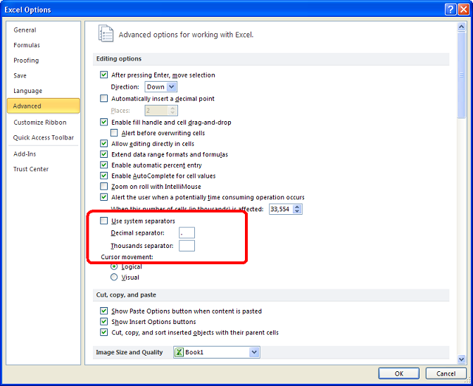

{}

In Microsoft Excel, you can specify the Custom Decimal and Thousands Separators instead of using System Separators from the **Advanced Excel Options** as shown in the screenshot below.

Aspose.Cells provides the [**WorkbookSettings.numberDecimalSeparator**](https://reference.aspose.com/cells/nodejs-cpp/workbooksettings/#numberDecimalSeparator-string-) and [**WorkbookSettings.numberGroupSeparator**](https://reference.aspose.com/cells/nodejs-cpp/workbooksettings/#numberGroupSeparator-string-) properties to set the custom separators for formatting/parsing numbers.

{}

## **Specifying Custom Separators using Microsoft Excel**

The following screenshot shows the **Advanced Excel Options** and highlights the section to specify the **Custom Separators**.



## **Specifying Custom Separators using Aspose.Cells for Node.js via C++**

The following sample code illustrates how to specify the Custom Separators using Aspose.Cells API. It specifies the Custom Number Decimal and Group Separators as dot and space respectively.

### Node.js code to specify custom Number Decimal and Group Separators

```javascript
const path = require("path");
const AsposeCells = require("aspose.cells.node");

// The path to the documents directory.
const dataDir = path.join(__dirname, "data");
const filePath = path.join(dataDir, "sample.xlsx");
// Loads the workbook which contains hidden external links
const workbook = new AsposeCells.Workbook(filePath);

// Specify custom separators
workbook.getSettings().setNumberDecimalSeparator('.');
workbook.getSettings().setNumberGroupSeparator(' ');

const worksheet = workbook.getWorksheets().get(0);

// Set cell value
const cell = worksheet.getCells().get("A1");
cell.putValue(123456.789);

// Set custom cell style
const style = cell.getStyle();
style.setCustom("#,##0.000;[Red]#,##0.000");
cell.setStyle(style);

worksheet.autoFitColumns();

// Save workbook as pdf
workbook.save(path.join(dataDir, "CustomSeparator_out.pdf"));
```
