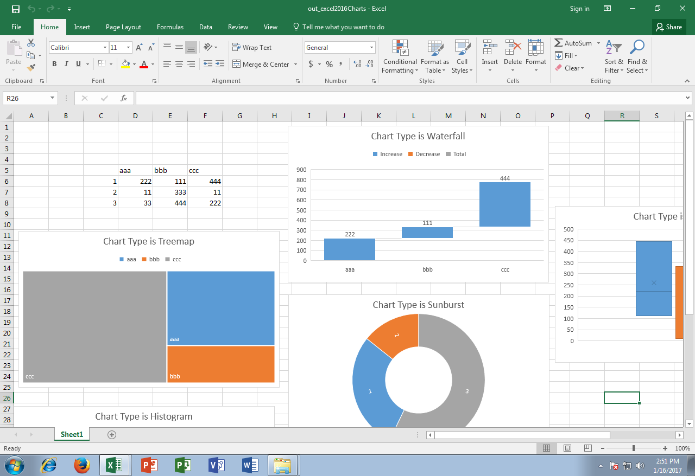

---  
title: Read and Manipulate Excel 2016 Charts with Node.js via C++  
linktitle: Read and Manipulate Excel 2016 Charts  
description: Learn how to read and manipulate Excel 2016 charts using Aspose.Cells for Node.js via C++. This guide will show you how to access and modify various chart properties.  
keywords: Aspose.Cells for Node.js, Excel 2016 charts, read, manipulate, data labels, series colors, layout, hierarchical charting, circular charting.  
type: docs  
weight: 48  
url: /nodejs-cpp/read-and-manipulate-excel-2016-charts/  
ai_search_scope: cells_nodejscpp
ai_search_endpoint: "https://docsearch.api.aspose.cloud/ask"
---  

## **Possible Usage Scenarios**  
Aspose.Cells now supports the reading and manipulation of Microsoft Excel 2016 charts which are not present in Microsoft Excel 2013 or earlier versions.  
## **Read and Manipulate Excel 2016 Charts**  
The following sample code loads the [source excel file](22774101.xlsx) which contains Excel 2016 charts in the first worksheet. It reads all charts one by one and changes its title as per its chart type. The following screenshot shows the source excel file before the execution of code. As you can see, chart title is the same for all charts.


The following screenshot shows the [output excel file](22774104.xlsx) after the execution of code. As you can see, the chart title is changed as per its chart type.

  
## **Sample Code**  
```javascript
const path = require("path");
const AsposeCells = require("aspose.cells.node");

// The path to the documents directory.
const dataDir = path.join(__dirname, "data");
const filePath = path.join(dataDir, "excel2016Charts.xlsx");

// Load source excel file containing excel 2016 charts
const workbook = new AsposeCells.Workbook(filePath);

// Access the first worksheet which contains the charts
const sheet = workbook.getWorksheets().get(0);

// Access all charts one by one and read their types
for (let i = 0; i < sheet.getCharts().getCount(); i++) {
// Access the chart
const ch = sheet.getCharts().get(i);

// Print chart type
console.log(ch.getType());

// Change the title of the charts as per their types
ch.getTitle().setText("Chart Type is " + ch.getType().toString());
}

// Save the workbook
workbook.save(path.join(dataDir, "out_excel2016Charts.xlsx"));
```  
## **Console Output**  
Here is the console output of the above sample code when executed with the provided [source excel file](22774101.xlsx).

  

 Waterfall  

Treemap  

Sunburst  

Histogram  

BoxWhisker  

  

## **Advance topics**  
- [Creating Waterfall Chart](/cells/nodejs-cpp/creating-waterfall-chart/)  
- [Creating TreeMap Chart](/cells/nodejs-cpp/creating-treemap-chart/)  
- [Creating Sunburst Chart](/cells/nodejs-cpp/creating-sunburst-chart/)  
  

