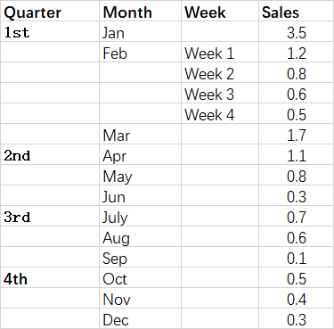

## **Possible Usage Scenarios**
Treemap charts are good for comparing proportions within the hierarchy; however, treemap charts aren't great at showing hierarchical levels between the largest categories and each data point. A sunburst chart provides a much better visual representation for this. The sunburst chart is ideal for displaying hierarchical data. Each level of the hierarchy is represented by one ring or circle with the innermost circle as the top of the hierarchy. A sunburst chart without any hierarchical data (one level of categories) looks similar to a doughnut chart. However, a sunburst chart with multiple levels of categories shows how the outer rings relate to the inner rings. The sunburst chart is most effective at showing how one ring is broken into its contributing pieces, while another type of hierarchical chart, the treemap chart, is ideal for comparing relative sizes.



## **Sunburst chart**
After running the code below, you will see the Sunburst chart as shown below.


## **Sample Code**
The following sample code loads the [sample Excel file](sunburst.xlsx) and generates the [output Excel file](out.xlsx).

```javascript
const path = require("path");
const AsposeCells = require("aspose.cells.node");

// The path to the documents directory.
const dataDir = path.join(__dirname, "data");
const filePath = path.join(dataDir, "sunburst.xlsx");
// Create an instance of Workbook
const workbook = new AsposeCells.Workbook(filePath);
// Access the first worksheet
const worksheet = workbook.getWorksheets().get(0);
// Add a Sunburst chart
const pieIdx = worksheet.getCharts().add(AsposeCells.ChartType.Sunburst, 5, 6, 25, 12);
// Retrieve the Chart object
const chart = worksheet.getCharts().get(pieIdx);
// Set the legend to be shown
chart.setShowLegend(true);
// Set the chart title name 
chart.getTitle().setText("Sunburst Chart");
// Add series data range
chart.getNSeries().add("D2:D16", true);
// Set category data (A2:A16 is incorrect, as hierarchical categories)
chart.getNSeries().setCategoryData("A2:C16");
// Show the DataLabels with category names
chart.getNSeries().get(0).getDataLabels().setShowCategoryName(true);
// Fill the PlotArea with nothing 
chart.getPlotArea().getArea().getFillFormat().setFillType(AsposeCells.FillType.None);
// Save the Excel file
workbook.save("out.xlsx");
```

