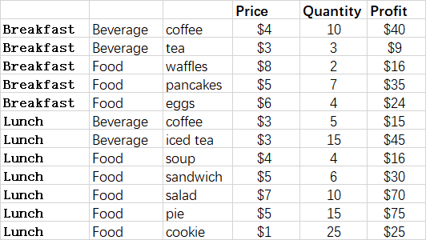

---  
title: How to create TreeMap chart with Node.js via C++  
linktitle: How to create TreeMap chart  
description: Learn how to create a Treemap chart in Aspose.Cells for Node.js via C++. Our guide will help you understand the various properties and formatting options available for Treemap charts, including colors, labels, and data representation.  
keywords: Aspose.Cells for Node.js, Treemap chart, create, properties, formatting, colors, labels, data representation, circular chart, hierarchical charting.  
type: docs  
weight: 161  
url: /nodejs-cpp/creating-treemap-chart/  
---  

## **Possible Usage Scenarios**  
A treemap chart provides a hierarchical view of your data and makes it easy to spot patterns, such as which items are a store's best sellers. The tree branches are represented by rectangles and each sub-branch is shown as a smaller rectangle. The treemap chart displays categories by color and proximity and can easily show lots of data which would be difficult with other chart types.  

  
## **TreeMap chart**  
After running the code below, you will see the TreeMap chart as shown below.  

  
## **Sample Code**  
The following sample code loads the [sample Excel file](treemap.xlsx) and generates the [output Excel file](out.xlsx).  

```javascript
const path = require("path");
const AsposeCells = require("aspose.cells.node");

// The path to the documents directory.
const dataDir = path.join(__dirname, "data");
const filePath = path.join(dataDir, "treemap.xlsx");
// Create an instance of Workbook
const workbook = new AsposeCells.Workbook(filePath);
// Access the first worksheet
const worksheet = workbook.getWorksheets().get(0);
// Add a Treemap chart
const pieIdx = worksheet.getCharts().add(AsposeCells.ChartType.Treemap, 5, 6, 20, 12);
// Retrieve the Chart object
const chart = worksheet.getCharts().get(pieIdx);
// Set the legend can be showed
chart.setShowLegend(true);
// Set the chart title name 
chart.getTitle().setText("TreeMap Chart");
// Add series data range(D2:D13,actually)
chart.getNSeries().add("D2:F13", true);
// Set category data(A2:A13 is incorrect )
chart.getNSeries().setCategoryData("A2:C13");
// Show the DataLabels with category names
chart.getNSeries().get(0).getDataLabels().setShowCategoryName(true);
// Fill the PlotArea area with nothing 
chart.getPlotArea().getArea().getFillFormat().setFillType(AsposeCells.FillType.None);
// Save the Excel file
workbook.save("out.xlsx");
```  
  
