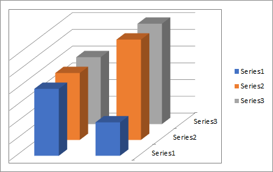

## **Possible Usage Scenarios**
For some 3-D charts such as 3-D column, 3-D cone, or 3-D pyramid which has a depth (series) axis, also known as the Z axis, that you can change. You can specify the interval between tick marks, axis labels and other operations.

## **Handle Primary and Secondary Axis like Microsoft Excel**
Please see the following sample code that creates a new Excel file and puts values of the chart in the first worksheet. Then we add a chart and set the chart type to Column3D, then you can see the Z Axis also called Depth Axis. 



## **Sample Code**
```javascript
const path = require("path");
const AsposeCells = require("aspose.cells.node");

// The path to the documents directory.
const dataDir = path.join(__dirname, "data");
const filePath = path.join(dataDir, "sample.xlsx");
// Loads the workbook which contains hidden external links
const workbook = new AsposeCells.Workbook(filePath);
// Get the first worksheet
const worksheet = workbook.getWorksheets().get(0);
// Put values to cells for creating chart
worksheet.getCells().get("A1").putValue("A");
worksheet.getCells().get("B1").putValue("B");
worksheet.getCells().get("C1").putValue("C");
worksheet.getCells().get("A2").putValue(2);
worksheet.getCells().get("A3").putValue(1);
worksheet.getCells().get("B2").putValue(2);
worksheet.getCells().get("B3").putValue(3);
worksheet.getCells().get("C2").putValue(2);
worksheet.getCells().get("C3").putValue(3);
// Add a chart to the worksheet
const chartIndex = worksheet.getCharts().add(AsposeCells.ChartType.Column3D, 9, 6, 25, 16);
// Access the instance of the newly added chart
const chart = worksheet.getCharts().get(chartIndex);
// Calculate the chart
chart.calculate();
// Add SeriesCollection (chart data source) to the chart ranging from "A2" cell to "C3"
chart.setChartDataRange("A2:C3", true);
// Hide the CategoryAxis axis
chart.getCategoryAxis().setIsVisible(false);
// Hide the ValueAxis axis
chart.getValueAxis().setIsVisible(false);
// Save the file
workbook.save("ZAxis.xlsx");
```
