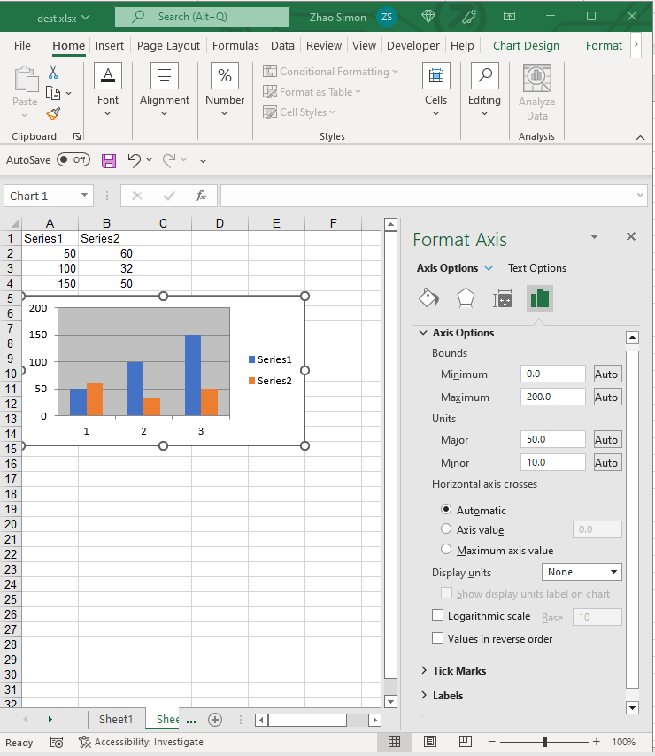

---  
title: Manage Axes of Excel Charts with Node.js via C++  
description: Learn how to configure chart axes in Aspose.Cells for Node.js via C++. Our guide will show you how to adjust the primary and secondary axes, set their ranges, and modify their properties to enhance your charts.  
keywords: Aspose.Cells for Node.js via C++, chart axes, configuration, primary axes, secondary axes, range, properties.  
linktitle: Axes  
type: docs  
weight: 50  
url: /nodejs-cpp/chart-axes/  
ai_search_scope: cells_nodejscpp
ai_search_endpoint: "https://docsearch.api.aspose.cloud/ask"
---  

{}  

In Excel charts, there are 3 kinds of Axes:  
1. Horizontal(Category) Axis : X Axis  
1. Vertical(Value) Axis : Y Axis  
1. Depth(Series) Axis : Z Axis  

{}  

## **Axis Options**  
Aspose.Cells for Node.js via C++ also allows you to manage chart's axes at runtime. With the [Axis](https://reference.aspose.com/cells/nodejs-cpp/axis/) object, you can change all options of Axis as done in Excel.  

||  

## **Manage X and Y Axes**  
In Excel chart, horizontal and vertical axes are the two most popular axes to use.  

The following code snippet demonstrates how to set the options of X and Y axes.  

```javascript
const AsposeCells = require("aspose.cells.node");
const path = require("path");

// The path to the documents directory.
const dataDir = path.join(__dirname, "data");
const filePath = path.join(dataDir, "chart_axes.xlsx");

// Instantiating a Workbook object
const workbook = new AsposeCells.Workbook();

// Adding a new worksheet to the Workbook object
const sheetIndex = workbook.getWorksheets().add();

// Obtaining the reference of the newly added worksheet by passing its sheet index
const worksheet = workbook.getWorksheets().get(sheetIndex);

// Adding sample values to cells
worksheet.getCells().get("A1").putValue("Series1");
worksheet.getCells().get("A2").putValue(50);
worksheet.getCells().get("A3").putValue(100);
worksheet.getCells().get("A4").putValue(150);
worksheet.getCells().get("B1").putValue("Series2");
worksheet.getCells().get("B2").putValue(60);
worksheet.getCells().get("B3").putValue(32);
worksheet.getCells().get("B4").putValue(50);

// Adding a chart to the worksheet
const chartIndex = worksheet.getCharts().add(AsposeCells.ChartType.Column, 5, 0, 15, 5);

// Accessing the instance of the newly added chart
const chart = worksheet.getCharts().get(chartIndex);
// Adding SeriesCollection (chart data source) to the chart ranging from "A1" cell to "B4"
chart.setChartDataRange("A1:B4", true);

// Hiding X axis
chart.getCategoryAxis().setIsVisible(false);

// Setting max value of Y axis
chart.getValueAxis().setMaxValue(200);
// Setting major unit
chart.getValueAxis().setMajorUnit(50);

// Save the file
workbook.save(filePath);
```  

## **Advance topics**  
- [Change Tick Label Direction](/cells/nodejs-cpp/change-tick-label-direction/)  
- [Determine which Axis exists in the Chart](/cells/nodejs-cpp/determine-which-axis-exists-in-the-chart/)  
- [Handle Automatic Units of Chart Axis like Microsoft Excel](/cells/nodejs-cpp/handle-automatic-units-of-chart-axis-like-microsoft-excel/)  
- [Read Axis Labels after Calculating the Chart](/cells/nodejs-cpp/read-axis-labels-after-calculating-the-chart/)  
- [How to Set Category Axis in Excel Chart](/cells/nodejs-cpp/how-to-set-category-axis/)  
  

