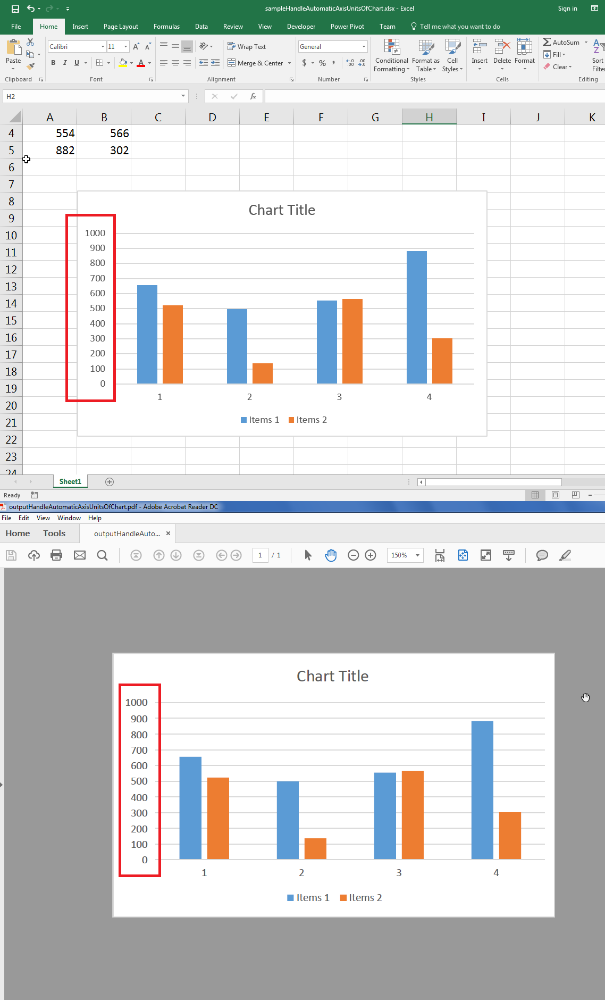

---  
title: Handle Automatic Units of Chart Axis like Microsoft Excel with Node.js via C++  
linktitle: Handle Automatic Units of Chart Axis like Microsoft Excel  
description: Learn how to handle automatic units on chart axes in Aspose.Cells for Node.js via C++. Our guide will show you how to configure and customize automatic units on a chart axis, including the display of scientific notation and adjusting the scale.  
keywords: Aspose.Cells for Node.js via C++, chart axes, automatic units, Microsoft Excel, configuration, customization, scientific notation, scaling.  
type: docs  
weight: 120  
url: /nodejs-cpp/handle-automatic-units-of-chart-axis-like-microsoft-excel/  
---  

## **Possible Usage Scenarios**  
Early versions of Aspose.Cells for Node.js via C++ were not able to handle automatic units of the chart axis properly when the chart is rendered to image or PDF. Now, Aspose.Cells for Node.js via C++ supports the handling of automatic units of the chart axis. There is no code change. Just convert your chart into an image or PDF and it will render the chart axis just like Microsoft Excel renders it.  

## **Handle Automatic Units of Chart Axis like Microsoft Excel**  
The following sample code loads the [sample Excel file](61767755.xlsx) and generates the [output PDF chart](61767752.pdf). The screenshot shows the automatic units of the chart axis in red rectangles and also compares the sample Excel file chart with the output PDF chart. Both are exactly similar.  

  

## **Sample Code**  
```javascript
const path = require("path");
const AsposeCells = require("aspose.cells.node");

// The path to the documents directory.
const dataDir = path.join(__dirname, "data");
const filePath = path.join(dataDir, "sampleHandleAutomaticUnitsOfChartAxisLikeMicrosoftExcel.xlsx");

// Load the sample Excel file
const workbook = new AsposeCells.Workbook(filePath);

// Access first worksheet
const worksheet = workbook.getWorksheets().get(0);

// Access first chart
const chart = worksheet.getCharts().get(0);

// Render chart to pdf
chart.toPdf("outputHandleAutomaticUnitsOfChartAxisLikeMicrosoftExcel.pdf");
```  
