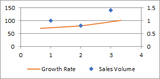

## **Possible Usage Scenarios**
When the numbers in a chart vary widely from data series to data series, or when you have mixed types of data (price and volume), plot one or more data series on a secondary vertical (value) axis.  The scale of the secondary vertical axis shows the values for the associated data series.  A secondary axis works well in a chart that shows a combination of column and line charts.

## **Handle Primary and Second Axis like Microsoft Excel**
Please see the following sample code that creates a new Excel file and puts values of the chart in the first worksheet. 
Then we add a chart and show the second-axis.



## **Sample Code**
```javascript
const path = require("path");
const AsposeCells = require("aspose.cells.node");

// The path to the documents directory.
const dataDir = path.join(__dirname, "data");
const filePath = path.join(dataDir, "sample.xlsx");

// Loads the workbook which contains hidden external links
const workbook = new AsposeCells.Workbook(filePath);

// Access the first worksheet.
const worksheet = workbook.getWorksheets().get(0);

// Put the sample values used in a chart
worksheet.getCells().get("A1").putValue("Region");
worksheet.getCells().get("A2").putValue("Peking");
worksheet.getCells().get("A3").putValue("New York");
worksheet.getCells().get("A4").putValue("Paris");
worksheet.getCells().get("B1").putValue("Sales Volume");
worksheet.getCells().get("C1").putValue("Growth Rate");
worksheet.getCells().get("B2").putValue(100);
worksheet.getCells().get("B3").putValue(80);
worksheet.getCells().get("B4").putValue(140);
worksheet.getCells().get("C2").putValue(0.7);
worksheet.getCells().get("C3").putValue(0.8);
worksheet.getCells().get("C4").putValue(1.0);

// Create a Scatter chart
const pieIdx = worksheet.getCharts().add(AsposeCells.ChartType.Scatter, 6, 6, 15, 11);
// Retrieve the Chart object
const chart = worksheet.getCharts().get(pieIdx);
// Add Series
chart.getNSeries().add("B2:C4", true);
// Set the category data
chart.getNSeries().setCategoryData("=Sheet1!$A$2:$A$4");
// Set the Second-Axis
chart.getNSeries().get(1).setPlotOnSecondAxis(true);
// Show the Second-Axis
chart.getSecondValueAxis().setIsVisible(true);
// Set the second series ChartType to line
chart.getNSeries().get(1).setType(AsposeCells.ChartType.Line);
// Set the series name
chart.getNSeries().get(0).setName("Sales Volume");
chart.getNSeries().get(1).setName("Growth Rate");
// Set the Legend at the bottom of the chart area
chart.getLegend().setPosition(AsposeCells.LegendPositionType.Bottom);
// Fill the PlotArea area with nothing
chart.getPlotArea().getArea().getFillFormat().setFillType(AsposeCells.FillType.None);
// Save the file
workbook.save("PrimaryandSecondaryAxis.xlsx");
```

