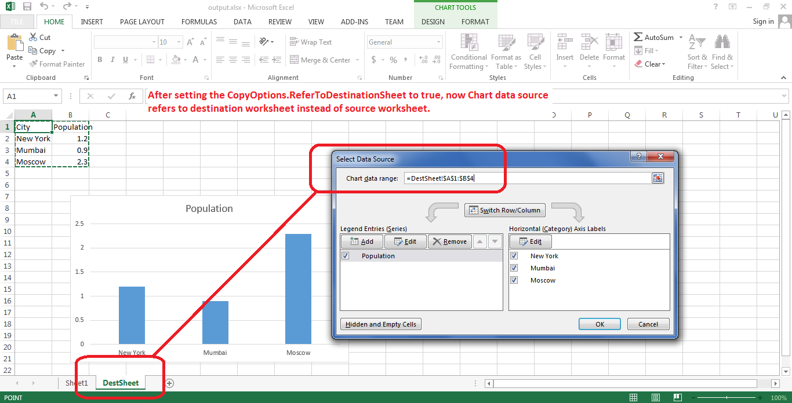

## **Possible Usage Scenarios**

When you copy rows or a range that contains charts to a new worksheet, the data source of the chart does not change. For example, if the data source of the chart is `=Sheet1!$A$1:$B$4`, then after copying rows or a range to a new worksheet, the data source will remain the same, i.e., `=Sheet1!$A$1:$B$4`. It still refers to the old worksheet, i.e., Sheet1. This is also the behavior in Microsoft Excel. However, if you want it to refer to the new destination worksheet, please use the [**CopyOptions.getReferToDestinationSheet()**](https://reference.aspose.com/cells/nodejs-cpp/copyoptions/#getReferToDestinationSheet--) property and set it to **true** while calling the [**Cells.copyRows(Cells, number, number, number)**](https://reference.aspose.com/cells/nodejs-cpp/cells/#copyRows-cells-number-number-number-) method. Now, if your destination worksheet is **DestSheet**, the data source of your chart will change from `=Sheet1!$A$1:$B$4` to `=DestSheet!$A$1:$B$4`.

## **Change Data Source of the Chart to Destination Worksheet while Copying Rows or Range**

The following sample code demonstrates the usage of the [**CopyOptions.getReferToDestinationSheet()**](https://reference.aspose.com/cells/nodejs-cpp/copyoptions/#getReferToDestinationSheet--) property while copying rows or a range containing charts to a new worksheet. The code uses the [sample Excel file](5113699.xlsx) and generates the [output Excel file](5113697.xlsx).



```javascript
const path = require("path");
const AsposeCells = require("aspose.cells.node");

// The path to the documents directory.
const dataDir = path.join(__dirname, "data");
const filePath = path.join(dataDir, "sample.xlsx");
// Load sample Excel file
const wb = new AsposeCells.Workbook(filePath);

// Access the first sheet which contains the chart
const source = wb.getWorksheets().get(0);

// Add another sheet named DestSheet
const destination = wb.getWorksheets().add("DestSheet");

// Set CopyOptions.ReferToDestinationSheet to true
const options = new AsposeCells.CopyOptions();
options.setReferToDestinationSheet(true);

// Copy all the rows of the source worksheet to the destination worksheet, which includes the chart as well
// The chart data source will now refer to DestSheet
destination.getCells().copyRows(source.getCells(), 0, 0, source.getCells().getMaxDisplayRange().getRowCount(), options);

// Save the workbook in XLSX format
wb.save(path.join(dataDir, "output_out.xlsx"), AsposeCells.SaveFormat.Xlsx);
```

