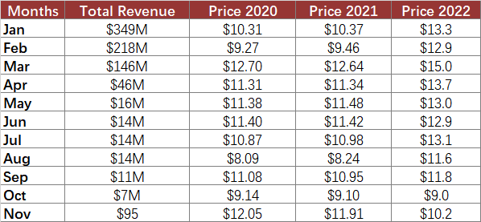

## **Possible Usage Scenarios**
Combo charts in Excel let you avail of this option because you can easily combine two or more chart types to make your data understandable. Combo charts are helpful when your data contains multiple kinds of values including price and volume. Moreover, Combo charts are feasible when your data numbers change widely from series to series.
Taking the following dataset as an example, we can observe that these data are quite similar to the data mentioned in [**VHCL**](https://docs.aspose.com/cells/nodejs-cpp/create-volume-high-low-close-stock-chart/). If we want to visualize series0, which corresponds to "Total Revenue," as a Line chart, how should we proceed?


## **Combo chart**
After running the code below, you will see the Combo chart as shown below.


## **Sample Code**
The following sample code loads the [sample Excel file](combo.xlsx) and generates the [output Excel file](out.xlsx).

```javascript
const path = require("path");
const AsposeCells = require("aspose.cells.node");

// The path to the documents directory.
const dataDir = path.join(__dirname, "data");
const filePath = path.join(dataDir, "combo.xlsx");

// Create the workbook
const workbook = new AsposeCells.Workbook(filePath);
// Access the first worksheet
const worksheet = workbook.getWorksheets().get(0);
// Add a stock volume (VHLC)
const pieIdx = worksheet.getCharts().add(AsposeCells.ChartType.StockVolumeHighLowClose, 15, 0, 34, 12);
// Retrieve the Chart object
const chart = worksheet.getCharts().get(pieIdx);
// Set the legend can be showed
chart.setShowLegend(true);
// Set the chart title name 
chart.getTitle().setText("Combo Chart");
// Set the Legend at the bottom of the chart area
chart.getLegend().setPosition(AsposeCells.LegendPositionType.Bottom);
// Set data range
chart.setChartDataRange("A1:E12", true);
// Set category data 
chart.getNSeries().get(0).setXValues("A2:A12");  // Corrected method

// Set the Series[1] Series[2] and Series[3] to different Marker Style
for (let j = 0; j < chart.getNSeries().getCount(); j++) {
switch (j) {
case 1:
chart.getNSeries().get(j).getMarker().setMarkerStyle(AsposeCells.ChartMarkerType.Circle);
chart.getNSeries().get(j).getMarker().setMarkerSize(15);
chart.getNSeries().get(j).getMarker().getArea().setFormatting(AsposeCells.FormattingType.Custom);
chart.getNSeries().get(j).getMarker().getArea().setForegroundColor(AsposeCells.Color.Pink);
chart.getNSeries().get(j).getBorder().setIsVisible(false);
break;
case 2:
chart.getNSeries().get(j).getMarker().setMarkerStyle(AsposeCells.ChartMarkerType.Dash);
chart.getNSeries().get(j).getMarker().setMarkerSize(15);
chart.getNSeries().get(j).getMarker().getArea().setFormatting(AsposeCells.FormattingType.Custom);
chart.getNSeries().get(j).getMarker().getArea().setForegroundColor(AsposeCells.Color.Orange);
chart.getNSeries().get(j).getBorder().setIsVisible(false);
break;
case 3:
chart.getNSeries().get(j).getMarker().setMarkerStyle(AsposeCells.ChartMarkerType.Square);
chart.getNSeries().get(j).getMarker().setMarkerSize(15);
chart.getNSeries().get(j).getMarker().getArea().setFormatting(AsposeCells.FormattingType.Custom);
chart.getNSeries().get(j).getMarker().getArea().setForegroundColor(AsposeCells.Color.LightBlue);
chart.getNSeries().get(j).getBorder().setIsVisible(false);
break;
}
}
// Set the chart type for Series[0] 
chart.getNSeries().get(0).setType(AsposeCells.ChartType.Line);
// Set style for the border of first series
chart.getNSeries().get(0).getBorder().setStyle(AsposeCells.LineType.Solid);
// Set Color for the first series
chart.getNSeries().get(0).getBorder().setColor(AsposeCells.Color.DarkBlue);
// Fill the PlotArea area with nothing 
chart.getPlotArea().getArea().setFormatting(AsposeCells.FormattingType.None);
// Save the Excel file
workbook.save("out.xlsx");
```
