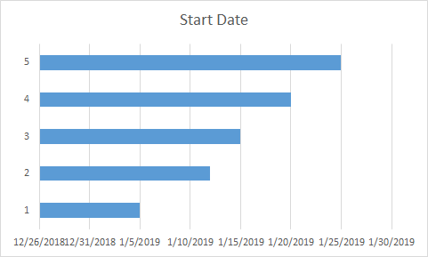
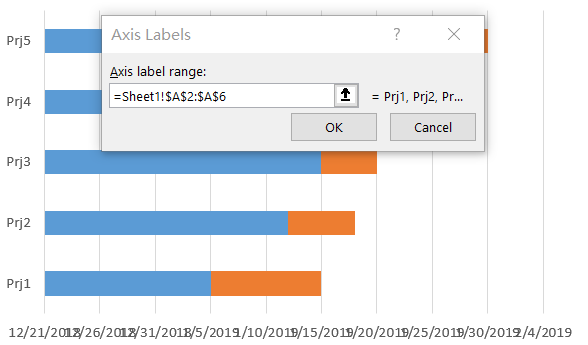
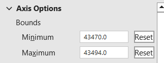
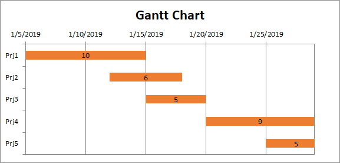

## **What is a Gantt chart**

A Gantt chart is a type of bar chart that illustrates a project schedule. It shows the start and finish dates of the various elements of a project. Each task or activity is represented by a bar, with its length corresponding to its duration. Gantt charts also indicate dependencies between tasks, allowing project managers to visualize the sequence in which tasks need to be completed. They are widely used in project management to plan, schedule, and track projects effectively.

## **How to Create a Gantt Chart in Excel**

You can create a Gantt chart in Excel by following these steps:
1. Add some data for the Gantt chart.  
   <br>
   
2. Select the data and go to Insert → Charts → Insert Column or Bar Chart → Stacked Bar Chart. In our example, that’s B1:B7, and then Insert **Stacked Bar** chart.  
   <br>
   

3. Select the chart, **Select Data** → **Add**, set the **Series name** and **Series values** as follows.  
   <br>
   

4. Select the chart, edit the **Horizontal (Category) Axis Labels**.  
   <br>
   

5. **Format the Y Axis**, select **Categories in reverse order**.

6. Select the **Blue Series** and set the **Fill → NO Fill**.

7. **Format the X Axis**, set the **Minimum and Maximum** (1/5/2019:43470, 1/30/2019:43494).  
   <br>
   

8. **Add data labels** to the chart; now you will get a Gantt chart.  
   <br>
   

## **How to Add a Gantt Chart in Aspose.Cells**
Please see the following sample code. It loads the [sample Excel file](sample.xlsx) that contains some sample data. It then creates the stacked bar chart based on the initial data and sets relevant properties. Finally, it saves the workbook to [output XLSX format](result.xlsx). The following screenshot shows the Gantt chart created by Aspose.Cells in the output Excel file.  
<br>


### **Sample Code**

```javascript
const path = require("path");
const AsposeCells = require("aspose.cells.node");

// The path to the documents directory.
const dataDir = path.join(__dirname, "data");
const filePath = path.join(dataDir, "sample.xlsx");
// Loads the workbook which contains hidden external links
const workbook = new AsposeCells.Workbook(filePath);
// Access the first worksheet
const worksheet = workbook.getWorksheets().get(0);
// Create BarStacked Chart
const i = worksheet.getCharts().add(AsposeCells.ChartType.BarStacked, 5, 6, 20, 15);
// Retrieve the Chart object
const chart = worksheet.getCharts().get(i);
// Set the chart title
chart.getTitle().setText("Gantt Chart");
// Make the chart title visible
chart.getTitle().setIsVisible(true);
// Set data range
chart.setChartDataRange("B1:B6", true);
// Add series data range
chart.getNSeries().add("C2:C6", true);
// No fill for one series
chart.getNSeries().get(0).getArea().getFillFormat().setFillType(AsposeCells.FillType.None);
// Set the Horizontal (Category) Axis
chart.getNSeries().setCategoryData("A2:A6");
// Reverse the Horizontal (Category) Axis
chart.getCategoryAxis().setIsPlotOrderReversed(true);
// Set the value axis's MinValue and MaxValue
const minValue = parseFloat(worksheet.getCells().get("B2").getValue());
const maxValue = parseFloat(worksheet.getCells().get("D6").getValue());
chart.getValueAxis().setMinValue(isNaN(minValue) ? 0 : minValue);
chart.getValueAxis().setMaxValue(isNaN(maxValue) ? 0 : maxValue);
chart.getPlotArea().getArea().getFillFormat().setFillType(AsposeCells.FillType.None);
// Show the DataLabels
chart.getNSeries().get(1).getDataLabels().setShowValue(true);
// Disable the Legend
chart.setShowLegend(false);
// Save the result
workbook.save("result.xlsx");
```


