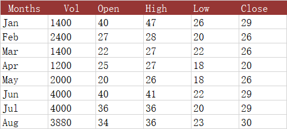

{}

This paragraph will tell you how to create a stock chart, which includes four types:
- **HLC** – High-Low-Close.
- **OHLC** – Open-High-Low-Close.
- **VHLC** – Volume-High-Low-Close.
- **VOHLC** – Volume-Open-High-Low-Close.

{}

## **What is stock chart?**

Stock charts are a specific chart used to track the changes in price of traded assets such as commodities, stocks, and cryptocurrencies. They allow you to see high and low values over time, along with opening and closing values in one chart. Aspose.Cells for Node.js via C++ offers four stock charts, and to use these, you must have the right sets of data available, and you must select the columns in the right order.

The following dataset shows the daily trading information for a stock. We will use this data to create four types of stock charts: High-Low-Close (HLC) stock chart, Open-High-Low-Close (OHLC) chart, Volume-High-Low-Close (VHLC) stock chart, and Volume-Open-High-Low-Close (VOHLC) stock chart.

