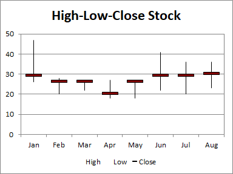

---  
title: Create High-Low-Close (HLC) Stock Chart with Node.js via C++  
linktitle: Create High-Low-Close (HLC) Stock Chart  
description: Learn how to create a high-low-close stock chart using Aspose.Cells for Node.js via C++. Our step-by-step guide will demonstrate how to plot stock market data, including the high, low, and close prices, onto a chart for better analysis and visualization.  
keywords: Aspose.Cells for Node.js, High-Low-Close Stock Chart, Stock Market Data, Analysis, Visualization.  
type: docs  
weight: 181  
url: /nodejs-cpp/create-high-low-close-stock-chart/  
ai_search_scope: cells_nodejscpp
ai_search_endpoint: "https://docsearch.api.aspose.cloud/ask"
---  

## **Possible Usage Scenarios**  
The High-Low-Close (HLC) stock chart uses four columns of data. The first column is a category, usually a date but stock names can also be used. The next three columns in order are for high, low, and closing prices. The range of **prices** for each category is indicated by a vertical line from low to high, and the closing price is shown using a tick mark extending to the right of this line.  

  
## **Visibility improvements in the chart**  
Sometimes, to make the chart look more intuitive, we can modify the appearance of the **close** marker, or **display it** on the secondary axis.  

  
## **Sample Code**  
The following sample code loads the [sample Excel file](High-Low-Close.xlsx) and generates the [output Excel file](out.xlsx).  

```javascript
const path = require("path");
const AsposeCells = require("aspose.cells.node");

// The path to the documents directory.
const dataDir = path.join(__dirname, "data");
const filePath = path.join(dataDir, "High-Low-Close.xlsx");

// Create an instance of Workbook
const workbook = new AsposeCells.Workbook(filePath);
// Access the first worksheet.
const worksheet = workbook.getWorksheets().get(0);
// Create High-Low-Close-Stock Chart
const pieIdx = worksheet.getCharts().add(AsposeCells.ChartType.StockHighLowClose, 5, 6, 20, 12);
// Retrieve the Chart object
const chart = worksheet.getCharts().get(pieIdx);
// Set the legend **to be shown**
chart.setShowLegend(true);
// **Set the chart title**
chart.getTitle().setText("High-Low-Close Stock");
// **Set the legend** at the bottom of the chart area
chart.getLegend().setPosition(AsposeCells.LegendPositionType.Bottom);
// Set data range
chart.setChartDataRange("A1:D9", true);
// Set category data 
chart.getNSeries().setCategoryData("A2:A9");
// Set the marker with the built-in data 
chart.getNSeries().get(2).getMarker().setMarkerStyle(AsposeCells.ChartMarkerType.Dash);
chart.getNSeries().get(2).getMarker().setMarkerSize(20);
chart.getNSeries().get(2).getMarker().getArea().setFormatting(AsposeCells.FormattingType.Custom);
chart.getNSeries().get(2).getMarker().getArea().setForegroundColor(AsposeCells.Color.Maroon);
// **Fill the PlotArea with nothing** 
chart.getPlotArea().getArea().getFillFormat().setFillType(AsposeCells.FillType.None);
// Save the Excel file
workbook.save("out.xlsx");
```  


