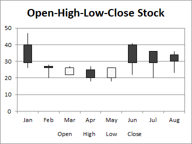
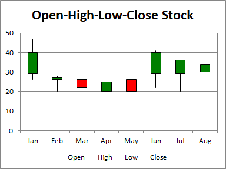

## **Possible Usage Scenarios**
The Open-High-Low-Close (OHLC) chart uses five columns of data, in order: category, open, high, low, and close. The range of prices in each category is indicated by a vertical line, while the range between open and close is given by a wider floating bar; if the price increases in the category (close is higher than open), the bar is filled with one color, while if the price decreases, the bar is filled with another. This type of chart is often called a candlestick chart.




## **Visibility improvements in the chart**
We often use colors rather than black and white to indicate increasing and decreasing prices. In the first set of candlesticks below, red indicates increasing and green indicates decreasing prices.



## **Sample Code**
The following sample code loads the [sample Excel file](Open-High-Low-Close.xlsx) and generates the [output Excel file](out.xlsx).

```javascript
const AsposeCells = require("aspose.cells.node");
const path = require("path");

// The path to the documents directory.
const dataDir = path.join(__dirname, "data");
const filePath = path.join(dataDir, "Open-High-Low-Close.xlsx");

// Create an instance of Workbook
const workbook = new AsposeCells.Workbook(filePath);
// Access the first worksheet.
const worksheet = workbook.getWorksheets().get(0);
// Create Open-High-Low-Close Stock Chart
const pieIdx = worksheet.getCharts().add(AsposeCells.ChartType.StockOpenHighLowClose, 5, 6, 20, 12);
// Retrieve the Chart object
const chart = worksheet.getCharts().get(pieIdx);
// Set the legend to be shown
chart.setShowLegend(true);
// Set the chart title name 
chart.getTitle().setText("Open-High-Low-Close Stock");
// Set the Legend at the bottom of the chart area
chart.getLegend().setPosition(AsposeCells.LegendPositionType.Bottom);
// Set data range
chart.setChartDataRange("A1:E9", true);
// Set category data 
chart.getNSeries().getCategoryData("A2:A9");
// Set the DownBars and UpBars with different colors
chart.getNSeries().get(0).getDownBars().getArea().setForegroundColor(AsposeCells.Color.Green);
chart.getNSeries().get(0).getUpBars().getArea().setForegroundColor(AsposeCells.Color.Red);
// Fill the PlotArea with nothing 
chart.getPlotArea().getArea().getFillFormat().setFillType(AsposeCells.FillType.None);
// Save the Excel file
workbook.save("out.xlsx");
```

