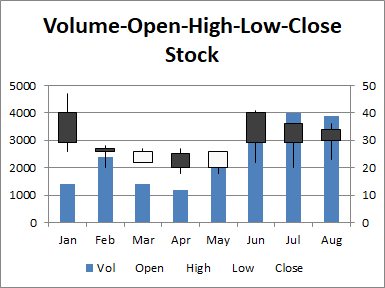

## **Possible Usage Scenarios**
The fourth stock chart we will look at is the Volume Open High Low Close chart. Again it is important to repeat that you must have the data in the correct order. If you need to rearrange your data table, you should do it before you set up your chart. This chart includes a column for volume immediately after the first (category) column, and the charts include a column chart on the primary axis showing this volume, while the prices are moved to the secondary axis.


## **Volume-Open-High-Low-Close (VHLC) stock chart**


## **Sample Code**
The following sample code loads the [sample Excel file](Volume-Open-High-Low-Close.xlsx) and generates the [output Excel file](out.xlsx).

```javascript
const path = require("path");
const AsposeCells = require("aspose.cells.node");

// The path to the documents directory.
const dataDir = path.join(__dirname, "data");
const filePath = path.join(dataDir, "Volume-Open-High-Low-Close.xlsx");

// Create an instance of Workbook
const workbook = new AsposeCells.Workbook(filePath);
// Access the first worksheet.
const worksheet = workbook.getWorksheets().get(0);
// Create High-Low-Close-Stock Chart
const pieIdx = worksheet.getCharts().add(AsposeCells.ChartType.StockVolumeOpenHighLowClose, 5, 6, 20, 12);
// Retrieve the Chart object
const chart = worksheet.getCharts().get(pieIdx);
// Set the legend can be showed
chart.setShowLegend(true);
// Set the chart title name 
chart.getTitle().setText("Volume-Open-High-Low-Close Stock");
// Set the Legend at the bottom of the chart area
chart.getLegend().setPosition(AsposeCells.LegendPositionType.Bottom);
// Set data range
chart.setChartDataRange("A1:F9", true);
// Set category data 
chart.getNSeries().setCategoryData("A2:A9");
// Set Color for the first series (Volume) data 
chart.getNSeries().get(0).getArea().setForegroundColor(new AsposeCells.Color(79, 129, 189));
// Fill the PlotArea area with nothing 
chart.getPlotArea().getArea().getFillFormat().setFillType(AsposeCells.FillType.None);
// Save the Excel file
workbook.save("out.xlsx");
```
