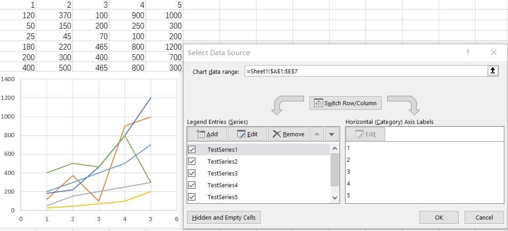
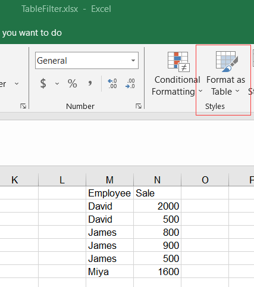

{}

## **1. Filtering out series to render a chart**

### **Steps to filter series from a chart in Excel**
In Excel, we can filter out specific series from a chart, causing those filtered series not to be displayed in the chart. The original chart is shown in **Figure 1**. However, when we filter out **Testseries2** and **Testseries4**, the chart will appear as shown in **Figure 2**.

In Aspose.Cells for Node.js via C++, we can perform a similar operation. For a [sample](seriesFiltered.xlsx) file like this, if we want to filter out **Testseries2** and **Testseries4**, we can execute the following code. Additionally, we will maintain two lists: one ([Chart.getNSeries()](https://reference.aspose.com/cells/nodejs-cpp/chart/#getNSeries--)) list to store all the selected series.




### **Sample Code**
The following sample code loads the [sample Excel file](seriesFiltered.xlsx).

```javascript
const path = require("path");
const AsposeCells = require("aspose.cells.node");

// The path to the documents directory.
const dataDir = path.join(__dirname, "data");
const filePath = path.join(dataDir, "seriesFiltered.xlsx");
// Create an instance of existing Workbook
let workbook = new AsposeCells.Workbook(filePath);
// Get filtered series list
let nSeriesFiltered = workbook.getWorksheets().get(0).getCharts().get("Chart 1").getFilteredNSeries();
// Get selected series list
let nSeries = workbook.getWorksheets().get(0).getCharts().get("Chart 1").getNSeries();
// Should be 0
console.log("Filtered Series count: " + nSeriesFiltered.getCount());
// Should be 6
console.log("Visible Series count: " + nSeries.getCount());
// Process from the end to the beginning
nSeries.get(1).setIsFiltered(true);
nSeries.get(0).setIsFiltered(true);
// Should be 2
console.log("Filtered Series count: " + nSeriesFiltered.getCount());
// Should be 4
console.log("Visible Series count: " + nSeries.getCount());
workbook.save("seriesFiltered-out.xlsx");
workbook = new AsposeCells.Workbook("seriesFiltered-out.xlsx");
// Should be 2
console.log("Filtered Series count: " + nSeriesFiltered.getCount());
// Should be 4
console.log("Visible Series count: " + nSeries.getCount());
```

## **2. Filter the data and let the chart change**

Filtering your data is a great way to handle chart filters with a lot of data. When you filter the data, the chart will change. One issue we're going to have to address is making sure the chart stays on the screen. When you filter, you get hidden rows, and occasionally, the chart will be in those hidden rows.


### **Steps to use Data Filters to change the chart in Excel**

1. Click inside your data range.
2. Click the **Data** tab, and turn on Filters by clicking Filters. Your header row will have drop down arrows.
3. Create a chart by going to **Insert** tab and selecting a columns chart.
4. Now filter your data using the drop down arrows in the data. Don't use the Chart Filters.

### **Sample Code**
The following sample code shows the same feature using Aspose.Cells.

```javascript
const path = require("path");
const AsposeCells = require("aspose.cells.node");

// The path to the documents directory.
const dataDir = path.join(__dirname, "data");
const filePath = path.join(dataDir, "sample.xlsx");
// Loads the workbook which contains hidden external links
const workbook = new AsposeCells.Workbook(filePath);

// Create an instance of Workbook
const sheet = workbook.getWorksheets().get("Sheet1");
// Add data into details cells.
sheet.getCells().get(0, 0).putValue("Fruits Name");
sheet.getCells().get(0, 1).putValue("Fruits Price");
sheet.getCells().get(1, 0).putValue("Apples");
sheet.getCells().get(2, 0).putValue("Bananas");
sheet.getCells().get(3, 0).putValue("Grapes");
sheet.getCells().get(4, 0).putValue("Oranges");
sheet.getCells().get(1, 1).putValue(5);
sheet.getCells().get(2, 1).putValue(2);
sheet.getCells().get(3, 1).putValue(1);
sheet.getCells().get(4, 1).putValue(4);
// Add a chart to the worksheet
const chartIndex = sheet.getCharts().add(AsposeCells.ChartType.Column, 7, 7, 15, 15);
// Access the instance of the newly added chart
const chart = sheet.getCharts().get(chartIndex);
// Set data range
chart.setChartDataRange("A1:B5", true);
// Set AutoFilter range
sheet.getAutoFilter().setRange("A1:B5");
// Add filters for a filter column.
sheet.getAutoFilter().addFilter(0, "Bananas");
sheet.getAutoFilter().addFilter(0, "Oranges");
// Apply the filters
sheet.getAutoFilter().refresh();
chart.toImage("Autofilter.png");
workbook.save("Autofilter.xlsx");
```

## **3. Filter the data using a Table and let the chart change**

Using a Table is similar to Method 2, using a range, but you have advantages with tables over ranges. When you change your range to a Table and add data, the chart automatically updates. With a range, you will have to change the data source.

### **Format as table in Excel**

Click inside your data and use **CTRL + T** or use the Home tab, **Format as Table**



### **Sample Code**
The following sample code loads the [sample Excel file](TableFilters.xlsx) shows the same feature using Aspose.Cells.

```javascript
const path = require("path");
const AsposeCells = require("aspose.cells.node");

// The path to the documents directory.
const dataDir = path.join(__dirname, "data");
const filePath = path.join(dataDir, "TableFilters.xlsx");
// Create a workbook.
const workbook = new AsposeCells.Workbook(filePath);
// Access first worksheet
const sheet = workbook.getWorksheets().get(0);
// Access the instance of the newly added chart
const chartIndex = sheet.getCharts().add(AsposeCells.Charts.ChartType.Column, 7, 7, 15, 15);
const chart = sheet.getCharts().get(chartIndex);
// Set data range
chart.setChartDataRange("A1:B7", true);
// Convert the chart to image
chart.toImage("TableFilters.before.png");
// Add a new List Object to the worksheet
const listObject = sheet.getListObjects().get(sheet.getListObjects().add("A1", "B7", true));
// Add default style to the table
listObject.setTableStyleType(AsposeCells.Tables.TableStyleType.TableStyleMedium10);
// Show Total
listObject.setShowTotals(false);
// Add filters for a filter column.
listObject.getAutoFilter().addFilter(0, "James");
// Apply the filters
listObject.getAutoFilter().refresh();
// After adding new value the chart will change
listObject.putCellValue(7, 0, "Me");
listObject.putCellValue(7, 1, 1000);
// Check the changed images
chart.toImage("TableFilters.after.png");
// Saving the Excel file
workbook.save("TableFilter.out.xlsx");
```
