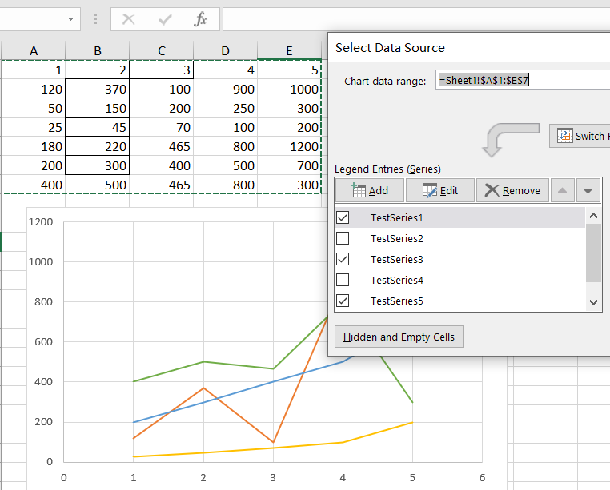
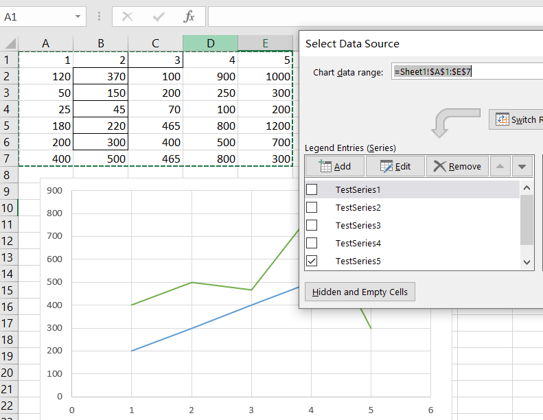

## How to set series invisible in Excel Chart

In an Excel chart, you can right‑click a chart, click **Select Data**, and in the pop‑up window, you can set whether a series is visible by checking or unchecking it. You can download the following [sample file](SeriesFiltered.xlsx) and work with it in Excel as shown in the figure to achieve this function. Next, we will show you how to achieve this using the Aspose.Cells library.



## How to set series invisible using Aspose.Cells 

We use the following code to set series invisible using Aspose.Cells:

```javascript
const path = require("path");
const AsposeCells = require("aspose.cells.node");

// The path to the documents directory.
const dataDir = path.join(__dirname, "data");
const filePath = path.join(dataDir, "SeriesFiltered.xlsx");
// Loads the workbook which contains hidden external links
const workbook = new AsposeCells.Workbook(filePath);

const charts = workbook.getWorksheets().get(0).getCharts();
const chart = charts.get("Chart 1");
const nSeriesFiltered = chart.getFilteredNSeries();
const nSeries = chart.getNSeries();
nSeries.get(1).setIsColorVaried(true);
nSeries.get(0).setIsColorVaried(true);
workbook.save(path.join(dataDir, "output.xlsx"));
```

You can download the following [input file](SeriesFiltered.xlsx) and [output file](output.xlsx).

As shown in the figure below, the first two series that were originally visible have become invisible in the output file.


