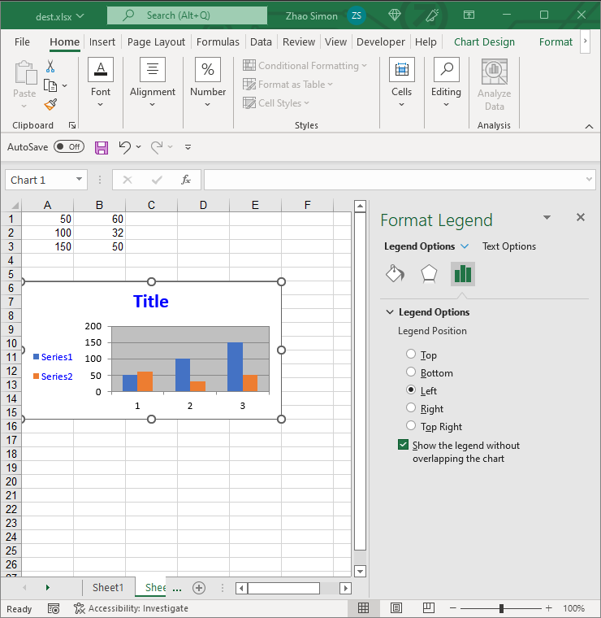

## **Legend Options**
Aspose.Cells for Node.js via C++ also allows managing a chart's legend at runtime. The [Legend](https://reference.aspose.com/cells/nodejs-cpp/legend/) object can be moved, updated, and formatted.

||

## **Setting the Legend of Chart**
It's simple to manage the legend of the chart with Aspose.Cells [Legend](https://reference.aspose.com/cells/nodejs-cpp/legend/).

The following code snippet demonstrates how to manage the legend:


```javascript
const path = require("path");
const AsposeCells = require("aspose.cells.node");

// The path to the documents directory.
const dataDir = path.join(__dirname, "data");
const filePath = path.join(dataDir, "sample.xlsx");

// Instantiating a Workbook object
const workbook = new AsposeCells.Workbook();

// Adding a new worksheet to the Workbook object
const sheetIndex = workbook.getWorksheets().add();

// Obtaining the reference of the newly added worksheet by passing its sheet index
const worksheet = workbook.getWorksheets().get(sheetIndex);

// Adding sample values to cells
worksheet.getCells().get("A1").putValue(50);
worksheet.getCells().get("A2").putValue(100);
worksheet.getCells().get("A3").putValue(150);
worksheet.getCells().get("B1").putValue(60);
worksheet.getCells().get("B2").putValue(32);
worksheet.getCells().get("B3").putValue(50);

// Adding a chart to the worksheet
const chartIndex = worksheet.getCharts().add(AsposeCells.ChartType.Column, 5, 0, 15, 5);

// Accessing the instance of the newly added chart
const chart = worksheet.getCharts().get(chartIndex);

// Adding SeriesCollection (chart data source) to the chart ranging from "A1" cell to "B3"
chart.getNSeries().add("A1:B3", true);

// Setting the title of a chart
chart.getTitle().setText("Title");

// Setting the font color of the chart title to blue
chart.getTitle().getFont().setColor(AsposeCells.Color.Blue);

// Move the legend to left
chart.getLegend().setPosition(AsposeCells.LegendPositionType.Left);

// Set font color of the legend
chart.getLegend().getFont().setColor(AsposeCells.Color.Blue);

// Save the file
workbook.save("chart_legend.xlsx");
```

## **Advance topics**
- [Set text of chart legend entry fill to none using Aspose.Cells](/cells/nodejs-cpp/set-text-of-chart-legend-entry-fill-to-none-using-aspose-cells/)
