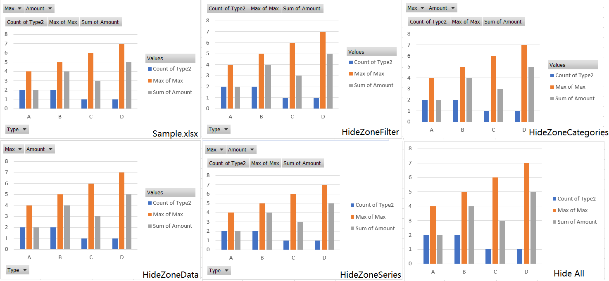

## What is PivotChart

A PivotChart in Excel is a graphical representation of data created from a PivotTable. It allows users to visualize and analyze data dynamically by summarizing and displaying information in chart form. PivotCharts are interactive and can be easily modified to show different perspectives of the data, making it a powerful tool for data analysis and presentation in Excel.

## How to manage PivotChart with PivotOptions

By using Aspose.Cells for Node.js via C++, you can use [**PivotOptions**](https://reference.aspose.com/cells/nodejs-cpp/pivotoptions/) to manage PivotChart.

Sample file and code:
[Sample File](Sample.xlsx)

```javascript
const path = require("path");
const AsposeCells = require("aspose.cells.node");

// The path to the documents directory.
const dataDir = path.join(__dirname, "data");
const filePath = path.join(dataDir, "Sample.xlsx");
// Loads the workbook which contains hidden external links
const workbook = new AsposeCells.Workbook(filePath);
const chart = workbook.getWorksheets().get(0).getCharts().get(0);
const opt = chart.getPivotOptions();

// Hide ZoneFilter in PivotChart
opt.setDropZoneFilter(false); // HideZoneFilter

// You can set more properties, try them!
// opt.setDropZoneCategories(false); // HideZoneCategories
// opt.setDropZoneData(false); // HideZoneData
// opt.setDropZoneSeries(false); // HideZoneSeries
// opt.setDropZonesVisible(false); // Hide All

// Save the file and see the effect.
workbook.save(path.join(dataDir, "HideZoneFilter.xlsx"));
```

With the example code above, you can check the result file with the following effect, as shown in the figure:

****
