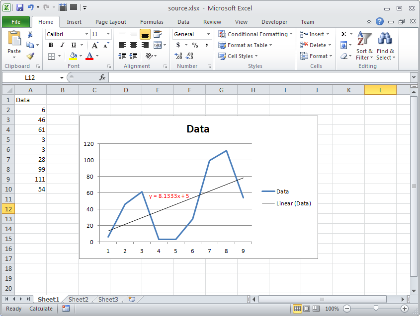

{}

You can retrieve the equation text of a chart trendline using Aspose.Cells for Node.js via C++. Aspose.Cells provides the [**DataLabels.getText()**](https://reference.aspose.com/cells/nodejs-cpp/datalabels/#getText--) property, which returns the equation text of the chart trendline. To make use of this property, you must first call the [**Chart.calculate()**](https://reference.aspose.com/cells/nodejs-cpp/chart/#calculate--) method.

{}

The following screenshot shows the chart with a trendline, and its equation text is shown in red. We will retrieve this text using the [**DataLabels.getText()**](https://reference.aspose.com/cells/nodejs-cpp/datalabels/#getText--) property in the sample code below.



## Node.js code to get equation text of chart trendline

```javascript
const path = require("path");
const AsposeCells = require("aspose.cells.node");

// The path to the documents directory.
const dataDir = path.join(__dirname, "data");
// Create workbook object from source Excel file
const workbook = new AsposeCells.Workbook(path.join(dataDir, "source.xlsx"));

// Access the first worksheet
const worksheet = workbook.getWorksheets().get(0);

// Access the first chart inside the worksheet
const chart = worksheet.getCharts().get(0);

// Calculate the chart first to get the equation text of the trendline
chart.calculate();

// Access the trendline
const trendLine = chart.getNSeries().get(0).getTrendLines().get(0);

// Read the equation text of the trendline
console.log("Equation Text: " + trendLine.getDataLabels().getText());
```

## Output generated by the sample code

This is the console output of the above sample code.


Equation Text: y = 8.1333x + 5


