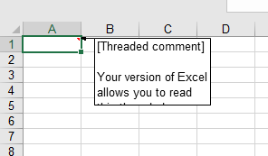
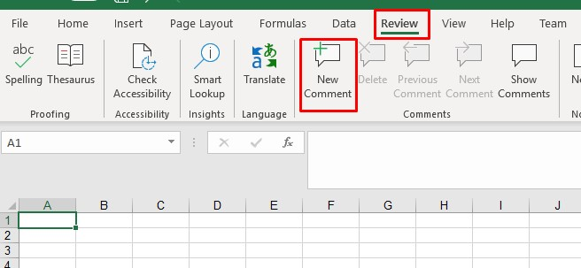
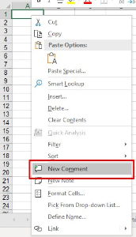

---  
title: Threaded Comments with Node.js via C++  
linktitle: Threaded Comments  
type: docs  
weight: 140  
url: /nodejs-cpp/threaded-comments/  
description: Manage threaded comments in Excel documents using Aspose.Cells for Node.js via C++. Learn to add, read, edit, and remove threaded comments.  
---  
  
## **Threaded Comments**  
  
MS Excel 365 provides a feature to add threaded comments. These comments work as conversations and can be used for discussions. The comments now come with a Reply box that allows for threaded conversations. The old comments are called Notes in Excel 365. The screenshot below shows how threaded comments are displayed when opened in Excel.  
  
  
  
Threaded comments are shown like this in older versions of Excel. The following images have been taken by opening the sample file in Excel 2016.  
  
  
  
  
  
Aspose.Cells also provides the feature to manage threaded comments.  
  
## **Add Threaded Comments**  
  
### **Add Threaded comment with Excel**  
  
To add threaded comments in Excel 365, follow the following steps.  
  
- Method 1  
  - Click the **Review** Tab  
  - Click the **New Comment** button  
  - This will open a dialogue to enter comments in the active cell.  
  -   
- Method 2  
  - Right click on the cell where you want to insert the comment.  
  - Click the **New Comment** option.  
  - This will open a dialogue to enter comments in the active cell.  
  -   
  
### **Add Threaded Comment using Aspose.Cells**  
  
Aspose.Cells provides [**Comments.AddThreadedComment**](https://reference.aspose.com/cells/nodejs-cpp/commentcollection/#addthreadedcomment-string-string-ThreadedCommentAuthor-) method to add threaded comments. The [**Comments.AddThreadedComment**](https://reference.aspose.com/cells/nodejs-cpp/commentcollection/#addthreadedcomment-string-string-ThreadedCommentAuthor-) method accepts the following three parameters.  
  
- Cell Name: The name of the cell where the comment will be inserted.  
- Comment Text: The text of the comment.  
- [**ThreadedCommentAuthor**](https://reference.aspose.com/cells/nodejs-cpp/threadedcommentauthor): The author of the comment  
  
The following code sample demonstrates the use of [**Comments.AddThreadedComment**](https://reference.aspose.com/cells/nodejs-cpp/commentcollection/#addthreadedcomment-string-string-ThreadedCommentAuthor-) method to add a threaded comment to cell A1. Please see the [output Excel file](89849859.xlsx) generated by the code for reference.  
  
#### **Sample Code**  
  
```javascript
const path = require("path");
const AsposeCells = require("aspose.cells.node");

// Source directory
const outDir = path.join(__dirname, "output");

const workbook = new AsposeCells.Workbook();

// Add Author
const authorIndex = workbook.getWorksheets().getThreadedCommentAuthors().add("Aspose Test", "", "");
const author = workbook.getWorksheets().getThreadedCommentAuthors().get(authorIndex);

// Add Threaded Comment
workbook.getWorksheets().get(0).getComments().addThreadedComment("A1", "Test Threaded Comment", author);

workbook.save(outDir + "AddThreadedComments_out.xlsx");
```  
  
## **Read Threaded Comments**  
  
### **Read Threaded comments with Excel**  
  
To read threaded comments in Excel, simply hover your mouse over the cell containing comments to view the comments. The comments view will look like the view in the following image.  
  
  
  
### **Read Threaded comments using Aspose.Cells**  
  
Aspose.Cells provides [**Comments.GetThreadedComments**](https://reference.aspose.com/cells/nodejs-cpp/commentcollection/#getthreadedcomments-string-) method to retrieve threaded comments for the specified column. [**Comments.GetThreadedComments**](https://reference.aspose.com/cells/nodejs-cpp/commentcollection/#getthreadedcomments-string-) method accepts the column name as a parameter and returns the [**ThreadedCommentCollection**](https://reference.aspose.com/cells/nodejs-cpp/threadedcommentcollection). You can iterate over the [**ThreadedCommentCollection**](https://reference.aspose.com/cells/nodejs-cpp/threadedcommentcollection) to view the comments.  
  
The following example demonstrates reading comments from column A1 by loading the [sample Excel File](89849861.xlsx). Please see the console output generated by the code for reference.  
  
#### **Sample Code**  
  
```javascript
const path = require("path");
const AsposeCells = require("aspose.cells.node");

// Source directory
const sourceDir = path.join(__dirname, "data"); // Adjust as necessary

const filePath = path.join(sourceDir, "ThreadedCommentsSample.xlsx");

// Loads the workbook which contains threaded comments
const workbook = new AsposeCells.Workbook(filePath);

// Access first worksheet
const worksheet = workbook.getWorksheets().get(0);

// Get Threaded Comments
const threadedComments = worksheet.getComments().getThreadedComments("A1");

const count = threadedComments.getCount();
for (let i = 0; i < count; i++) {
const comment = threadedComments.get(i);
console.log("Comment: " + comment.getNotes());
console.log("Author: " + comment.getAuthor().getName());
}
```  
  
#### **Console Output**  
  
  
  
Comment: Test Threaded Comment  
  
Author: Aspose Test  
  
  
  
### **Read Created Time of threaded comments**  
  
Aspose.Cells provides [**Comments.GetThreadedComments**](https://reference.aspose.com/cells/nodejs-cpp/commentcollection/#getthreadedcomments-string-) method to retrieve threaded comments for the specified column. [**Comments.GetThreadedComments**](https://reference.aspose.com/cells/nodejs-cpp/commentcollection/#getthreadedcomments-string-) method accepts the column name as a parameter and returns the [**ThreadedCommentCollection**](https://reference.aspose.com/cells/nodejs-cpp/threadedcommentcollection). You can iterate over the [**ThreadedCommentCollection**](https://reference.aspose.com/cells/nodejs-cpp/threadedcommentcollection) and use the [**ThreadedComment.getCreatedTime()**](https://reference.aspose.com/cells/nodejs-cpp/threadedcomment/#getCreatedTime--) property.  
  
The following example demonstrates reading the created time of threaded comments by loading the [sample Excel File](89849861.xlsx). Please see the console output generated by the code for reference.  
  
#### **Sample Code**  
  
```javascript
const path = require("path");
const AsposeCells = require("aspose.cells.node");

// Source directory
const sourceDir = path.join(__dirname, "data");
const filePath = path.join(sourceDir, "ThreadedCommentsSample.xlsx");

// Loads the workbook
const workbook = new AsposeCells.Workbook(filePath);

// Access first worksheet
const worksheet = workbook.getWorksheets().get(0);

// Get Threaded Comments
const threadedComments = worksheet.getComments().getThreadedComments("A1");

const count = threadedComments.getCount();

for (let i = 0; i < count; i++) {
const comment = threadedComments.get(i);
console.log("Comment: " + comment.getNotes());
console.log("Author: " + comment.getAuthor().getName());
console.log("Created Time: " + comment.getCreatedTime());
}
```  
  
#### **Console Output**  
  
  
  
Comment: Test Threaded Comment  
  
Author: Aspose Test  
  
Created Time: 5/15/2019 12:46:23 PM  
  
  
  
## **Edit Threaded Comments**  
  
### **Edit Threaded comment with Excel**  
  
To edit a threaded comment in Excel, click the **Edit** link on the comment as shown in the following image.  
  
  
  
### **Edit Threaded comment using Aspose.Cells**  
  
Aspose.Cells provides [**Comments.GetThreadedComments**](https://reference.aspose.com/cells/nodejs-cpp/commentcollection/#getthreadedcomments-string-) method to retrieve threaded comments for the specified column. [**Comments.GetThreadedComments**](https://reference.aspose.com/cells/nodejs-cpp/commentcollection/#getthreadedcomments-string-) method accepts the column name as a parameter and returns the [**ThreadedCommentCollection**](https://reference.aspose.com/cells/nodejs-cpp/threadedcommentcollection). You can update the required comment in the [**ThreadedCommentCollection**](https://reference.aspose.com/cells/nodejs-cpp/threadedcommentcollection) and save the workbook.  
  
The following example demonstrates editing the first threaded comment in column A1 by loading the [sample Excel File](89849861.xlsx). Please see the [output Excel file](89849862.xlsx) generated by the code showing the updated comment for reference.  
  
#### **Sample Code**  
  
```javascript
const path = require("path");
const AsposeCells = require("aspose.cells.node");

// Source and output directories
const sourceDir = path.join(__dirname, "data");
const outDir = path.join(__dirname, "output");

const filePath = path.join(sourceDir, "ThreadedCommentsSample.xlsx");
const workbook = new AsposeCells.Workbook(filePath);

// Access first worksheet
const worksheet = workbook.getWorksheets().get(0);

// Get Threaded Comment
const comment = worksheet.getComments().getThreadedComments("A1").get(0);
comment.setNotes("Updated Comment");

workbook.save(outDir + "EditThreadedComments.xlsx");
```  
  
## **Remove Threaded Comments**  
  
### **Remove Threaded comments with Excel**  
  
To remove threaded comments in Excel, right click on the cell containing the comments and click the **Delete Comment** option as shown in the following image.  
  
   

  
