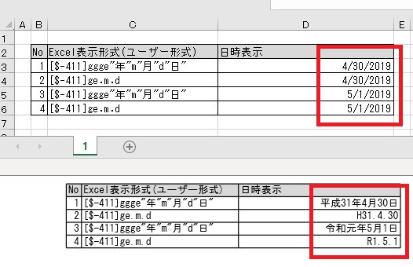

---  
title: Convert Dates to Japanese Dates with Node.js via C++  
linktitle: Convert Dates to Japanese Dates  
type: docs  
weight: 350  
url: /nodejs-cpp/convert-dates-to-japanese-dates/  
description: Learn how to convert Gregorian dates to Japanese dates using Aspose.Cells for Node.js via C++.  
ai_search_scope: cells_nodejscpp
ai_search_endpoint: "https://docsearch.api.aspose.cloud/ask"
---  

{}  

In the Japanese Calendar, a new era begins with the reign of a new emperor. On 1st May 2019, a new emperor came into power, ending the Heisei era and beginning the Reiwa era.  

{}  

Aspose.Cells provides a way to convert Gregorian dates to Japanese dates. During this conversion, the changes in the era are also considered. The following code snippet converts the [source Excel](90112015.xlsx) file containing Gregorian dates to the [output PDF](90112016.pdf) with Japanese dates as shown in the image below.  

  

```javascript
const path = require("path");
const AsposeCells = require("aspose.cells.node");

// Source directory
const sourceDir = path.join(__dirname, "data");

// Output directory
const outputDir = path.join(__dirname, "output");

const options = new AsposeCells.LoadOptions(AsposeCells.LoadFormat.Xlsx);
options.setLanguageCode(AsposeCells.CountryCode.Japan);
options.setRegion(AsposeCells.CountryCode.Japan);

const workbook = new AsposeCells.Workbook(path.join(sourceDir, "JapaneseDates.xlsx"), options);
workbook.save(outputDir + "JapaneseDates.pdf", AsposeCells.SaveFormat.Pdf);
```  


