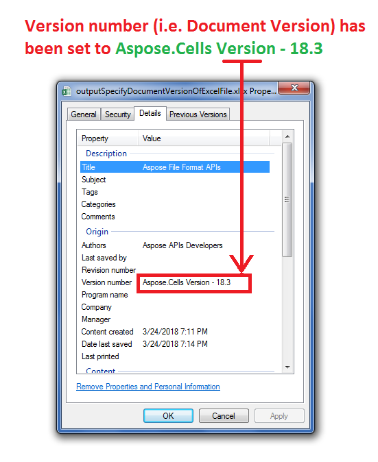

---  
title: Specify Document Version of the Excel File using BuiltIn Document Properties with Node.js via C++  
linktitle: Specify Document Version of the Excel File using BuiltIn Document Properties  
type: docs  
weight: 20  
url: /nodejs-cpp/specify-document-version-of-the-excel-file-using-builtin-document-properties/  
description: Learn how to specify the document version of an Excel file programmatically using built-in document properties with Node.js via C++.  
---  

## **Possible Usage Scenarios**  

You can change the **Version number** of an Excel file by right-clicking the file and then selecting Properties > Details and then editing the **Version number** field. Please use [**BuiltInDocumentPropertyCollection.getDocumentVersion()**](https://reference.aspose.com/cells/nodejs-cpp/builtindocumentpropertycollection/#getDocumentVersion--) property to change it programmatically using Aspose.Cells APIs.  

## **Specify Document Version of the Excel File using BuiltIn Document Properties**  

The following sample code creates a workbook and changes its built-in document properties that include Title, Authors, and Version number. Please see the [output Excel file](64716811.xlsx) generated by the code and screenshot that shows the modified Version number by [**BuiltInDocumentPropertyCollection.getDocumentVersion()**](https://reference.aspose.com/cells/nodejs-cpp/builtindocumentpropertycollection/#getDocumentVersion--) property.  

  

## **Sample Code**  

```javascript
const path = require("path");
const AsposeCells = require("aspose.cells.node");

// The path to the documents directory.
const dataDir = path.join(__dirname, "data");
const filePath = path.join(dataDir, "outputSpecifyDocumentVersionOfExcelFile.xlsx");

// Create workbook object
const wb = new AsposeCells.Workbook();

// Access built-in document property collection
const bdpc = wb.getBuiltInDocumentProperties();

// Set the title
bdpc.setTitle("Aspose File Format APIs");

// Set the author
bdpc.setAuthor("Aspose APIs Developers");

// Set the document version
bdpc.setDocumentVersion("Aspose.Cells Version - 18.3");

// Save the workbook in xlsx format
wb.save(filePath, AsposeCells.SaveFormat.Xlsx);
```  
  