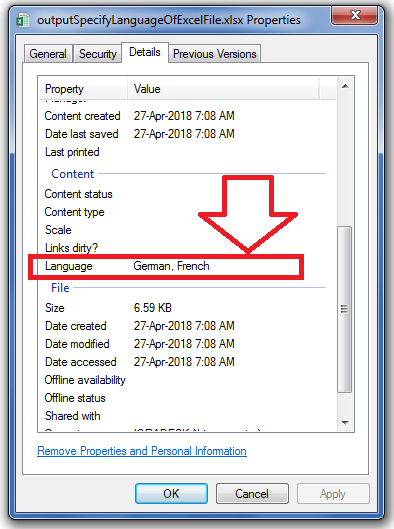

## **Possible Usage Scenarios**

You can change the language of an Excel file by right‑clicking the file, selecting **Properties > Details**, and editing the Language field. Please use [**BuiltInDocumentPropertyCollection.getLanguage()**](https://reference.aspose.com/cells/nodejs-cpp/builtindocumentpropertycollection/#getLanguage--) to change it programmatically using Aspose.Cells for Node.js via C++ APIs.

## **Specify the Language of the Excel File using BuiltIn Document Properties**

The following sample code creates a workbook and changes its built‑in document property named **Language**. Please see the [output Excel file](64716891.xlsx) generated by the code and the screenshot that shows the modified Language field using the [**BuiltInDocumentPropertyCollection.getLanguage()**](https://reference.aspose.com/cells/nodejs-cpp/builtindocumentpropertycollection/#getLanguage--) property.



## **Sample Code**

```javascript
const path = require("path");
const AsposeCells = require("aspose.cells.node");

// The path to the documents directory.
const dataDir = path.join(__dirname, "data");
const outputDir = path.join(__dirname, "output");

// Create workbook object.
const wb = new AsposeCells.Workbook();

// Access built‑in document property collection.
const bdpc = wb.getBuiltInDocumentProperties();

// Set the language of the Excel file.
bdpc.setLanguage("German, French");

// Save the workbook in xlsx format.
wb.save(
    path.join(outputDir, "outputSpecifyLanguageOfExcelFileUsingBuiltInDocumentProperties.xlsx"),
    AsposeCells.SaveFormat.Xlsx
);
```

