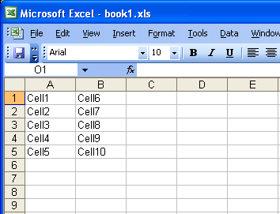

---  
title: Move Range of Cells in a Worksheet with Node.js via C++  
linktitle: Move Range of Cells in a Worksheet  
type: docs  
weight: 370  
url: /nodejs-cpp/move-range-of-cells-in-a-worksheet/  
description: Learn how to move a range of cells in a worksheet using Aspose.Cells for Node.js via C++.  
---  

{}  
This article shows how to move a range of cells in a worksheet.  
{}  

## **Move Range of Cells in a Worksheet**  
The example code uses a template file to demonstrate the task.  

**The input file**  

  

Please see the following generated file with range A1:B5 moved to C1:D5.  

**The output file**  

  

```javascript
const path = require("path");
const AsposeCells = require("aspose.cells.node");

// The path to the documents directory.
const dataDir = path.join(__dirname, "data");
const filePath = path.join(dataDir, "book1.xlsx");
// Instantiate the workbook object. Open the Excel file
const workbook = new AsposeCells.Workbook(filePath);

const cells = workbook.getWorksheets().get(0).getCells();

const range = cells.createRange("A1", "B5");
//move the range to right.
range.moveTo(0, 2);
```  
  
