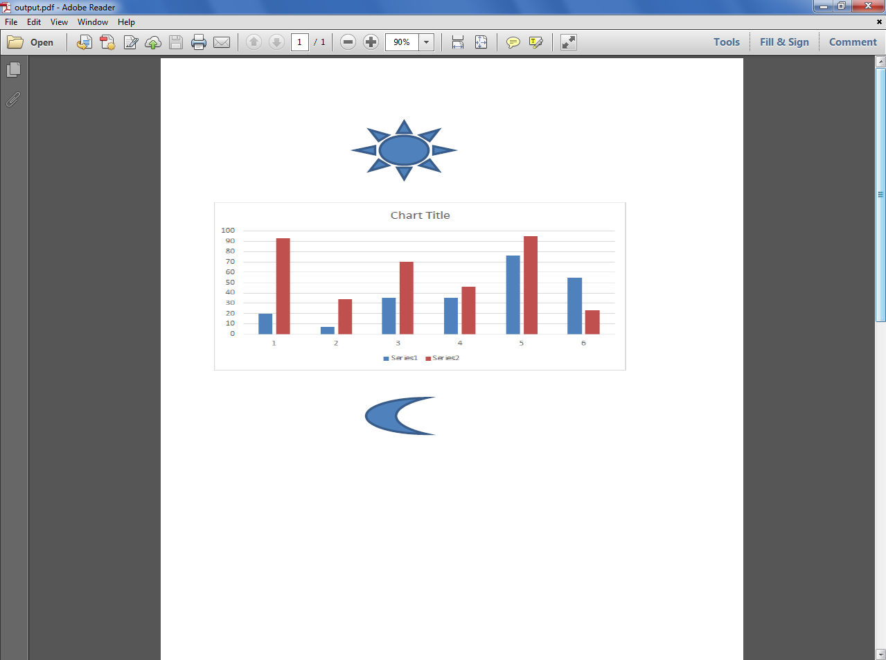

---  
title: Filtering the kind of data while loading the workbook from template file with Node.js via C++  
linktitle: Filtering the kind of data while loading the workbook from template file  
type: docs  
weight: 400  
url: /nodejs-cpp/filtering-the-kind-of-data-while-loading-the-workbook-from-template-file/  
---  

{}  
Sometimes, you want to specify which kind of data should be loaded when building the workbook from the template file. Filtering loaded data can improve the performance for your special purpose, especially when using [LightCells APIs](/cells/nodejs-cpp/using-lightcells-api/). Please use the [**LoadOptions.loadFilter**](https://reference.aspose.com/cells/nodejs-cpp/loadoptions/#loadFilter) property for this purpose.  
{}  

The following sample code loads only shape objects while loading the workbook from the [template file](5115552.xlsx) which you can download from the given link. The following screenshot shows the [template file](5115552.xlsx) contents and also explains that the data in Red color and Yellow background will not be loaded because [**LoadOptions.loadFilter**](https://reference.aspose.com/cells/nodejs-cpp/loadoptions/#loadFilter) property has been set to [**LoadDataFilterOptions.Shape**](https://reference.aspose.com/cells/nodejs-cpp/loaddatafilteroptions/#Shape)  

  

The following screenshot shows the [output PDF](5115555.pdf) which you can download from the given link. Here you can see, the data in Red color and Yellow background is not present but all shapes are there.  

  

```javascript
const path = require("path");
const AsposeCells = require("aspose.cells.node");

// Source directory
const sourceDir = RunExamples.Get_SourceDirectory();

// Output directory
const outputDir = RunExamples.Get_OutputDirectory();

// Set the load options, we only want to load shapes and do not want to load data
const loadOptions = new AsposeCells.LoadOptions(AsposeCells.LoadFormat.Xlsx);
loadOptions.setLoadFilter(AsposeCells.LoadDataFilterOptions.All & ~AsposeCells.LoadDataFilterOptions.Chart);

// Create workbook object from sample excel file using load options
const workbook = new AsposeCells.Workbook(path.join(sourceDir, "sampleFilterChars.xlsx"), loadOptions);

// Save the output in pdf format
workbook.save(path.join(outputDir, "sampleFilterChars_out.pdf"), AsposeCells.SaveFormat.Pdf);
```  
  