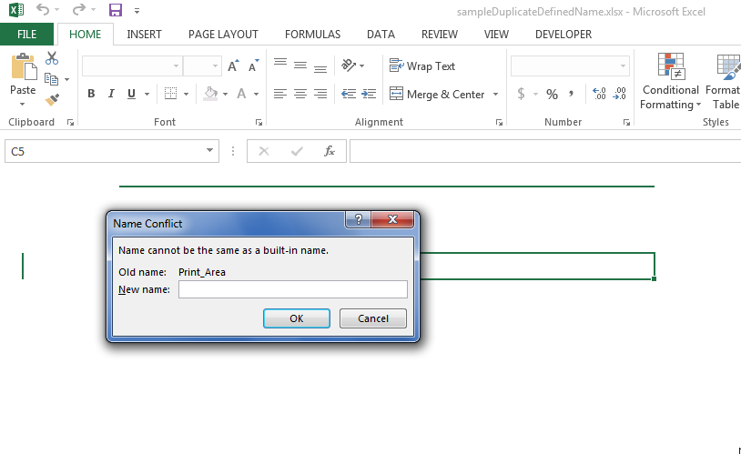

## **Possible Usage Scenarios**

Sometimes the user tries to load a workbook which is somewhat corrupt but loadable. In such cases, Aspose.Cells throws warnings while loading the workbook. You can catch these warnings by implementing the [**IWarningCallback**](https://reference.aspose.com/cells/nodejs-cpp/iwarningcallback) interface and setting the [**LoadOptions.getWarningCallback()**](https://reference.aspose.com/cells/nodejs-cpp/loadoptions/#getWarningCallback--) property.

## **Get Warnings while Loading Excel File**

The following sample code explains how to get warnings while loading an Excel file. The code loads the [sample excel file](sampleDuplicateDefinedName.xlsx) which throws a [**DuplicateDefinedName**](https://reference.aspose.com/cells/nodejs-cpp/warningtype) warning on loading. This warning is then caught by the [**IWarningCallback.warning(WarningInfo)**](https://reference.aspose.com/cells/nodejs-cpp/iwarningcallback/#warning-warninginfo-) method that prints the warning messages on the console. The code then saves the workbook as [output excel file](outputDuplicateDefinedName.xlsx). If you open the sample excel file in Microsoft Excel, it will also display this warning as shown in this screenshot. Please also check the console output of the code given below for more understanding.



## **Sample Code**

```javascript
const AsposeCells = require("aspose.cells.node");
const path = require("path");

// Implement IWarningCallback interface to catch warnings while loading workbook
class WarningCallback extends AsposeCells.IWarningCallback {
    warning(warningInfo) {
        if (warningInfo.getType() === AsposeCells.WarningType.DuplicateDefinedName) {
            console.log("Duplicate Defined Name Warning: " + warningInfo.getDescription());
        }
    }
}

// The path to the documents directory.
const dataDir = path.join(__dirname, "data");

// Create load options and set the WarningCallback property 
// to catch warnings while loading workbook
const options = new AsposeCells.LoadOptions();
options.setWarningCallback(new WarningCallback());

// Load the source excel file
const book = new AsposeCells.Workbook(path.join(dataDir, "sampleDuplicateDefinedName.xlsx"), options);

// Save the workbook 
book.save(path.join(dataDir, "outputDuplicateDefinedName.xlsx"));
```

## **Console Output**

Here is the console output of the above code when executed with the provided [sample excel file](sampleDuplicateDefinedName.xlsx).



Duplicate Defined Name Warning: Name:PRINT_AREA;ReferTo:Introduction!$D$16:$D$17

Duplicate Defined Name Warning: Name:PRINT_AREA;ReferTo:Panel!$B$228

Duplicate Defined Name Warning: Name:PRINT_AREA;ReferTo:'Queries '!$D$14:$D$16


