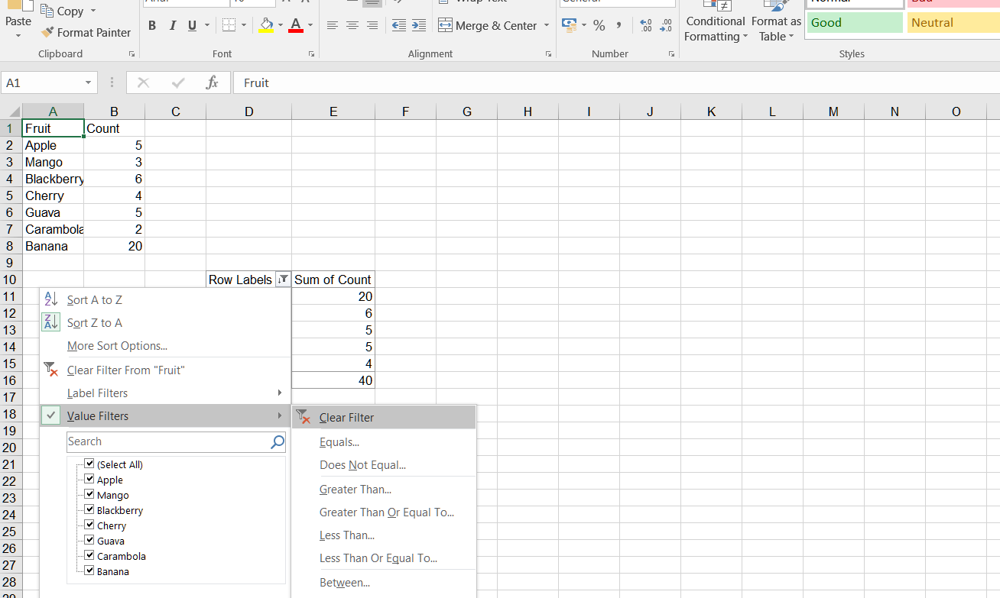
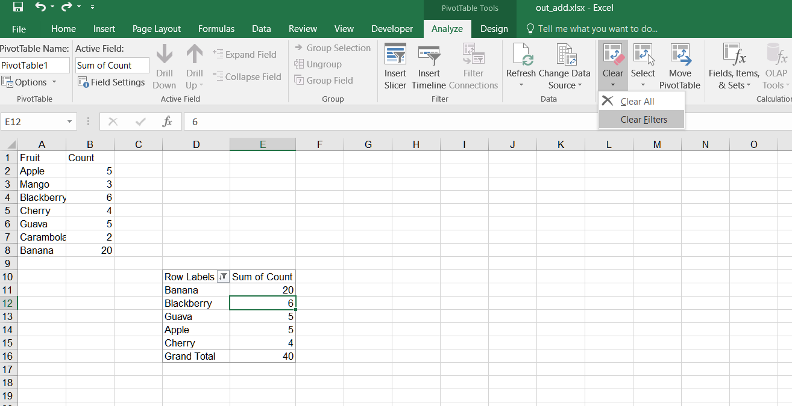

## **Possible Usage Scenarios**
When you create a pivot table with known data and want to filter the pivot table, you need to learn to use filters. It can help you filter the data you want effectively. By using the Aspose.Cells for Node.js via C++ API, you can operate filters on field values in Pivot Tables. 

## **How to Clear filter in Pivot Table in Excel**
To clear a filter in a PivotTable in Excel, follow these steps:

1. Select the PivotTable from which you want to clear the filter. 
2. Click on the drop‑down arrow for the filter you want to clear in the pivot table.
3. Select **Clear Filter** from the drop‑down menu.  
   
4. If you want to clear all filters from the pivot table, you can also click on the **Clear Filters** button in the **PivotTable Analyze** tab on the ribbon in Excel.  
   

## **How to Clear filter in Pivot Table Using Aspose.Cells for Node.js via C++**
Clear filter in a PivotTable using Aspose.Cells for Node.js via C++. Please see the following sample code.  
1. Set the data and create a PivotTable based on it.  
2. Add a filter on the row field of the pivot table.  
3. Save the workbook in [output XLSX](out_add.xlsx) format. After executing the example code, a pivot table with a Top10 filter is added to the worksheet.  
4. Clear the filter on a specific **PivotField**. After executing the code to clear the filter, the filter on the specific PivotField will be cleared. Please check the [output XLSX](out_delete.xlsx).

## **Sample Code**


