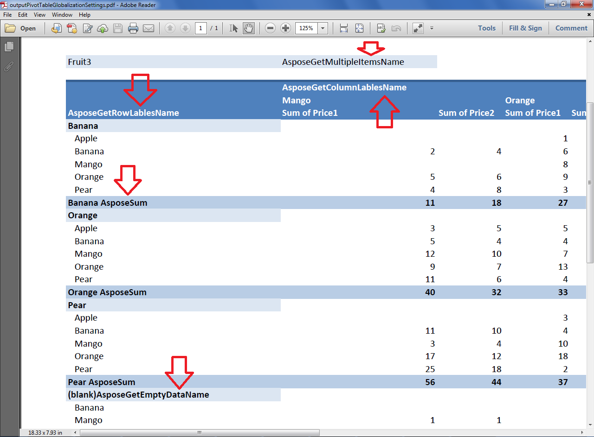

## **Possible Usage Scenarios**

Sometimes you want to customize the *Pivot Total, Sub Total, Grand Total, All Items, Multiple Items, Column Labels, Row Labels, Blank Values* text as per your requirements. Aspose.Cells for Node.js via C++ allows you to customize the globalization settings of the pivot table to deal with such scenarios. You can also use this feature to change the labels to other languages like Arabic, Hindi, Polish, etc.

## **Customize Globalization Settings for Pivot Table**

The following sample code explains how to customize globalization settings for the pivot table. It creates a class *CustomPivotTableGlobalizationSettings* derived from a base class [**PivotGlobalizationSettings**](https://reference.aspose.com/cells/nodejs-cpp/pivotglobalizationsettings/) and overrides all of its necessary methods. These methods return the customized text for the *Pivot Total, Sub Total, Grand Total, All Items, Multiple Items, Column Labels, Row Labels, Blank Values*. Then it assigns the object of this class to [**WorkbookSettings.getPivotSettings()**](https://reference.aspose.com/cells/nodejs-cpp/globalizationsettings/#getPivotSettings--) property. The code loads the [source excel file](40468488.xlsx) that contains the pivot table, refreshes and calculates its data and saves it as [output PDF](40468487.pdf) file. The following screenshot shows the effect of the sample code on the output PDF. As you can see in the screenshot, different parts of the pivot table have now a customized text returned by the overridden methods of [**PivotGlobalizationSettings**](https://reference.aspose.com/cells/nodejs-cpp/pivotglobalizationsettings/) class.



## **Sample Code**

```javascript
const path = require("path");
const AsposeCells = require("aspose.cells.node");

class CustomPivotTableGlobalizationSettings extends AsposeCells.PivotGlobalizationSettings {
// Gets the name of "Total" label in the PivotTable.
getTextOfTotal() {
console.log("---------GetPivotTotalName-------------");
return "AsposeGetPivotTotalName";
}

// Gets the name of "Grand Total" label in the PivotTable.
getTextOfGrandTotal() {
console.log("---------GetPivotGrandTotalName-------------");
return "AsposeGetPivotGrandTotalName";
}

// Gets the name of "(Multiple Items)" label in the PivotTable.
getTextOfMultipleItems() {
console.log("---------GetMultipleItemsName-------------");
return "AsposeGetMultipleItemsName";
}

// Gets the name of "(All)" label in the PivotTable.
getTextOfAll() {
console.log("---------GetAllName-------------");
return "AsposeGetAllName";
}

// Gets the name of "Column Labels" label in the PivotTable.
getTextOfColumnLabels() {
console.log("---------GetColumnLabelsOfPivotTable-------------");
return "AsposeGetColumnLabelsOfPivotTable";
}

// Gets the name of "Row Labels" label in the PivotTable.
getTextOfRowLabels() {
console.log("---------GetRowLabelsNameOfPivotTable-------------");
return "AsposeGetRowLabelsNameOfPivotTable";
}

// Gets the name of "(blank)" label in the PivotTable.
getTextOfEmptyData() {
console.log("---------GetEmptyDataName-------------");
return "(blank)AsposeGetEmptyDataName";
}

// Gets the name of PivotFieldSubtotalType type in the PivotTable.
getTextOfSubTotal(subTotalType) {
console.log("---------GetSubTotalName-------------");

switch (subTotalType) {
case AsposeCells.PivotFieldSubtotalType.Sum:
return "AsposeSum";

case AsposeCells.PivotFieldSubtotalType.Count:
return "AsposeCount";

case AsposeCells.PivotFieldSubtotalType.Average:
return "AsposeAverage";

case AsposeCells.PivotFieldSubtotalType.Max:
return "AsposeMax";

case AsposeCells.PivotFieldSubtotalType.Min:
return "AsposeMin";

case AsposeCells.PivotFieldSubtotalType.Product:
return "AsposeProduct";

case AsposeCells.PivotFieldSubtotalType.CountNums:
return "AsposeCount";

case AsposeCells.PivotFieldSubtotalType.Stdev:
return "AsposeStdDev";

case AsposeCells.PivotFieldSubtotalType.Stdevp:
return "AsposeStdDevp";

case AsposeCells.PivotFieldSubtotalType.Var:
return "AsposeVar";

case AsposeCells.PivotFieldSubtotalType.Varp:
return "AsposeVarp";
}

return "AsposeSubTotalName";
}
}

async function run() {
// The path to the documents directory.
const dataDir = path.join(__dirname, "data");

// Load your excel file
const workbook = new AsposeCells.Workbook(path.join(dataDir, "samplePivotTableGlobalizationSettings.xlsx"));

workbook.getSettings().setGlobalizationSettings(new AsposeCells.GlobalizationSettings());

// Setting Custom Pivot Table Globalization Settings
workbook.getSettings().getGlobalizationSettings().setPivotSettings(new CustomPivotTableGlobalizationSettings());

// Hide first worksheet that contains the data of the pivot table
workbook.getWorksheets().get(0).setIsVisible(false);

// Access second worksheet
const ws = workbook.getWorksheets().get(1);

// Access the pivot table, refresh and calculate its data
const pt = ws.getPivotTables().get(0);
pt.setRefreshDataFlag(true);
pt.refreshData();
pt.calculateData();
pt.setRefreshDataFlag(false);

// Pdf save options - save entire worksheet on a single pdf page
const options = new AsposeCells.PdfSaveOptions();
options.setOnePagePerSheet(true);

// Save the output pdf 
workbook.save(path.join(dataDir, "outputPivotTableGlobalizationSettings.pdf"), options);
}

run().catch(console.error);
```
