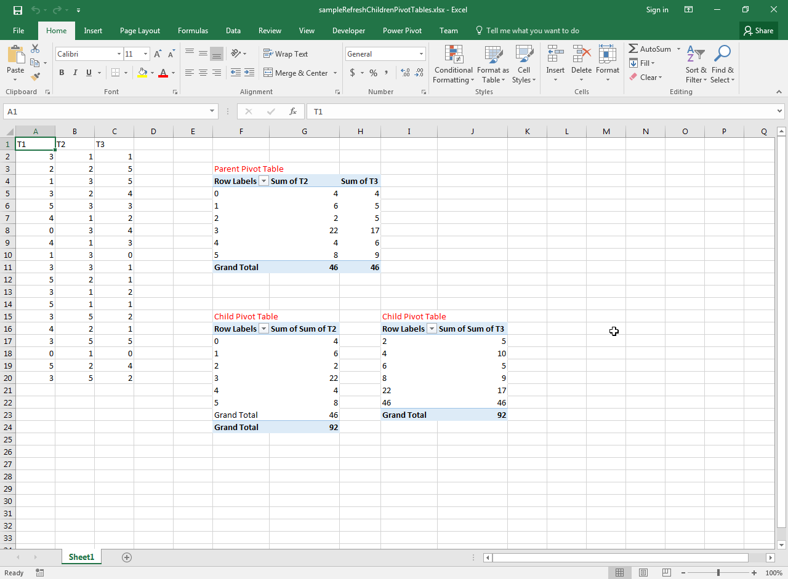

## **Possible Usage Scenarios**

Sometimes, one pivot table uses another pivot table as a data source, so it is called a child pivot table or nested pivot table. You can find the children pivot tables of a parent pivot table using the [**PivotTable.getChildren()**](https://reference.aspose.com/cells/nodejs-cpp/pivottable/#getChildren--) method.

## **How to Find and Refresh the Nested or Children Pivot Tables of Parent Pivot Table**

The following sample code loads the [sample Excel file](61767747.xlsx) that contains three pivot tables. The bottom two pivot tables are the children of the above pivot table as shown in this screenshot. The code finds the children pivot table using the [**PivotTable.getChildren()**](https://reference.aspose.com/cells/nodejs-cpp/pivottable/#getChildren--) method and then refreshes them one by one.

## **Sample Code**


