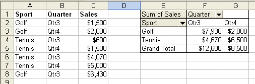

## **Pivot Table's Source Data**

There are times when you want to create Microsoft Excel reports with pivot tables that take data from different data sources (such as a database) that are not known at design time. This article provides an approach to dynamically change a pivot table's data source.

### **Changing a Pivot Table's Source Data**

1. Creating a new designer template.
   1. Create a new designer template file as in the screenshot below.
   1. Then define a named range, **DataSource**, which refers to this range of cells.

      **Creating a designer template & defining a named range, DataSource** 

1. Creating a Pivot Table Based on this named range.
   1. In Microsoft Excel, choose **Data**, then **PivotTable** and **PivotChart Report**.
   1. Create a pivot table based on the named range created in the first step.

      **Creating a pivot table based on the named range, DataSource** 

   1. Drag the corresponding field to pivot table row and column, then create the resulting pivot table as in the screenshot below.

   **Creating a pivot table based on a corresponding field** 

1. Right-click the pivot table and select **Table Options**.
   1. Check **Refresh on open** in **Data options** settings.

      **Setting the pivot table options** 

Now, you can save this file as your designer template file.

1. Populating new data and changing source data of a pivot table.
   1. Once the designer template is created, use the following code to change the source data of the pivot table.

Executing the example code below changes the source data of the pivot table.



