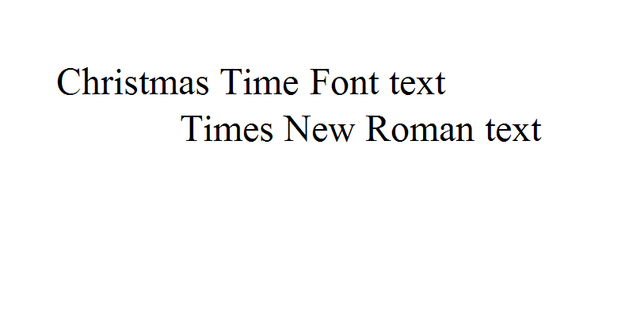

## **Possible Usage Scenarios**

While setting the **DefaultFont** property of [**PdfSaveOptions**](https://reference.aspose.com/cells/nodejs-cpp/pdfsaveoptions) and [**ImageOrPrintOptions**](https://reference.aspose.com/cells/nodejs-cpp/imageorprintoptions/), you might expect that saving to PDF or image would apply that DefaultFont to all the text in a workbook that has a missing (not installed) font.

Generally, when saving to PDF or image, Aspose.Cells for Node.js via C++ will first try to set the workbook's default font (i.e., `Workbook.DefaultStyle.Font`). If the workbook's default font still cannot display/render the text properly, Aspose.Cells will then try to render with the font specified in the DefaultFont attribute of [**PdfSaveOptions**](https://reference.aspose.com/cells/nodejs-cpp/pdfsaveoptions) / [**ImageOrPrintOptions**](https://reference.aspose.com/cells/nodejs-cpp/imageorprintoptions/).

To meet your expectation, we provide a Boolean property named **CheckWorkbookDefaultFont** in [**PdfSaveOptions**](https://reference.aspose.com/cells/nodejs-cpp/pdfsaveoptions) / [**ImageOrPrintOptions**](https://reference.aspose.com/cells/nodejs-cpp/imageorprintoptions/). You can set it to **false** to disable the attempt to use the workbook's default font and allow the **DefaultFont** setting in these options to have priority.

## **Set DefaultFont property of PdfSaveOptions/ImageOrPrintOptions**

The following sample code opens an Excel file. The A1 cell (in the first worksheet) contains the text “Christmas Time Font text”. The font name is “Christmas Time Personal Use”, which is not installed on the machine. We set the **DefaultFont** attribute of [**PdfSaveOptions**](https://reference.aspose.com/cells/nodejs-cpp/pdfsaveoptions) / [**ImageOrPrintOptions**](https://reference.aspose.com/cells/nodejs-cpp/imageorprintoptions/) to “Times New Roman”. We also set the **CheckWorkbookDefaultFont** Boolean property to **false**, which ensures that the text in cell A1 is rendered with the “Times New Roman” font and does not use the workbook's default font (“Calibri” in this case). The code renders the first worksheet to PNG and TIFF image formats and finally to a PDF file format.

{}

The default value of the **CheckWorkbookDefaultFont** attribute is **true**.

{}

This is the screenshot of the [template file](49446913.xlsx) used in the example code.


This is the output PNG image after setting the [**ImageOrPrintOptions.getDefaultFont()**](https://reference.aspose.com/cells/nodejs-cpp/imageorprintoptions/#getDefaultFont--) property to “Times New Roman”.



See the output [TIFF](48496672.tiff) image after setting the [**ImageOrPrintOptions.getDefaultFont()**](https://reference.aspose.com/cells/nodejs-cpp/imageorprintoptions/#getDefaultFont--) property to “Times New Roman”.

See the output [PDF](48496673.pdf) file after setting the [**PdfSaveOptions.getDefaultFont()**](https://reference.aspose.com/cells/nodejs-cpp/pdfsaveoptions/#getDefaultFont--) property to “Times New Roman”.

## **Sample Code**

```javascript
const path = require("path");
const AsposeCells = require("aspose.cells.node");

// The path to the documents directory.
const sourceDir = path.join(__dirname, "data");
const outputDir = path.join(__dirname, "output");

// Open an Excel file.
const workbook = new AsposeCells.Workbook(
    path.join(sourceDir, "sampleSetDefaultFontPropertyOfPdfSaveOptionsAndImageOrPrintOptions.xlsx")
);

// Rendering to PNG file format while setting the CheckWorkbookDefaultFont attribute to false.
// So, "Times New Roman" font will be used for any missing (not installed) font in the workbook.
const imgOpt = new AsposeCells.ImageOrPrintOptions();
imgOpt.setImageType(AsposeCells.ImageType.Png);
imgOpt.setCheckWorkbookDefaultFont(false);
imgOpt.setDefaultFont("Times New Roman");
const sr = new AsposeCells.SheetRender(workbook.getWorksheets().get(0), imgOpt);
sr.toImage(0, path.join(outputDir, "out1_imagePNG.png"));

// Rendering to TIFF file format while setting the CheckWorkbookDefaultFont attribute to false.
// So, "Times New Roman" font will be used for any missing (not installed) font in the workbook.
imgOpt.setImageType(AsposeCells.ImageType.Tiff);
const wr = new AsposeCells.WorkbookRender(workbook, imgOpt);
wr.toImage(path.join(outputDir, "out1_imageTIFF.tiff"));

// Rendering to PDF file format while setting the CheckWorkbookDefaultFont attribute to false.
// So, "Times New Roman" font will be used for any missing (not installed) font in the workbook.
const saveOptions = new AsposeCells.PdfSaveOptions();
saveOptions.setDefaultFont("Times New Roman");
saveOptions.setCheckWorkbookDefaultFont(false);
workbook.save(path.join(outputDir, "out1_pdf.pdf"), saveOptions);
```

