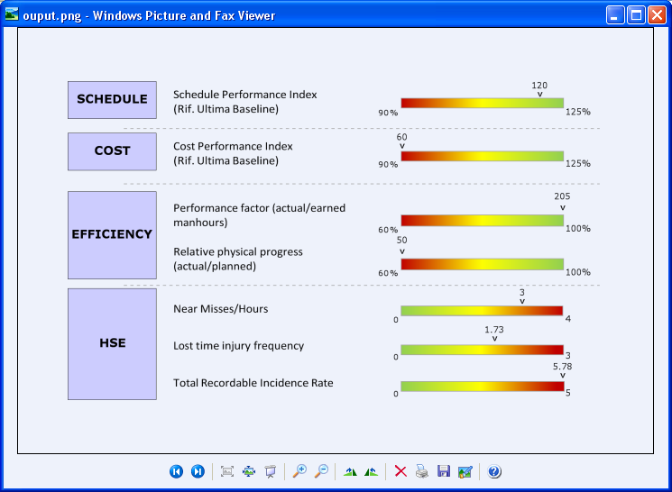

---  
title: Create Transparent Image of Excel Worksheet with Node.js via C++  
linktitle: Create Transparent Image of Excel Worksheet  
type: docs  
weight: 170  
url: /nodejs-cpp/create-transparent-image-of-excel-worksheet/  
description: Learn how to generate a transparent image of an Excel worksheet using Aspose.Cells for Node.js via C++.  
---  

{}  

Sometimes, you need to generate the image of your worksheet as a transparent image. You want to apply transparency to all cells which have no fill colors. Aspose.Cells provides the [**ImageOrPrintOptions.Transparent**](https://reference.aspose.com/cells/nodejs-cpp/imageorprintoptions/#transparent) property to apply transparency to the worksheet image. When this property is **false**, then cells with no fill colors are drawn with white color and when it is **true**, cells with no fill colors are drawn transparent.  

{}  

In the following worksheet image, transparency has not been applied. The cells with no fill colors are drawn white.  

|**Output without transparency: the cell background is white**|  
| :- |  
||  

While, in the following worksheet image, transparency has been applied. The cells with no fill colors are transparent.  

|**Output with transparency enabled**|  
| :- |  
||  

The following sample code generates a transparent image from an Excel worksheet.  

```javascript
const path = require("path");
const AsposeCells = require("aspose.cells.node");

// Source directory
const sourceDir = RunExamples.Get_SourceDirectory();

// Output directory
const outputDir = RunExamples.Get_OutputDirectory();

// Create workbook object from source file
const wb = new AsposeCells.Workbook(path.join(sourceDir, "sampleCreateTransparentImage.xlsx"));

// Apply different image or print options
const imgOption = new AsposeCells.ImageOrPrintOptions();
imgOption.setImageType(AsposeCells.ImageType.Png);
imgOption.setHorizontalResolution(200);
imgOption.setVerticalResolution(200);
imgOption.setOnePagePerSheet(true);

// Apply transparency to the output image
imgOption.setTransparent(true);

// Create image after applying image or print options
const sr = new AsposeCells.SheetRender(wb.getWorksheets().get(0), imgOption);
sr.toImage(0, path.join(outputDir, "outputCreateTransparentImage.png"));
```  
  