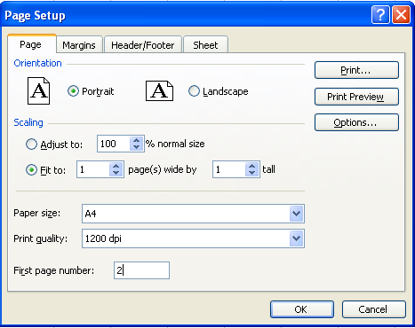
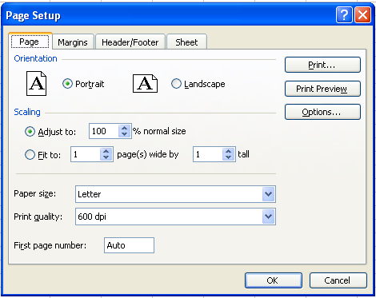

---  
title: Page Setup and Printing Options with Node.js via C++  
linktitle: Page Setup and Printing Options  
type: docs  
weight: 60  
url: /nodejs-cpp/page-setup-and-printing-options/  
ai_search_scope: cells_nodejscpp
ai_search_endpoint: "https://docsearch.api.aspose.cloud/ask"
---  

{}  
Sometimes, developers need to configure page‑setup and print settings to control the printing process. Page‑setup and print settings offer various options and are fully supported in Aspose.Cells.  

This article shows how to create a console application in Node.js via C++ and apply page‑setup and printing options to a worksheet with a few simple lines of code using the Aspose.Cells API.  
{}  

## **Working with Page and Print Settings**  

For this example, we created a workbook in Microsoft Excel and used Aspose.Cells to set page‑setup and print options.  

### **Using Aspose.Cells to Set Page Setup Options**  

First, create a simple worksheet in Microsoft Excel. Then apply page‑setup options to it. Executing the code changes the page‑setup options as shown in the screenshot below.  

| **Output file** |  
| :- |  
|  |  

1. **Create a worksheet with some data in Microsoft Excel:**  
   1. Open a new workbook in Microsoft Excel.  
   2. Add some data.  

2. **Set page‑setup options:**  
   Apply page‑setup options to the file. Below is a screenshot of the default options, before the new options are applied.  

| **Default page setup options** |  
| :- |  
|  |  

3. **Download and install Aspose.Cells:**  
   1. [Download](https://downloads.aspose.com/cells/nodejs-cpp) Aspose.Cells for Node.js via C++.  
   2. Install it on your development computer.  
      All Aspose components, when installed, work in evaluation mode. The evaluation mode has no time limit and it only injects watermarks into produced documents.  

4. **Create a project:**  
   1. Start your Node.js environment.  
   2. Create a new console application.  
      This example shows a Node.js console application, but you can use C++ bindings too.  

5. **Add references:**  
   1. This example uses Aspose.Cells, so add a reference to that component in the project. For example:  
      …\Program Files\Aspose\Aspose.Cells\Bin\Node.js-Cpp\Aspose.Cells.node  

6. **Write the application that invokes the API:**  

```javascript
const path = require("path");
const AsposeCells = require("aspose.cells.node");

// The path to the documents directory.
const dataDir = path.join(__dirname, "data");
const filePath = path.join(dataDir, "CustomerReport.xlsx");

// Open the template workbook
const workbook = new AsposeCells.Workbook(filePath);

// Access the first worksheet in the Excel file
const worksheet = workbook.getWorksheets().get(0);

// Set the orientation to Portrait
worksheet.getPageSetup().setOrientation(AsposeCells.PageOrientationType.Portrait);

// Set the number of pages to which the length of the worksheet will be spanned
worksheet.getPageSetup().setFitToPagesTall(1);

// Set the number of pages to which the width of the worksheet will be spanned
worksheet.getPageSetup().setFitToPagesWide(1);

// Set the paper size to A4
worksheet.getPageSetup().setPaperSize(AsposeCells.PaperSizeType.PaperA4);

// Set the print quality of the worksheet to 1200 dpi
worksheet.getPageSetup().setPrintQuality(1200);

// Set the first page number of the worksheet pages
worksheet.getPageSetup().setFirstPageNumber(2);

// Save the workbook
workbook.save(path.join(dataDir, "PageSetup_out.xlsx"));
```  

### **Setting Print Options**  

Page‑setup settings also provide several print options (also called sheet options) that allow users to control how worksheet pages are printed. They enable users to:  

- Select a specific print area of a worksheet.  
- Print titles.  
- Print gridlines.  
- Print row/column headings.  
- Print in draft quality.  
- Print comments.  
- Print cell errors.  
- Define page ordering.  

The example below applies print options to the file created in the previous example (`PageSetup.xlsx`). The screenshot shows the default print options before the new options are applied.  

| **Input document** |  
| :- |  
|  |  

Executing the code changes the print options.  

| **Output file** |  
| :- |  
|  |  

```javascript
const path = require("path");
const AsposeCells = require("aspose.cells.node");

// The path to the documents directory.
const dataDir = path.join(__dirname, "data");
const filePath = path.join(dataDir, "PageSetup.xlsx");

// Open the template workbook
const workbook = new AsposeCells.Workbook(filePath);

// Access the first worksheet in the Excel file
const worksheet = workbook.getWorksheets().get(0);

const pageSetup = worksheet.getPageSetup();

// Specify the cell range (A1:E30) of the print area
pageSetup.setPrintArea("A1:E30");

// Define columns A through E as title columns
pageSetup.setPrintTitleColumns("$A:$E");

// Define rows 1 and 2 as title rows
pageSetup.setPrintTitleRows("$1:$2");

// Enable printing of gridlines
pageSetup.setPrintGridlines(true);

// Enable printing of row/column headings
pageSetup.setPrintHeadings(true);

// Enable printing of the worksheet in black‑and‑white mode
pageSetup.setBlackAndWhite(true);

// Print comments as displayed on the worksheet
pageSetup.setPrintComments(AsposeCells.PrintCommentsType.PrintInPlace);

// Print the worksheet with draft quality
pageSetup.setPrintDraft(true);

// Print cell errors as N/A
pageSetup.setPrintErrors(AsposeCells.PrintErrorsType.PrintErrorsNA);

// Set the printing order of the pages to Over Then Down
pageSetup.setOrder(AsposeCells.PrintOrderType.OverThenDown);

// Save the workbook
workbook.save(path.join(dataDir, "PageSetup_Print_out.xlsx"));
```  


