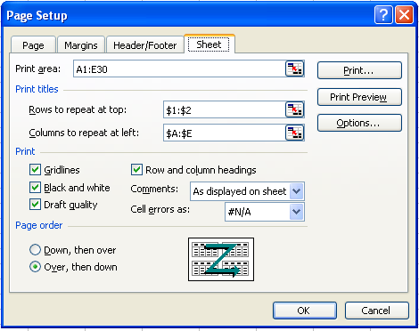

---  
title: Page Setup and Printing Options with Node.js via C++  
linktitle: Page Setup and Printing Options  
type: docs  
weight: 60  
url: /nodejs-cpp/page-setup-and-printing-options/  
ai_search_scope: cells_nodejscpp
ai_search_endpoint: "https://docsearch.api.aspose.cloud/ask"
---  

{}  
Sometimes, developers need to configure page setup and print settings to control the printing process. Page setup and print settings offer various options and are fully supported in Aspose.Cells.  

This article shows how to create a console application in Node.js via C++, and apply page setup and printing options to a worksheet with a few simple lines of code using the Aspose.Cells API.  
{}  

## **Working with Page and Print Settings**  

For this example, we created a workbook in Microsoft Excel and used Aspose.Cells to set page setup and print options.  

### **Using Aspose.Cells to set Page Setup Options**  

First create a simple worksheet in Microsoft Excel. Then apply page setup options to it. Executing the code changes the Page Setup options as in the screenshot below.  

|**Output file.**|  
| :- |  
||  

1. Create a worksheet with some data in Microsoft Excel:  
   1. Open a new workbook in Microsoft Excel.  
   1. Add some data.  
1. Set page setup options:  
   Apply page setup options to the file. Below is a screenshot of the default options, before the new options are applied.  

|**Default page setup options.**|  
| :- |  
||  

1. Download and install Aspose.Cells:  
   1. [Download](https://downloads.aspose.com/cells/nodejs-cpp) Aspose.Cells for Node.js via C++.  
   1. Install it on your development computer.  
      All Aspose components, when installed, work in evaluation mode. The evaluation mode has no time limit and it only injects watermarks into produced documents.  
1. Create a project:  
   1. Start your Node.js environment.  
   1. Create a new console application.  
      This example will show a Node.js console application, but you can use C++ bindings too.  
1. Add references:  
   1. This example uses Aspose.Cells so add a reference to that component to the project. For example:  
      …\Program Files\Aspose\Aspose.Cells\Bin\Node.js-Cpp\Aspose.Cells.node  
1. Write the application that invokes the API:  

```javascript
const path = require("path");
const AsposeCells = require("aspose.cells.node");

// The path to the documents directory.
const dataDir = path.join(__dirname, "data");
const filePath = path.join(dataDir, "CustomerReport.xlsx");

// Open the template workbook
const workbook = new AsposeCells.Workbook(filePath);

// Accessing the first worksheet in the Excel file
const worksheet = workbook.getWorksheets().get(0);

// Setting the orientation to Portrait
worksheet.getPageSetup().setOrientation(AsposeCells.PageOrientationType.Portrait);

// Setting the number of pages to which the length of the worksheet will be spanned
worksheet.getPageSetup().setFitToPagesTall(1);

// Setting the number of pages to which the width of the worksheet will be spanned
worksheet.getPageSetup().setFitToPagesWide(1);

// Setting the paper size to A4
worksheet.getPageSetup().setPaperSize(AsposeCells.PaperSizeType.PaperA4);

// Setting the print quality of the worksheet to 1200 dpi
worksheet.getPageSetup().setPrintQuality(1200);

// Setting the first page number of the worksheet pages
worksheet.getPageSetup().setFirstPageNumber(2);

// Save the workbook
workbook.save(path.join(dataDir, "PageSetup_out.xlsx"));
```  

### **Setting Print options**  

Page setup settings also provide several print options (also called sheet options) that allow users to control how worksheet pages are printed. They allow users to:  

- Select a specific print area of a worksheet.
- Print titles.
- Print gridlines.
- Print row/column headings.
- Achieve draft quality.
- Print comments.
- Print cell errors.
- Define page ordering.  

The example that follows applies print options to the file created in the example above (PageSetup.xls). The screenshot below shows the default print options before new options are applied.  

|**Input document**|  
| :- |  
||  
Executing the code changes the print options.  

|**Output file**|  
| :- |  
||  

```javascript
const path = require("path");
const AsposeCells = require("aspose.cells.node");

// The path to the documents directory.
const dataDir = path.join(__dirname, "data");
const filePath = path.join(dataDir, "PageSetup.xlsx");

// Open the template workbook
const workbook = new AsposeCells.Workbook(filePath);

// Accessing the first worksheet in the Excel file
const worksheet = workbook.getWorksheets().get(0);

const pageSetup = worksheet.getPageSetup();

// Specifying the cells range (from A1 cell to E30 cell) of the print area
pageSetup.setPrintArea("A1:E30");

// Defining column numbers A & E as title columns
pageSetup.setPrintTitleColumns("$A:$E");

// Defining row numbers 1 as title rows
pageSetup.setPrintTitleRows("$1:$2");

// Allowing to print gridlines
pageSetup.setPrintGridlines(true);

// Allowing to print row/column headings
pageSetup.setPrintHeadings(true);

// Allowing to print worksheet in black & white mode
pageSetup.setBlackAndWhite(true);

// Allowing to print comments as displayed on worksheet
pageSetup.setPrintComments(AsposeCells.PrintCommentsType.PrintInPlace);

// Allowing to print worksheet with draft quality
pageSetup.setPrintDraft(true);

// Allowing to print cell errors as N/A
pageSetup.setPrintErrors(AsposeCells.PrintErrorsType.PrintErrorsNA);

// Setting the printing order of the pages to over then down
pageSetup.setOrder(AsposeCells.PrintOrderType.OverThenDown);

// Save the workbook
workbook.save(path.join(dataDir, "PageSetup_Print_out.xlsx"));
```  
  

