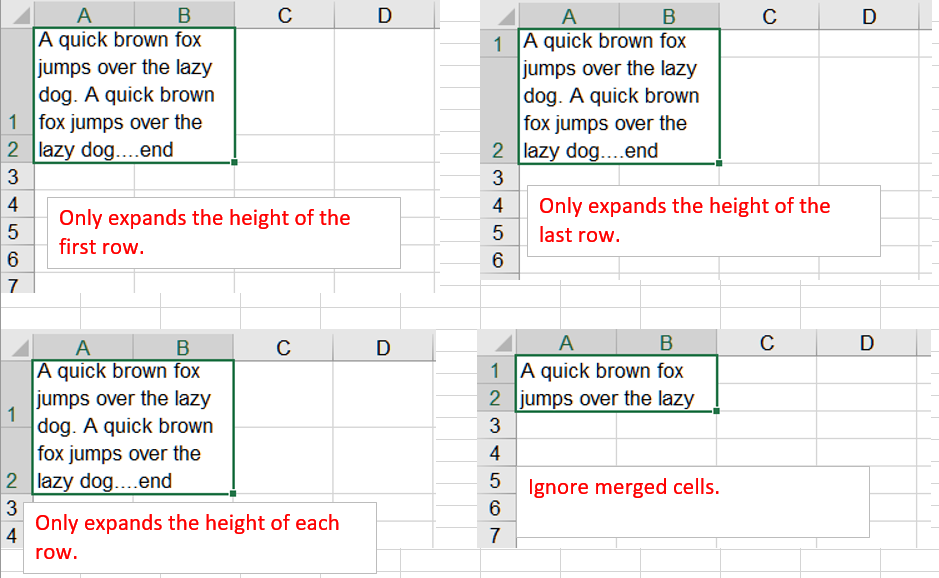

{}

Microsoft Excel provides a feature that allows you to auto-size the height of a cell according to its content. The feature is called auto-fit rows. Microsoft Excel doesn't set auto-fit operation on merged cells natively. Sometimes the feature becomes vital for a user who really needs to implement auto-fit rows on merged cells too.

{}

## **How to use AutoFitMergedCellsType for autofitting rows**
Aspose.Cells for Node.js via C++ supports this feature through the [**AutoFitterOptions.autoFitMergedCellsType**](https://reference.aspose.com/cells/nodejs-cpp/autofitmergedcellstype/) API. Using this API, it is possible to auto-fit rows in a worksheet including merged cells. Here is a list of all possible types of auto fitting merged cells:

- None
- FirstLine
- LastLine
- EachLine

## **Autofit Rows for Merged Cells**

Please see the following code, it creates a workbook object and adds multiple worksheets. Use different methods for autofit operations in each worksheet. The screenshot shows the results after the execution of the sample code.

<br>


## **Node.js Sample Code**

```javascript
const path = require("path");
const AsposeCells = require("aspose.cells.node");

// The path to the documents directory.
const dataDir = path.join(__dirname, "data");
const filePath = path.join(dataDir, "sample.xlsx");

// Instantiating a Workbook object
const workbook = new AsposeCells.Workbook();
// Obtaining the reference of the newly added worksheet
const sheet1 = workbook.getWorksheets().get(0);

// Create a range A1:B2
const range = sheet1.getCells().createRange(0, 0, 2, 2);

// Merge the cells
range.merge();

// Insert value to the merged cell A1
sheet1.getCells().get(0, 0).setValue("A quick brown fox jumps over the lazy dog. A quick brown fox jumps over the lazy dog....end");

// Create a style object
const style = sheet1.getCells().get(0, 0).getStyle();

// Set wrapping text on
style.setIsTextWrapped(true);

// Apply the style to the cell
sheet1.getCells().get(0, 0).setStyle(style);

// Create an object for AutoFitterOptions
const options = new AsposeCells.AutoFitterOptions();

// Only expands the height of the first row.
options.setAutoFitMergedCellsType(AsposeCells.AutoFitMergedCellsType.FirstLine);

// Autofit rows in the sheet (including the merged cells)
sheet1.autoFitRows(options);

let index = workbook.getWorksheets().add();
const sheet2 = workbook.getWorksheets().get(index);
sheet2.setName("Sheet2");
// Create a range A1:B2
const range2 = sheet2.getCells().createRange(0, 0, 2, 2);

// Merge the cells
range2.merge();

// Insert value to the merged cell A1
sheet2.getCells().get(0, 0).setValue("A quick brown fox jumps over the lazy dog. A quick brown fox jumps over the lazy dog....end");

// Create a style object
const style2 = sheet2.getCells().get(0, 0).getStyle();

// Set wrapping text on
style2.setIsTextWrapped(true);

// Apply the style to the cell
sheet2.getCells().get(0, 0).setStyle(style2);

// Create an object for AutoFitterOptions
const options2 = new AsposeCells.AutoFitterOptions();

// Only expands the height of the last row.
options2.setAutoFitMergedCellsType(AsposeCells.AutoFitMergedCellsType.LastLine);

// Autofit rows in the sheet (including the merged cells)
sheet2.autoFitRows(options2);

index = workbook.getWorksheets().add();
const sheet3 = workbook.getWorksheets().get(index);
sheet3.setName("Sheet3");
// Create a range A1:B2
const range3 = sheet3.getCells().createRange(0, 0, 2, 2);

// Merge the cells
range3.merge();

// Insert value to the merged cell A1
sheet3.getCells().get(0, 0).setValue("A quick brown fox jumps over the lazy dog. A quick brown fox jumps over the lazy dog....end");

// Create a style object
const style3 = sheet3.getCells().get(0, 0).getStyle();

// Set wrapping text on
style3.setIsTextWrapped(true);

// Apply the style to the cell
sheet3.getCells().get(0, 0).setStyle(style3);

// Create an object for AutoFitterOptions
const options3 = new AsposeCells.AutoFitterOptions();

// Only expands the height of each row.
options3.setAutoFitMergedCellsType(AsposeCells.AutoFitterOptions.AutoFitMergedCellsType.EachLine);

// Autofit rows in the sheet (including the merged cells)
sheet3.autoFitRows(options3);

index = workbook.getWorksheets().add();
const sheet4 = workbook.getWorksheets().get(index);
sheet4.setName("Sheet4");
// Create a range A1:B2
const range4 = sheet4.getCells().createRange(0, 0, 2, 2);

// Merge the cells
range4.merge();

// Insert value to the merged cell A1
sheet4.getCells().get(0, 0).setValue("A quick brown fox jumps over the lazy dog. A quick brown fox jumps over the lazy dog....end");

// Create a style object
const style4 = sheet4.getCells().get(0, 0).getStyle();

// Set wrapping text on
style4.setIsTextWrapped(true);

// Apply the style to the cell
sheet4.getCells().get(0, 0).setStyle(style4);

// Create an object for AutoFitterOptions
const options4 = new AsposeCells.AutoFitterOptions();

// Ignore merged cells.
options4.setAutoFitMergedCellsType(AsposeCells.AutoFitterMergedCellsType.None);

// Autofit rows in the sheet (not including the merged cells)
sheet4.autoFitRows(options4);

// Save the Excel file
workbook.save("out.xlsx");
```
