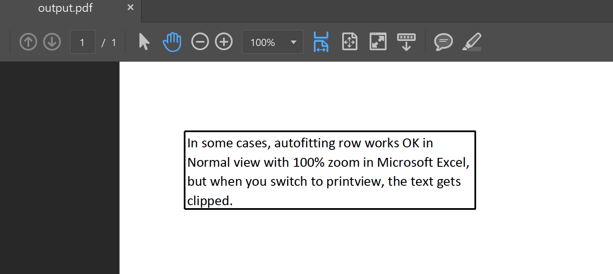

---  
title: AutoFit Rows for Rendering with Node.js via C++  
linktitle: AutoFit Rows for Rendering  
type: docs  
weight: 130  
url: /nodejs-cpp/autofit-rows-for-rendering/  
description: Learn how to auto-fit rows for rendering in Excel using Aspose.Cells for Node.js via C++. Prevent text clipping in saved PDF files.  
---  

Generally, when you want to display all the text in a cell, you can auto-fit the row in Normal view with 100% zoom in Microsoft Excel. This allows the text to be fully visible in Normal view, and even when you print or save the file as a PDF, the text will be displayed correctly.

However, in some cases, auto-fitting the row works fine in Normal view, but when you switch to print view or save the file as a PDF, the text gets clipped. Please check the source file [Book1.xlsx](Book1.xlsx) and screenshots.


If you want to prevent text from being clipped in the saved PDF file, you can auto-fit the row with the [AutoFitterOptions.getForRendering()](https://reference.aspose.com/cells/nodejs-cpp/autofitteroptions/#getForRendering--) option.

```javascript
const path = require("path");
const AsposeCells = require("aspose.cells.node");

// The path to the documents directory.
const dataDir = path.join(__dirname, "data");
const filePath = path.join(dataDir, "Book1.xlsx");

// Init workbook instance.
const workbook = new AsposeCells.Workbook(filePath);

// Set autofit options for rendering.
const autoFitterOptions = new AsposeCells.AutoFitterOptions();
autoFitterOptions.setForRendering(true);

// Autofit rows with options.
workbook.getWorksheets().get(0).autoFitRows(autoFitterOptions);

// Save to pdf.
workbook.save("output.pdf", AsposeCells.SaveFormat.Pdf);
```

Now, the text is not clipped in the output PDF file.

  
