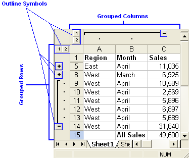

---
title: Grouping and Ungrouping Rows and Columns with Node.js via C++
linktitle: Grouping and Ungrouping Rows and Columns
type: docs
weight: 50
url: /nodejs-cpp/grouping-and-ungrouping-rows-and-columns/
description: Discover how to group and ungroup rows and columns in Excel using Aspose.Cells for Node.js via C++.
ai_search_scope: cells_nodejscpp
ai_search_endpoint: "https://docsearch.api.aspose.cloud/ask"
--- 

## **Introduction**

In a Microsoft Excel file, you can create an outline for the data to let you show and hide levels of detail with a single mouse click.

Click the **Outline Symbols**, 1,2,3, + and - to quickly display only the rows or columns that provide summaries or headings for sections in a worksheet, or you can use the symbols to see details under an individual summary or heading as shown below in the figure:

|**Grouping Rows and Columns.**|
| :- |
||

## **Group Management of Rows and Columns**

Aspose.Cells provides a class, [**Workbook**](https://reference.aspose.com/cells/nodejs-cpp/workbook) that represents a Microsoft Excel file. The [**Workbook**](https://reference.aspose.com/cells/nodejs-cpp/workbook) class contains a [**WorksheetCollection**](https://reference.aspose.com/cells/nodejs-cpp/worksheetcollection) that allows access to each worksheet in the Excel file. A worksheet is represented by the [**Worksheet**](https://reference.aspose.com/cells/nodejs-cpp/worksheet) class. The [**Worksheet**](https://reference.aspose.com/cells/nodejs-cpp/worksheet) class provides a [**Cells**](https://reference.aspose.com/cells/nodejs-cpp/cells) collection that represents all cells in the worksheet.

The [**Cells**](https://reference.aspose.com/cells/nodejs-cpp/cells) collection provides several methods to manage rows or columns in a worksheet, few of these are discussed below in more detail.

### **Grouping Rows and Columns**

It is possible to group rows or columns by calling the [**groupRows(number, number, boolean)**](https://reference.aspose.com/cells/nodejs-cpp/cells/#groupRows-number-number-boolean-) and [**groupColumns(number, number)**](https://reference.aspose.com/cells/nodejs-cpp/cells/#groupColumns-number-number-) methods of the [**Cells**](https://reference.aspose.com/cells/nodejs-cpp/cells) collection. Both methods take the following parameters:

- First row/column index, the first row or column in the group.
- Last row/column index, the last row or column in the group.
- Is hidden, a Boolean parameter that specifies whether to hide rows/columns after grouping or not.

```javascript
const path = require("path");
const AsposeCells = require("aspose.cells.node");

// The path to the documents directory.
const dataDir = path.join(__dirname, "data");
const filePath = path.join(dataDir, "book1.xls");

// Reading the Excel file into a buffer
const fs = require("fs");
const fileContent = fs.readFileSync(filePath);

// Opening the Excel file through the buffer
const workbook = new AsposeCells.Workbook(fileContent);

// Accessing the first worksheet in the Excel file
const worksheet = workbook.getWorksheets().get(0);

// Grouping first six rows (from 0 to 5) and making them hidden by passing true
worksheet.getCells().groupRows(0, 5, true);

// Grouping first three columns (from 0 to 2) and making them hidden by passing true
worksheet.getCells().groupColumns(0, 2, true);

// Saving the modified Excel file
workbook.save(path.join(dataDir, "output.xls"));
```

#### **Group Settings**

Microsoft Excel allows you to configure group settings for displaying:

- Summary rows below detail.
- Summary columns to the right of detail.

Developers can configure these group settings using the [**getOutline()**](https://reference.aspose.com/cells/nodejs-cpp/worksheet/#getOutline--) property of the [**Worksheet**](https://reference.aspose.com/cells/nodejs-cpp/worksheet) class.

### **Summary Rows to Below of Detail**

It is possible to control whether summary rows are displayed below detail by setting the [**Outline**](https://reference.aspose.com/cells/nodejs-cpp/outline) class' [**getSummaryRowBelow()**](https://reference.aspose.com/cells/nodejs-cpp/outline/#getSummaryRowBelow--) property to **true** or **false**.

```javascript
const path = require("path");
const AsposeCells = require("aspose.cells.node");

// The path to the documents directory.
const dataDir = path.join(__dirname, "data");
const filePath = path.join(dataDir, "sample.xlsx");
// Loads the workbook which contains hidden external links
const workbook = new AsposeCells.Workbook(filePath);
const worksheet = workbook.getWorksheets().get(0);

// Grouping first six rows and first three columns
worksheet.getCells().groupRows(0, 5, true);
worksheet.getCells().groupColumns(0, 2, true);

// Setting SummaryRowBelow property to false
worksheet.getOutline().setSummaryRowBelow(false);

// Saving the modified Excel file
workbook.save(path.join(dataDir, "output.xls"));
```

### **Summary Columns to Right of Detail**

Developers can also control displaying summary columns to the right of detail by setting the [**getSummaryColumnRight()**](https://reference.aspose.com/cells/nodejs-cpp/outline/#getSummaryColumnRight--) property of [**Outline**](https://reference.aspose.com/cells/nodejs-cpp/outline) class to **true** or **false**.

```javascript
const path = require("path");
const AsposeCells = require("aspose.cells.node");

// The path to the documents directory.
const dataDir = path.join(__dirname, "data");
const filePath = path.join(dataDir, "sample.xlsx");
// Loads the workbook which contains hidden external links
const workbook = new AsposeCells.Workbook(filePath);
const worksheet = workbook.getWorksheets().get(0);

// Grouping first six rows and first three columns
worksheet.getCells().groupRows(0, 5, true);
worksheet.getCells().groupColumns(0, 2, true);

worksheet.getOutline().setSummaryColumnRight(true);

// Saving the modified Excel file
workbook.save(path.join(dataDir, "output.xls"));
```

## **Ungrouping Rows and Columns**

To ungroup any grouped rows or columns, call the [**Cells**](https://reference.aspose.com/cells/nodejs-cpp/cells) collection's [**ungroupRows(number, number, boolean)**](https://reference.aspose.com/cells/nodejs-cpp/cells/#ungroupRows-number-number-boolean-) and [**ungroupColumns(number, number)**](https://reference.aspose.com/cells/nodejs-cpp/cells/#ungroupColumns-number-number-) methods. Both methods take two parameters:

- First row or column index, the first row/column to be ungrouped.
- Last row or column index, the last row/column to be ungrouped.

[**ungroupRows(number, number, boolean)**](https://reference.aspose.com/cells/nodejs-cpp/cells/#ungroupRows-number-number-boolean-) has an overload that takes a Boolean third parameter. Setting it to **true** removes all grouped information. Otherwise, only the outer group information is removed.

```javascript
const path = require("path");
const fs = require("fs");
const AsposeCells = require("aspose.cells.node");

// The path to the documents directory.
const dataDir = path.join(__dirname, "data");
const filePath = path.join(dataDir, "book1.xls");

// Reading Excel file into buffer
const buffer = fs.readFileSync(filePath);

// Instantiating a Workbook object with file content
const workbook = new AsposeCells.Workbook(buffer);

// Accessing the first worksheet in the Excel file
const worksheet = workbook.getWorksheets().get(0);

// Ungrouping first six rows (from 0 to 5)
worksheet.getCells().ungroupRows(0, 5);

// Ungrouping first three columns (from 0 to 2)
worksheet.getCells().ungroupColumns(0, 2);

// Saving the modified Excel file
workbook.save(path.join(dataDir, "output.xls"));
```

