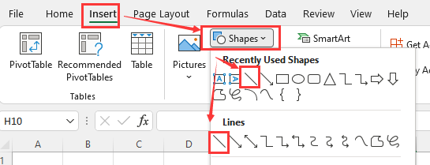
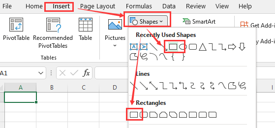
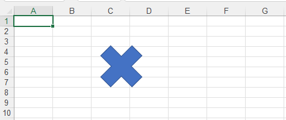
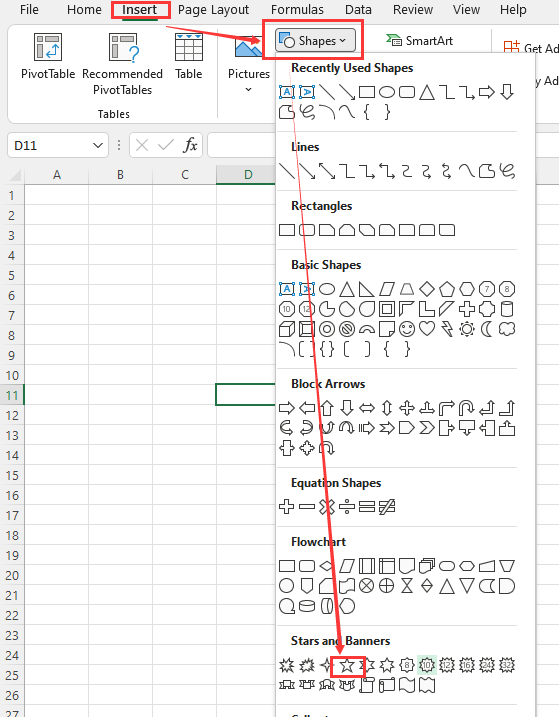
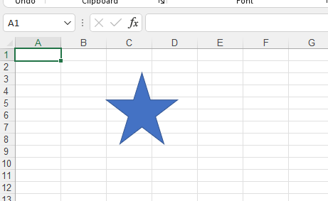

---  
title: Insert Pictures and Shapes of Excel files with Node.js via C++  
linktitle: Shapes  
type: docs  
weight: 140  
url: /nodejs-cpp/insert-shapes/  
description: Manage pictures, OLE objects, and shapes in Excel files using Aspose.Cells for Node.js via C++.  
---  

{}  
Sometimes you need to insert some necessary shapes into the worksheet. You may need to insert the same shape in different positions of the worksheet. Or you need to batch insert shapes in the worksheet.  
Do not worry! [Aspose.Cells](https://products.aspose.com/cells/) supports all these operations.  
{}  

The shapes in Excel are mainly divided into the following types:  
- **Pictures**  
- **OleObjects**  
- **Lines**  
- **Rectangles**  
- **Basic Shapes**  
- **Block Arrows**  
- **Equation Shapes**  
- **FlowCharts**  
- **Stars and Banners**  
- **Callouts**  

This guide document will select one or two shapes from each type to make samples. Through these examples, you will learn how to use [Aspose.Cells](https://products.aspose.com/cells/) to insert the specified shape into the worksheet.  

## **Adding Pictures in Excel Worksheet using Node.js**  

Adding pictures to a spreadsheet is very easy. It only takes a few lines of code:  
Simply call the [**Add**](https://reference.aspose.com/cells/nodejs-cpp/picturecollection/#add-int-int-string-) method of the [**Pictures**](https://reference.aspose.com/cells/nodejs-cpp/picturecollection) collection (encapsulated in the [**Worksheet**](https://reference.aspose.com/cells/nodejs-cpp/worksheet) object). The [**Add**](https://reference.aspose.com/cells/nodejs-cpp/picturecollection/#add-int-int-string-) method takes the following parameters:  

- **Upper left row index**, the index of the upper left row.  
- **Upper left column index**, the index of the upper left column.  
- **Image file name**, the name of the image file, complete with path.  

```javascript
const path = require("path");
const AsposeCells = require("aspose.cells.node");

// The path to the documents directory.
const dataDir = path.join(__dirname, "data");

// Create directory if it is not already present.
const fs = require("fs");
if (!fs.existsSync(dataDir)) {
    fs.mkdirSync(dataDir);
}

// Instantiating a Workbook object
const workbook = new AsposeCells.Workbook();

// Adding a new worksheet to the Workbook object
const sheetIndex = workbook.getWorksheets().add();

// Obtaining the reference of the newly added worksheet by passing its sheet index
const worksheet = workbook.getWorksheets().get(sheetIndex);

// Adding a picture at the location of a cell whose row and column indices
// Are 5 in the worksheet. It is "F6" cell
worksheet.getPictures().add(5, 5, path.join(dataDir, "logo.jpg"));

// Saving the Excel file
workbook.save(path.join(dataDir, "output.xls"));
```  

## **Inserting OLE Objects into Excel Worksheet using Node.js**  

Aspose.Cells supports adding, extracting, and manipulating OLE objects in worksheets. For this reason, Aspose.Cells has the [**OleObjectCollection**](https://reference.aspose.com/cells/nodejs-cpp/oleobjectcollection) class, used to add a new OLE Object to the collection list. Another class, [**OleObject**](https://reference.aspose.com/cells/nodejs-cpp/oleobject), represents an OLE Object. It has some important members:  

- The [**ImageData**](https://reference.aspose.com/cells/nodejs-cpp/oleobject/#imagedata) property specifies the image (icon) data of byte array type. The image will be displayed to show the OLE Object in the worksheet.  
- The [**ObjectData**](https://reference.aspose.com/cells/nodejs-cpp/oleobject/#objectdata) property specifies the object data in the form of a byte array. This data will be shown in its related program when you double-click on the OLE Object icon.  

The following example shows how to add an OLE Object(s) into a worksheet.  

```javascript
const path = require("path");
const fs = require("fs");
const AsposeCells = require("aspose.cells.node");

// The path to the documents directory.
const dataDir = path.join(__dirname, "data");

// Create directory if it is not already present.
if (!fs.existsSync(dataDir)) {
    fs.mkdirSync(dataDir);
}

// Instantiate a new Workbook.
const workbook = new AsposeCells.Workbook();

// Get the first worksheet.
const sheet = workbook.getWorksheets().get(0);

// Define a string variable to store the image path.
const imageUrl = path.join(dataDir, "logo.jpg");

// Get the picture into the streams.
const imageData = fs.readFileSync(imageUrl);

// Get an excel file path in a variable.
const excelFilePath = path.join(dataDir, "book1.xls");

// Get the file into the streams.
const objectData = fs.readFileSync(excelFilePath);

// Add an Ole object into the worksheet with the image
// Shown in MS Excel.
sheet.getOleObjects().add(14, 3, 200, 220, imageData);

// Set embedded ole object data.
sheet.getOleObjects().get(0).setObjectData(objectData);

// Save the excel file
workbook.save(path.join(dataDir, "output.out.xls"));
```  

## **Inserting a Line to Excel Worksheet using Node.js**  

The shape of the line belongs to the **lines** category.  

***In Microsoft Excel (for example 2007):***  

- Select the cell where you want to insert the line  
- Click the Insert menu and click Shapes.  
- Then, select the line from 'Recently Used Shapes' or 'Lines'  

  

***Using Aspose.Cells***  

You can use the following method to insert a line in the worksheet.  

{}  
[**public LineShape AddLine(int upperLeftRow, int top, int upperLeftColumn, int left, int height, int width)**](https://reference.aspose.com/cells/nodejs-cpp/shapecollection/#addline-int-int-int-int-int-int-)  
The method returns a [LineShape](https://reference.aspose.com/cells/nodejs-cpp/lineshape) object.  
{}  

The following example shows how to insert a line to a worksheet.  

```javascript
const path = require("path");
const AsposeCells = require("aspose.cells.node");

// The path to the documents directory.
const dataDir = path.join(__dirname, "data");
const filePath = path.join(dataDir, "sample.xlsx");
// Create workbook from sample file
const workbook = new AsposeCells.Workbook(filePath);

// Access first worksheet from the collection
const sheet = workbook.getWorksheets().get(0);

// Add the line to the worksheet
sheet.getShapes().addLine(2, 0, 2, 0, 100, 300); // method 1
// sheet.getShapes().addAutoShape(AutoShapeType.Line, 2, 0, 2, 0, 100, 300); // method 2
// sheet.getShapes().addShape(MsoDrawingType.Line, 2, 0, 2, 0, 100, 300); // method 3

// Save. You can check your line in this way.
workbook.save("sample.xlsx", AsposeCells.SaveFormat.Xlsx);
```  

Execute the above code, you will get the following results:  

  

## **Inserting a line arrow to Excel Worksheet using Node.js**  

The shape of the line arrow belongs to the **Lines** category. It is a special case of line.  

***In Microsoft Excel (for example 2007):***  

- Select the cell where you want to insert the line arrow  
- Click the Insert menu and click Shapes.  
- Then, select the line arrow from 'Recently Used Shapes' or 'Lines'  

  

***Using Aspose.Cells***  

You can use the following method to insert a line arrow in the worksheet.  

{}  
[**public LineShape AddLine(int upperLeftRow, int top, int upperLeftColumn, int left, int height, int width)**](https://reference.aspose.com/cells/nodejs-cpp/shapecollection/#addline-int-int-int-int-int-int-)  
The method returns a [LineShape](https://reference.aspose.com/cells/nodejs-cpp/lineshape) object.  
{}  

The following example shows how to insert a line arrow to a worksheet.  

```javascript
const path = require("path");
const AsposeCells = require("aspose.cells.node");

// The path to the documents directory.
const dataDir = path.join(__dirname, "data");
const filePath = path.join(dataDir, "sample.xlsx");
// Loads the workbook which contains hidden external links
const workbook = new AsposeCells.Workbook(filePath);

// Access first worksheet from the collection
const sheet = workbook.getWorksheets().get(0);

// Add the line arrow to the worksheet
let s = sheet.getShapes().addLine(2, 0, 2, 0, 100, 300); // method 1
// let s = sheet.getShapes().addAutoShape(AsposeCells.AutoShapeType.Line, 2, 0, 2, 0, 100, 300); // method 2
// let s = sheet.getShapes().addShape(AsposeCells.MsoDrawingType.Line, 2, 0, 2, 0, 100, 300); // method 3

// add a arrow at the line begin
s.getLine().setBeginArrowheadStyle(AsposeCells.MsoArrowheadStyle.Arrow); // arrow type
s.getLine().setBeginArrowheadWidth(AsposeCells.MsoArrowheadWidth.Wide); // arrow width
s.getLine().setBeginArrowheadLength(AsposeCells.MsoArrowheadLength.Short); // arrow length

// add a arrow at the line end
s.getLine().setEndArrowheadStyle(AsposeCells.MsoArrowheadStyle.ArrowOpen); // arrow type
s.getLine().setEndArrowheadWidth(AsposeCells.MsoArrowheadWidth.Narrow); // arrow width
s.getLine().setEndArrowheadLength(AsposeCells.MsoArrowheadLength.Long); // arrow length

// Save. You can check your arrow in this way.
workbook.save("sample.xlsx", AsposeCells.SaveFormat.Xlsx);
```  

Execute the above code, you will get the following results:  

  

## **Inserting a Rectangle to Excel Worksheet using Node.js**  

The shape of the rectangle belongs to the **Rectangles** category.  

***In Microsoft Excel (for example 2007):***  

- Select the cell where you want to insert the rectangle  
- Click the Insert menu and click Shapes.  
- Then, select the rectangle from 'Recently Used Shapes' or 'Rectangles'  

  

***Using Aspose.Cells***  

You can use the following method to insert a rectangle in the worksheet.  

{}  
[**public RectangleShape AddRectangle(int upperLeftRow, int top, int upperLeftColumn, int left, int height, int width)**](https://reference.aspose.com/cells/nodejs-cpp/shapecollection/#addrectangle-int-int-int-int-int-int-)  
The method returns a [RectangleShape](https://reference.aspose.com/cells/nodejs-cpp/rectangleshape) object.  
{}  

The following example shows how to insert a rectangle to a worksheet.  

```javascript
const AsposeCells = require("aspose.cells.node");
const path = require("path");

// The path to the documents directory.
const dataDir = path.join(__dirname, "data");
const filePath = path.join(dataDir, "sample.xlsx");
// Create workbook from sample file
const workbook = new AsposeCells.Workbook(filePath);

// Access first worksheet from the collection
const sheet = workbook.getWorksheets().get(0);

// Add the rectangle to the worksheet
sheet.getShapes().addRectangle(2, 0, 2, 0, 100, 300);

// Save
workbook.save("sample.xlsx", AsposeCells.SaveFormat.Xlsx);
```  

Execute the above code, you will get the following results:  

  

## **Inserting a Cube to Excel Worksheet using Node.js**  

The shape of the cube belongs to the **Basic Shapes** category.  

***In Microsoft Excel (for example 2007):***  

- Select the cell where you want to insert the cube  
- Click the Insert menu and click Shapes.  
- Then, select the Cube from **Basic Shapes**  

  

***Using Aspose.Cells***  

You can use the following method to insert a cube in the worksheet.  

{}  
[**public Shape AddAutoShape(AutoShapeType type, int upperLeftRow, int top, int upperLeftColumn, int left, int height, int width)**](https://reference.aspose.com/cells/nodejs-cpp/shapecollection/#addautoshape-autoshapetype-int-int-int-int-int-int-)  
The method returns a [Shape](https://reference.aspose.com/cells/nodejs-cpp/shape) object.  
{}  

The following example shows how to insert a cube to a worksheet.  

```javascript
const path = require("path");
const AsposeCells = require("aspose.cells.node");

// The path to the documents directory.
const dataDir = path.join(__dirname, "data");
const filePath = path.join(dataDir, "sample.xlsx");
// Loads the workbook which contains hidden external links
const workbook = new AsposeCells.Workbook(filePath);

// Access first worksheet from the collection
const sheet = workbook.getWorksheets().get(0);

// Add the cube to the worksheet
sheet.getShapes().addAutoShape(AsposeCells.AutoShapeType.Cube, 2, 0, 2, 0, 100, 300);

// Save. You can check your cube in this way.
workbook.save("sample.xlsx", AsposeCells.SaveFormat.Xlsx);
```  

Execute the above code, you will get the following results:  

  

## **Inserting a callout quad arrow to Excel Worksheet using Node.js**  

The shape of the callout quad arrow belongs to the **Block Arrows** category.  

***In Microsoft Excel (for example 2007):***  

- Select the cell where you want to insert the callout quad arrow  
- Click the Insert menu and click Shapes.  
- Then, select the callout quad arrow from **Block Arrows**  

  

***Using Aspose.Cells***  

You can use the following method to insert a callout quad arrow in the worksheet.  

{}  
[**public Shape AddAutoShape(AutoShapeType type, int upperLeftRow, int top, int upperLeftColumn, int left, int height, int width)**](https://reference.aspose.com/cells/nodejs-cpp/shapecollection/#addautoshape-autoshapetype-int-int-int-int-int-int-)  
The method returns a [Shape](https://reference.aspose.com/cells/nodejs-cpp/shape) object.  
{}  

The following example shows how to insert a callout quad arrow to a worksheet.  

```javascript
const path = require("path");
const AsposeCells = require("aspose.cells.node");

// The path to the documents directory.
const dataDir = path.join(__dirname, "data");
const filePath = path.join(dataDir, "sample.xlsx");
// Loads the workbook which contains hidden external links
const workbook = new AsposeCells.Workbook(filePath);

// Access first worksheet from the collection
const sheet = workbook.getWorksheets().get(0);

// Add the callout quad arrow to the worksheet
sheet.getShapes().addAutoShape(AsposeCells.AutoShapeType.QuadArrowCallout, 2, 0, 2, 0, 100, 100);

//Save
workbook.save("sample.xlsx", AsposeCells.SaveFormat.Xlsx);
```  

Execute the above code, you will get the following results:  

  

## **Inserting a multiplication sign to Excel Worksheet using Node.js**  

The shape of the multiplication sign belongs to the **Equation Shapes** category.  

***In Microsoft Excel (for example 2007):***  

- Select the cell where you want to insert the multiplication sign  
- Click the Insert menu and click Shapes.  
- Then, select the multiplication sign from **Equation Shapes**  

  

***Using Aspose.Cells***  

You can use the following method to insert a multiplication sign in the worksheet.  

{}  
[**public Shape AddAutoShape(AutoShapeType type, int upperLeftRow, int top, int upperLeftColumn, int left, int height, int width)**](https://reference.aspose.com/cells/nodejs-cpp/shapecollection/#addautoshape-autoshapetype-int-int-int-int-int-int-)  
The method returns a [Shape](https://reference.aspose.com/cells/nodejs-cpp/shape) object.  
{}  

The following example shows how to insert a multiplication sign to a worksheet.  

```javascript
const path = require("path");
const AsposeCells = require("aspose.cells.node");

// The path to the documents directory.
const dataDir = path.join(__dirname, "data");
const filePath = path.join(dataDir, "sample.xlsx");
// Loads the workbook which contains hidden external links
const workbook = new AsposeCells.Workbook(filePath);

// Access first worksheet from the collection
const sheet = workbook.getWorksheets().get(0);

// Add the multiplication sign to the worksheet
sheet.getShapes().addAutoShape(AsposeCells.AutoShapeType.MathMultiply, 2, 0, 2, 0, 100, 100);

// Save. You can check your multiplication in this way.
workbook.save("sample.xlsx", AsposeCells.SaveFormat.Xlsx);
```  

Execute the above code, you will get the following results:  

  

## **Inserting a multidocument to Excel Worksheet using Node.js**  

The shape of the multidocument belongs to the **FlowCharts** category.  

***In Microsoft Excel (for example 2007):***  

- Select the cell where you want to insert the multidocument  
- Click the Insert menu and click Shapes.  
- Then, select the multidocument from **FlowCharts**  

  

***Using Aspose.Cells***  

You can use the following method to insert a multidocument in the worksheet.  

{}  
[**public Shape AddAutoShape(AutoShapeType type, int upperLeftRow, int top, int upperLeftColumn, int left, int height, int width)**](https://reference.aspose.com/cells/nodejs-cpp/shapecollection/#addautoshape-autoshapetype-int-int-int-int-int-int-)  
The method returns a [Shape](https://reference.aspose.com/cells/nodejs-cpp/shape) object.  
{}  

The following example shows how to insert a multidocument to a worksheet.  

```javascript
const path = require("path");
const AsposeCells = require("aspose.cells.node");

// The path to the documents directory.
const dataDir = path.join(__dirname, "data");
const filePath = path.join(dataDir, "sample.xlsx");
// Create workbook from sample file
const workbook = new AsposeCells.Workbook(filePath);

// Access first worksheet from the collection
const sheet = workbook.getWorksheets().get(0);

// Add the multidocument to the worksheet
sheet.getShapes().addAutoShape(AsposeCells.AutoShapeType.FlowChartMultidocument, 2, 0, 2, 0, 100, 100);

// Save
workbook.save("sample.xlsx", AsposeCells.SaveFormat.Xlsx);
```  

Execute the above code, you will get the following results:  

  

## **Inserting a Five-pointed star to Excel Worksheet using Node.js**  

The shape of the Five-pointed star belongs to the **Stars and Banners** category.  

***In Microsoft Excel (for example 2007):***  

- Select the cell where you want to insert the Five-pointed star  
- Click the Insert menu and click Shapes.  
- Then, select the Five-pointed star from **Stars and Banners**  

  

***Using Aspose.Cells***  

You can use the following method to insert a Five-pointed star in the worksheet.  

{}  
[**public Shape AddAutoShape(AutoShapeType type, int upperLeftRow, int top, int upperLeftColumn, int left, int height, int width)**](https://reference.aspose.com/cells/nodejs-cpp/shapecollection/#addautoshape-autoshapetype-int-int-int-int-int-int-)  
The method returns a [Shape](https://reference.aspose.com/cells/nodejs-cpp/shape) object.  
{}  

The following example shows how to insert a Five-pointed star to a worksheet.  

```javascript
const AsposeCells = require("aspose.cells.node");
const path = require("path");

// The path to the documents directory.
const dataDir = path.join(__dirname, "data");
const filePath = path.join(dataDir, "sample.xlsx");
// Create workbook from sample file
const workbook = new AsposeCells.Workbook(filePath);

// Access first worksheet from the collection
const sheet = workbook.getWorksheets().get(0);

// Add the Five-pointed star to the worksheet
sheet.getShapes().addAutoShape(AsposeCells.AutoShapeType.Star5, 2, 0, 2, 0, 100, 100);

// Save. You can check your icon in this way.
workbook.save("sample.xlsx", AsposeCells.SaveFormat.Xlsx);
```  

Execute the above code, you will get the following results:  

  

## **Inserting a thought bubble cloud to Excel Worksheet using Node.js**  

The shape of the thought bubble cloud belongs to the **Callouts** category.  

***In Microsoft Excel (for example 2007):***  

- Select the cell where you want to insert the thought bubble cloud  
- Click the Insert menu and click Shapes.  
- Then, select the thought bubble cloud from **Callouts**  

  

***Using Aspose.Cells***  

You can use the following method to insert a thought bubble cloud in the worksheet.  

{}  
[**public Shape AddAutoShape(AutoShapeType type, int upperLeftRow, int top, int upperLeftColumn, int left, int height, int width)**](https://reference.aspose.com/cells/nodejs-cpp/shapecollection/#addautoshape-autoshapetype-int-int-int-int-int-int-)  
The method returns a [Shape](https://reference.aspose.com/cells/nodejs-cpp/shape) object.  
{}  

The following example shows how to insert a thought bubble cloud to a worksheet.  

```javascript
const AsposeCells = require("aspose.cells.node");
const path = require("path");

// The path to the documents directory.
const dataDir = path.join(__dirname, "data");
const filePath = path.join(dataDir, "sample.xlsx");
// Loads the workbook which contains hidden external links
const workbook = new AsposeCells.Workbook(filePath);

// Access first worksheet from the collection
const sheet = workbook.getWorksheets().get(0);

// Add the thought bubble cloud to the worksheet
sheet.getShapes().addAutoShape(AsposeCells.AutoShapeType.CloudCallout, 2, 0, 2, 0, 100, 100);

// Save
workbook.save("sample.xlsx", AsposeCells.SaveFormat.Xlsx);
```  

Execute the above code, you will get the following results:  

  

## **Advance topics**  
- [Change Adjustment Values of the Shape](/cells/nodejs-cpp/change-adjustment-values-of-the-shape/)  
- [Copy Shapes between Worksheets](/cells/nodejs-cpp/copy-shapes-between-worksheets/)  
- [Data in Non-Primitive Shape](/cells/nodejs-cpp/data-in-non-primitive-shape/)  
- [Finding Absolute Position of Shape inside the Worksheet](/cells/nodejs-cpp/finding-absolute-position-of-shape-inside-the-worksheet/)  
- [Get Connection points from shape](/cells/nodejs-cpp/get-connection-points-from-shape/)  
- [Managing Controls](/cells/nodejs-cpp/managing-controls/)  
- [Add Icons to Worksheet](/cells/nodejs-cpp/insert-svg-to-excel/)  
- [Managing OLE Objects](/cells/nodejs-cpp/managing-ole-objects/)  
- [Managing Pictures](/cells/nodejs-cpp/managing-pictures/)  
- [Manage Smart Art](/cells/nodejs-cpp/managing-smartart/)  
- [Managing TextBox](/cells/nodejs-cpp/managing-textbox-of-excel/)  
- [Add WordArt Watermark to Worksheet](/cells/nodejs-cpp/add-wordart-watermark-to-worksheet/)  
- [Refresh Values of Linked Shapes](/cells/nodejs-cpp/refresh-values-of-linked-shapes/)  
- [Send Shape Front or Back inside the Worksheet](/cells/nodejs-cpp/send-shape-front-or-back-inside-the-worksheet/)  
- [Manage Shape Options](/cells/nodejs-cpp/managing-shape-options/)  
- [Manage Shape Text Options](/cells/nodejs-cpp/managing-shape-text-options/)  
- [Web Extensions - Office Add-ins](/cells/nodejs-cpp/web-extensions-office-add-ins/)  

  