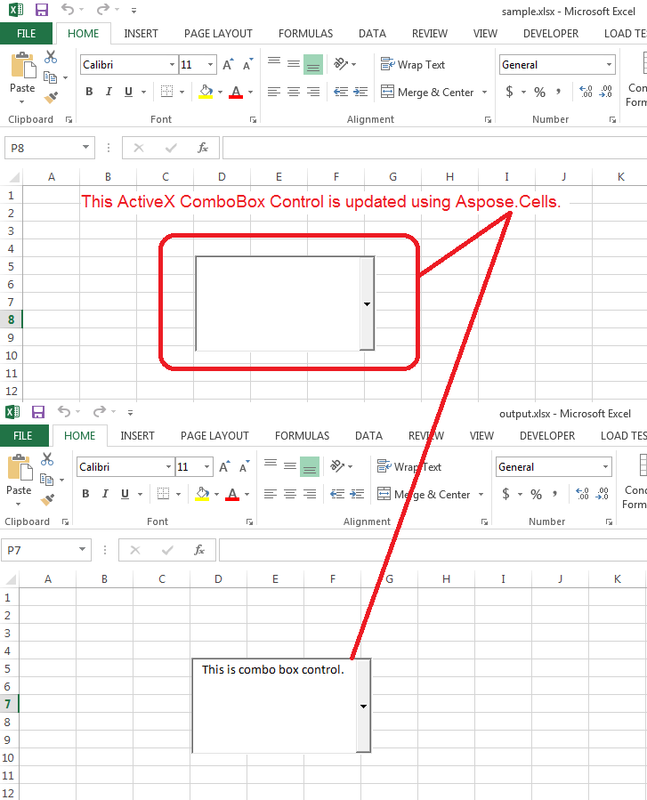

## **Possible Usage Scenarios**
You can read or write the values of ActiveX ComboBox Control using Aspose.Cells for Node.js via C++. Please access the ActiveX Control via [Shape.getActiveXControl()](https://reference.aspose.com/cells/nodejs-cpp/shape/#getActiveXControl--) property and check its type via [ActiveXControlBase.getType()](https://reference.aspose.com/cells/nodejs-cpp/activexcontrolbase/#getType--) property, it should return [ControlType.ComboBox](https://reference.aspose.com/cells/nodejs-cpp/controltype/) value and then typecast it into [ComboBoxActiveXControl](https://reference.aspose.com/cells/nodejs-cpp/comboboxactivexcontrol/) object and read or modify its various properties.

Please download the [sample excel file](5115124.xlsx) used in the following sample code.
## **Update ActiveX ComboBox Control**
The following screenshot shows the effect of the sample code on the [sample excel file](5115124.xlsx). As you can see, the ActiveX ComboBox value has been updated to "This is combo box control".

||
| :- |
## **Sample Code**
The following sample code updates the value of ActiveX ComboBox Control present inside the [sample excel file](5115124.xlsx).

```javascript
const path = require("path");
const AsposeCells = require("aspose.cells.node");

// The path to the documents directory.
const dataDir = path.join(__dirname, "data");
const filePath = path.join(dataDir, "SourceFile_activex.xlsx");
// Create a workbook
const wb = new AsposeCells.Workbook(filePath);

// Access first shape from first worksheet
const shape = wb.getWorksheets().get(0).getShapes().get(0);

// Access ActiveX ComboBox Control and update its value
if (shape.getActiveXControl() != null)
{
// Access Shape ActiveX Control
const c = shape.getActiveXControl();

if (c instanceof AsposeCells.ComboBoxActiveXControl)
{
// Type cast ActiveXControl into ComboBoxActiveXControl and change its value
const comboBoxActiveX = new AsposeCells.ComboBoxActiveXControl(c);
comboBoxActiveX.setValue("This is combo box control with updated value.");

}

}

// Save the workbook
const outputFilePath = path.join(dataDir, "OutputFile_out.xlsx");
wb.save(outputFilePath);
```
