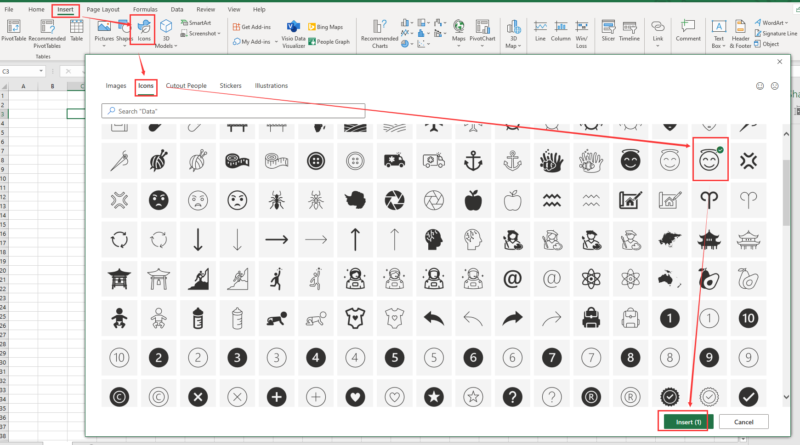

---  
title: Add Icons to Worksheet with Node.js via C++  
linktitle: Managing Icons  
type: docs  
weight: 100  
url: /nodejs-cpp/insert-svg-to-excel/  
---  

## Add Icons to Worksheet in Aspose.Cells for Node.js via C++

If you need to use [Aspose.Cells](https://products.aspose.com/cells/) to add 'icons' in an Excel file, then this document can provide you with some help.

The Excel interface corresponding to the insert icon operation is as follows:



- Select the position of the icon to be inserted in the worksheet
- Left click *Insert*->*Icons*
- In the window that opens, select the icon in the red rectangle in the figure above
- Left click *Insert*, it will be inserted into the Excel file.

The effect is as follows:


Here, we have prepared *sample code* to help you insert icons using [Aspose.Cells](https://products.aspose.com/cells/). There is also a necessary [sample file](sample.xlsx) and an icon [resource file](icon.zip). We used the Excel interface to insert an icon with the same display effect as the [resource file](icon.zip) in the [sample file](sample.xlsx).

### Node.js

```javascript
const fs = require("fs");
const path = require("path");
const AsposeCells = require("aspose.cells.node");

// Read icon resource file data
const fileName = "icon.svg";
const bytes = fs.readFileSync(fileName);

// The path to the documents directory.
const dataDir = path.join(__dirname, "data");
const filePath = path.join(dataDir, "sample.xlsx");
// Loads the workbook which contains hidden external links
const workbook = new AsposeCells.Workbook(filePath);

// Access first worksheet from the collection
const sheet = workbook.getWorksheets().get(0);

// Add the icon to the worksheet
sheet.getShapes().addIcons(3, 0, 7, 0, 100, 100, bytes, null);

// Set a prompt message
const c = sheet.getCells().get(8, 7);
c.putValue("Insert via Aspose.Cells");
const s = c.getStyle();
s.getFont().setColor(AsposeCells.Color.Blue);
c.setStyle(s);

// Save. You can check your icon in this way.
workbook.save("sample2.xlsx", AsposeCells.SaveFormat.Xlsx);
```

When you execute the above code in your project, you will get the following results:

  
  
