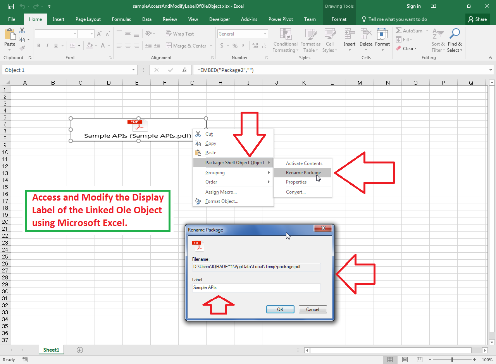

## **Possible Usage Scenarios**

Microsoft Excel allows you to change the display label of the Ole Object as shown in the following screenshot. You can also access or modify the display label of the Ole object using Aspose.Cells APIs with the [**OleObject.getLabel()**](https://reference.aspose.com/cells/nodejs-cpp/oleobject/#getLabel--) property.



## **Access and Modify the Display Label of the Linked Ole Object**

Please see the following sample code, it loads the [sample Excel file](64716810.xlsx) that contains the Ole Object. The code accesses the Ole Object and changes its label from Sample APIs to Aspose APIs. Please see the console output given below that shows the effect of the sample code on the sample Excel file for a reference.

## **Sample Code**

```javascript
const path = require("path");
const AsposeCells = require("aspose.cells.node");

// The path to the documents directory.
const dataDir = path.join(__dirname, "data");
const filePath = path.join(dataDir, "sampleAccessAndModifyLabelOfOleObject.xlsx");

// Load the sample Excel file 
const wb = new AsposeCells.Workbook(filePath);

// Access first worksheet
const ws = wb.getWorksheets().get(0);

// Access first Ole Object
let oleObject = ws.getOleObjects().get(0);

// Display the Label of the Ole Object
console.log("Ole Object Label - Before: " + oleObject.getLabel());

// Modify the Label of the Ole Object
oleObject.setLabel("Aspose APIs");

// Save workbook to memory stream
const ms = wb.save(AsposeCells.SaveFormat.Xlsx);

// Set the workbook reference to null
wb.dispose();

// Load workbook from memory stream
const wbFromStream = new AsposeCells.Workbook(ms);

// Access first worksheet
const wsFromStream = wbFromStream.getWorksheets().get(0);

// Access first Ole Object
oleObject = wsFromStream.getOleObjects().get(0);

// Display the Label of the Ole Object that has been modified earlier
console.log("Ole Object Label - After: " + oleObject.getLabel());
```

## **Console Output**



Ole Object Label - Before: Sample APIs

Ole Object Label - After: Aspose APIs


