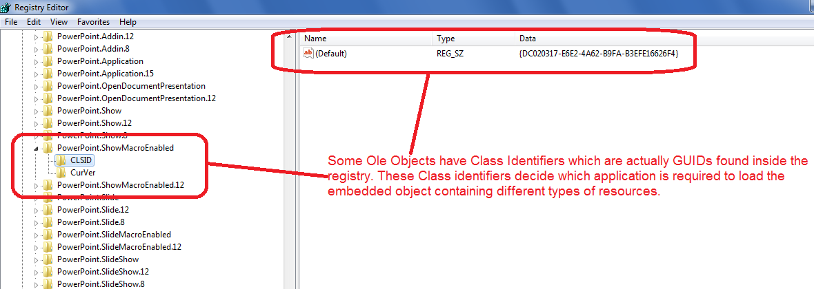

---  
title: Get or Set the Class Identifier of the Embedded OLE Object with Node.js via C++  
linktitle: Get or Set the Class Identifier of the Embedded OLE Object  
type: docs  
weight: 200  
url: /nodejs-cpp/get-or-set-the-class-identifier-of-the-embedded-ole-object/  
description: Learn how to get or set the class identifier of embedded OLE objects in Node.js using Aspose.Cells via C++.  
---  

## **Possible Usage Scenarios**  
Aspose.Cells provides the [OleObject.classIdentifier](https://reference.aspose.com/cells/nodejs-cpp/oleobject/properties/classidentifier) property which you can use to get or set the class identifier of an embedded OLE object. OLE object class identifiers are actually GUIDs i.e., Globally Unique Identifiers. GUID is always 16 bytes long; therefore, class identifiers are also 16 bytes long. They are often found inside the Windows Registry and provide information to the host application about how to open embedded OLE objects containing various embedded resources inside the client application.

## **Get or Set the Class Identifier of the Embedded OLE Object**  
The following screenshot shows the OLE object class identifier i.e., GUID which has been read from the [sample Excel file](5115190.xls) containing the embedded PowerPoint OLE object.

  
### **Sample Code**  
Please see the following sample code executed with [sample Excel file](5115190.xls) and its console output which prints the class identifier of the OLE object i.e., GUID. The printed GUID is exactly the same as shown inside the screenshot.

```javascript
const path = require("path");
const AsposeCells = require("aspose.cells.node");

// The path to the documents directory.
const dataDir = path.join(__dirname, "data");
// Load your sample workbook which contains embedded PowerPoint ole object
const workbook = new AsposeCells.Workbook(path.join(dataDir, "sample.xls"));

// Access its first worksheet
const worksheet = workbook.getWorksheets().get(0);

// Access first ole object inside the worksheet
const oleObject = worksheet.getOleObjects().get(0);

// Convert 16-bytes array into GUID
const guid = new Uint8Array(oleObject.getClassIdentifier()).reduce((acc, byte) => acc + String.fromCharCode(byte), '');

// Print the GUID
console.log(guid.toUpperCase());
```  
### **Console Output**  
This is the console output of the above sample code when executed with the [sample Excel file](5115190.xls).

  
 DC020317-E6E2-4A62-B9FA-B3EFE16626F4  
  
  