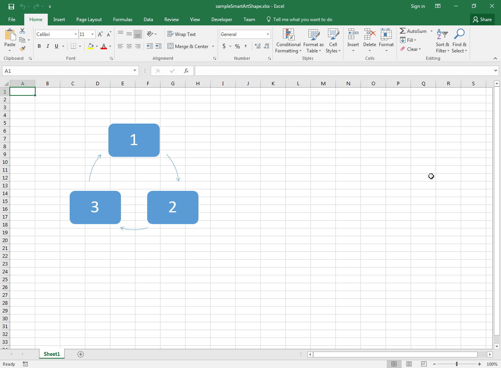

---  
title: Determine if Shape is Smart Art Shape with Node.js via C++  
linktitle: Determine if Shape is Smart Art Shape  
type: docs  
weight: 400  
url: /nodejs-cpp/determine-if-shape-is-smart-art-shape/  
description: Learn how to determine if a shape in Excel is a Smart Art shape using Aspose.Cells for Node.js via C++.  
ai_search_scope: cells_nodejscpp  
ai_search_endpoint: "https://docsearch.api.aspose.cloud/ask"  
---  

## **Possible Usage Scenarios**  

Smart Art Shapes are special shapes in Microsoft Excel that allow you to create complex diagrams automatically. You can determine whether a shape is a Smart Art shape or a normal shape using the [**Shape.isSmartArt()**](https://reference.aspose.com/cells/nodejs-cpp/shape/#isSmartArt--) property.  

## **Determine if Shape is Smart Art Shape**  

The following sample code loads the [sample Excel file](55541792.xlsx) containing a Smart Art shape, as shown in this screenshot. It then prints the value of the [**Shape.isSmartArt()**](https://reference.aspose.com/cells/nodejs-cpp/shape/#isSmartArt--) property for the first shape. See the console output shown below.  

  

## **Sample Code**  

```javascript
const path = require("path");
const AsposeCells = require("aspose.cells.node");

// The path to the documents directory.
const dataDir = path.join(__dirname, "data");
const filePath = path.join(dataDir, "sampleSmartArtShape.xlsx");

// Load the sample Smart Art shape - Excel file
const workbook = new AsposeCells.Workbook(filePath);

// Access first worksheet
const worksheet = workbook.getWorksheets().get(0);

// Access first shape
const shape = worksheet.getShapes().get(0);

// Determine if shape is Smart Art
console.log("Is Smart Art Shape: " + shape.isSmartArt());
```  

## **Console Output**  

  

Is Smart Art Shape: True  

  


