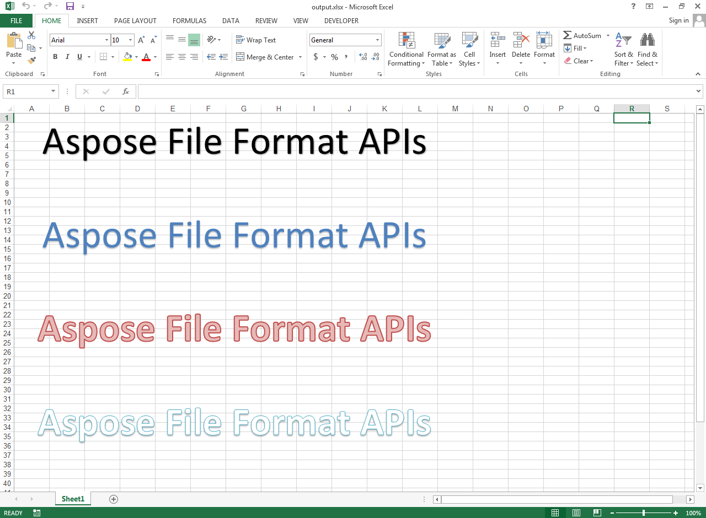

## **Possible Usage Scenarios**
You can add Word Art Text with Built-in Styles using Aspose.Cells for Node.js via C++. Please use [ShapeCollection.addWordArt()](https://reference.aspose.com/cells/nodejs-cpp/shapecollection/#addWordArt-presetwordartstyle-string-number-number-number-number-number-number-) method for this purpose.

## **Add Word Art Text with Built-in Styles**
The following sample code adds Word Art texts with different Built-in Styles. Please check the [output excel file](5115470.xlsx) generated with this code. This is how the [output excel file](5115470.xlsx) looks in Microsoft Excel.



```javascript
const path = require("path");
const AsposeCells = require("aspose.cells.node");

// The path to the documents directory.
const dataDir = path.join(__dirname, "data");
const filePath = path.join(dataDir, "sample.xlsx");
// Loads the workbook which contains hidden external links
const wb = new AsposeCells.Workbook();

// Access first worksheet
const ws = wb.getWorksheets().get(0);

// Add Word Art Text with Built-in Styles
ws.getShapes().addWordArt(AsposeCells.PresetWordArtStyle.WordArtStyle1, "Aspose File Format APIs", 0, 0, 0, 100, 800);
ws.getShapes().addWordArt(AsposeCells.PresetWordArtStyle.WordArtStyle2, "Aspose File Format APIs", 10, 0, 0, 100, 800);
ws.getShapes().addWordArt(AsposeCells.PresetWordArtStyle.WordArtStyle3, "Aspose File Format APIs", 20, 0, 0, 100, 800);
ws.getShapes().addWordArt(AsposeCells.PresetWordArtStyle.WordArtStyle4, "Aspose File Format APIs", 30, 0, 0, 100, 800);
ws.getShapes().addWordArt(AsposeCells.PresetWordArtStyle.WordArtStyle5, "Aspose File Format APIs", 40, 0, 0, 100, 800);

// Save the workbook in xlsx format
wb.save(path.join(dataDir, "output_out.xlsx"));
```
